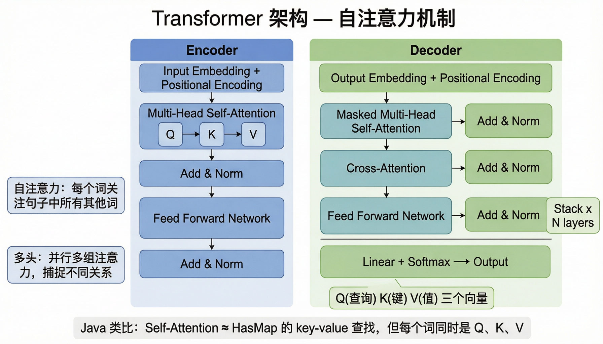
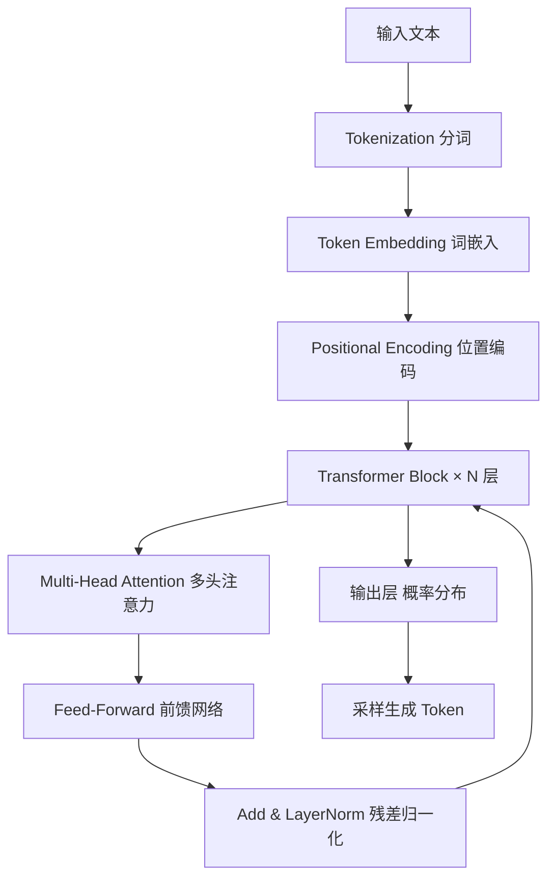

# 第 01 课：Transformer 与 LLM 原理

> **核心问题**：AI 是怎么"理解"人类语言的？
> **预计时间**：1-2 天

---

## 一、从你最熟悉的说起

作为 Java 开发者，你处理文本的方式是：`String.contains()`、正则匹配、分词器……
这些方法都是**基于规则**的——你告诉程序"匹配什么"，它就找什么。

**但 LLM 完全不同。** 它不是"匹配"文本，而是"理解"文本。

关键问题：**计算机怎么理解"意思"？**

---

## 二、核心概念：从词到数字

### 2.1 一切的起点——"把文字变成数字"

计算机只懂数学。要让 AI 处理语言，第一步就是把文字变成**向量**（一组数字）。

```
"候选人" → [0.12, -0.34, 0.78, 0.56, ...]  (比如 1536 个数字)
"求职者" → [0.11, -0.32, 0.80, 0.55, ...]  (意思相近，数字也相近！)
"数据库" → [-0.45, 0.67, -0.12, 0.03, ...]  (意思不同，数字差很远)
```

> 这就是 **Embedding（嵌入/向量化）**，后面第 04 课会深入讲。
> 你现在只需要知道：**每个文本都会变成一个向量，意思相近的文本，向量也相近。**

### 2.2 Transformer——现代 AI 的大脑

2017 年 Google 发表了一篇论文《Attention Is All You Need》，提出了 **Transformer** 架构。
这是 GPT、Claude、通义千问、DeepSeek 等所有现代大模型的基石。

### Self-Attention（自注意力机制）

> **严谨定义**：自注意力机制（Self-Attention）是 Transformer 架构的核心计算单元，通过计算序列中每个位置与其他所有位置的相关性权重（Attention Score），实现对上下文信息的动态聚合。其数学表达为 Attention(Q,K,V) = softmax(QK^T/√d_k)V，其中 Q、K、V 分别为查询、键、值矩阵，d_k 为键向量维度。

> **通俗理解**：就像你在读一句话时，大脑会自动关注最相关的词语。比如读“苹果公司的CEO”时，你会自然地把“苹果”和“公司”关联起来，而不是把“苹果”理解为水果。Self-Attention 就是让模型学会“该关注谁”。

#### 直观类比

想象你在读这句话：

> "小明把简历投给了**他**心仪的公司"

当你读到"他"时，你的大脑会自动把"他"和前面的"小明"关联起来。
**Self-Attention 就是让模型也能做这件事。**

具体来说，对于句子中的每个词，Self-Attention 会：
1. 看看句子里的**所有其他词**
2. 给每个词打一个**注意力分数**（"我跟这个词有多相关？"）
3. 根据分数**加权汇总**信息

```
句子: "小明" "把" "简历" "投给" "了" "他" "心仪" "的" "公司"

当处理到 "他" 时：
  "小明" → 注意力 0.35  ← 最高！（"他"指的是小明）
  "简历" → 注意力 0.15
  "投给" → 注意力 0.10
  "心仪" → 注意力 0.20
  "公司" → 注意力 0.10
  其他   → 注意力 0.10
  
最终 "他" 的表示 = 综合了所有词的信息，但 "小明" 的权重最大
```

#### 为什么这很重要？

在 Transformer 之前，RNN/LSTM 是**逐个词**处理文本的（像你看书时一个字一个字读）。
问题：
- 慢（不能并行）
- 长距离依赖容易丢失（读到句尾忘了句首）

Transformer 的 Self-Attention **同时看所有词**：
- 快（可以并行计算）
- 任何两个词都能直接关联，不管距离多远

---

## 三、Transformer 的整体架构

> 📊 **架构图参考**：
> 

```
输入文本
   ↓
┌─────────────────────────────┐
│  1. Tokenization（分词）      │  ← 把文本切成 token（第 02 课详解）
│  2. Token Embedding（词嵌入）  │  ← 每个 token 变成向量
│  3. Positional Encoding       │  ← 加入位置信息（哪个词在前哪个在后）
└─────────────────────────────┘
   ↓
┌─────────────────────────────┐
│  Transformer Block × N 层    │  ← 核心！GPT-3 有 96 层
│  ┌─────────────────────────┐ │
│  │  Multi-Head Attention    │ │  ← 多个"注意力头"，从不同角度理解关系
│  │  (多个 Self-Attention 并行)│ │
│  └─────────────────────────┘ │
│  ┌─────────────────────────┐ │
│  │  Feed-Forward Network    │ │  ← 对每个 token 独立做非线性变换
│  │  (前馈神经网络)           │ │
│  └─────────────────────────┘ │
│  ┌─────────────────────────┐ │
│  │  Add & LayerNorm         │ │  ← 残差连接 + 归一化（稳定训练）
│  └─────────────────────────┘ │
└─────────────────────────────┘
   ↓ （重复 N 次）
   ↓
┌─────────────────────────────┐
│  输出层                       │
│  - 训练时：预测下一个 token     │
│  - 推理时：生成文本 / 分类等    │
└─────────────────────────────┘
```

### Transformer 整体处理流程



### 关键概念解释

**Multi-Head Attention（多头注意力）**
- 不是只算一次注意力，而是同时算多次（比如 96 次）
- 每个"头"可以学到不同的语言关系：
  - 头 1 可能关注"指代关系"（他→小明）
  - 头 2 可能关注"修饰关系"（心仪→公司）
  - 头 3 可能关注"动作关系"（投给→简历）
- 最后把所有头的结果拼接起来 → 更全面的理解

**Feed-Forward Network（前馈网络）**
- 每个 token 独立经过一个小型神经网络
- 作用：把 Attention 收集到的信息做进一步加工

**层数（Depth）**
- GPT-3: 96 层, 1750 亿参数
- GPT-4: 估计 100+ 层, 万亿级参数
- 你项目中调用的 API：不需要关心层数，模型已经训练好了

---

## 四、LLM 是怎么"训练"出来的？

### 4.1 预训练（Pre-training）

**核心任务极其简单：预测下一个词。**

```
训练数据: "候选人张三有5年Java开发经验"

模型看到: "候选人张三有5年"
模型预测: "Java"  ← 如果预测对了，奖励；错了，调整参数

模型看到: "候选人张三有5年Java"
模型预测: "开发"  ← 继续调整

模型看到: "候选人张三有5年Java开发"
模型预测: "经验"  ← 继续调整
```

**训练数据量**：整个互联网 + 书籍 + 论文 + 代码... 数万亿 token

**关键理解**：
- 模型并没有"记住"知识，而是学到了**语言的模式和规律**
- 就像你读了 10000 篇 Java 文章后，即使记不住原文，也能写出类似的代码
- 这就是为什么 LLM 能"生成"看起来合理的回答

### 4.2 微调（Fine-tuning）

预训练后的模型是个"通才"，什么都会一点，但不擅长遵循指令。

微调：用**高质量的问答数据**继续训练

```
微调数据示例:
  输入: "请分析这份简历的优缺点"
  输出: "根据简历内容，该候选人有以下优势...不足之处在于..."
```

### RLHF（人类反馈强化学习）

> **严谨定义**：RLHF（Reinforcement Learning from Human Feedback）是一种模型对齐技术，分为三阶段：①监督微调（SFT）使模型适应指令格式；②训练奖励模型（Reward Model）学习人类偏好排序；③用 PPO 等强化学习算法优化策略模型，使其输出更符合人类期望。核心损失函数结合了语言建模损失与奖励信号。

> **通俗理解**：就像培训新员工——先让他看大量范文学习基本写法（预训练），再手把手教他按你的要求写（微调），最后通过“这个写得好、那个要改”的反馈让他越来越懂你的口味（RLHF）。三个阶段，从“会写”到“写对”再到“写好”。

让模型学会“什么样的回答是人类满意的”。

```
同一个问题，模型生成多个回答：
  回答 A: 详细、准确、有条理    → 人类评分: 👍
  回答 B: 简短、有错误           → 人类评分: 👎
  
用这些反馈训练一个“奖励模型”，然后用强化学习优化 LLM
```

---

## 五、LLM 推理：自回归生成

### 自回归生成（Autoregressive Generation）

> **严谨定义**：自回归生成是 LLM 推理的核心范式，模型在每一步将已生成的 token 序列作为输入，条件概率地预测下一个 token：P(x_t | x_1, ..., x_{t-1})。每生成一个 token 都需要完整的前向传播计算，因此生成延迟与输出长度线性相关。采样策略（Temperature、Top-P、Top-K）控制生成的随机性与多样性。

> **通俗理解**：就像你在填空题里一个字一个字地写答案——每写一个字，都要重新读一遍前面所有内容，再决定下一个字写什么。写得越长越慢，而且每次写出来的字都会影响后面的选择。这就是为什么 AI 回答是“流式”出来的，而不是一次性蹦出来。

当你调用 LLM API 时，模型是怎么生成回答的？

**答案：一个 token 一个 token 地生成。**

```
你输入: "Java 的三大特性是"

第 1 步: 模型计算 → 概率分布 { "封装": 0.35, "继承": 0.30, "多态": 0.25, ... }
         采样选中: "封装"
         
第 2 步: 输入变成 "Java 的三大特性是封装" → 模型计算 → 选中: "、"

第 3 步: 输入变成 "Java 的三大特性是封装、" → 模型计算 → 选中: "继承"

...以此类推，直到生成结束标记或达到 max_tokens
```

**这就是为什么：**
- LLM 响应是**流式**的（你项目中的 `Stream` 模式）——因为是一个个 token 生成的
- **Temperature** 参数控制随机性——温度越高，采样越随机，回答越"有创意"
- **max_tokens** 限制输出长度——因为每个 token 都要计算，token 数 = 成本

---

## 六、关键参数直觉理解

| 参数 | 本质 | 类比 | 你项目中的使用 |
|------|------|------|--------------|
| **Temperature** | 控制采样的随机程度 | 低=保守稳健，高=天马行空 | AI 面试分析用低温度(准确)，创意建议用高温度 |
| **Top-P** | 从概率累积达到 P 的 token 中采样 | Top-P=0.9 表示只在最可能的 90% 里选 | 通常和 Temperature 配合使用 |
| **Max Tokens** | 最多生成多少个 token | 限制回答长度 | 控制成本和响应时间 |
| **System Prompt** | 设定模型的行为角色和规则 | 给员工的"岗位说明书" | 你项目中每个 AI 功能都有专属 System Prompt |

---

## 七、与你项目的关联

你的 HR 候选人 AI 平台中，这些概念无处不在：

```java
// 你项目中调用 LLM 的本质就是：
// 1. 构造 Prompt（System + User）
// 2. 发送给 Transformer 模型
// 3. 模型自回归生成 token 流
// 4. 你接收并拼接结果

// 在 ai-service 中，类似这样的调用：
ChatResponse response = chatModel.call(prompt);
// 底层: HTTP → LLM API → Transformer 推理 → 返回生成的 token
```

**你项目中的 AI 功能，本质上都是在做：**
- 简历分析 → Prompt + LLM → 结构化分析结果
- 人岗匹配 → 简历 Embedding + 职位 Embedding → 相似度计算
- AI 面试 → Prompt + LLM → 面试评估
- RAG 问答 → 检索相关文档 → 注入 Prompt → LLM 生成回答

---

## 七点五、用 AI 工具实际体验

### 体验 1：用 ChatGPT 感受 Self-Attention

直接在 ChatGPT 中提问，感受模型如何"理解"语言：

```
🧑 用户提问：
请分析这句话中"他"指的是谁：
"张三把简历投给了李四推荐的公司，他很感激"

🤖 ChatGPT 回答：
在这句话中，"他"最可能指的是"张三"。
分析过程：
1. "张三把简历投给了李四推荐的公司" —— 张三是动作的发起者
2. "他很感激" —— 感激的对象通常是受益方
3. 张三因为李四的推荐而获得了投递机会，所以张三是感激的一方
4. 因此"他" = 张三

📝 解读：模型内部通过 Self-Attention 把"他"与"张三"关联起来，
   同时分析了"感激"的语义方向，才得出正确结论。
```

### 体验 2：用 Claude 对比不同 Temperature 的输出

```
🧑 用户提问（Claude，Temperature=0）：
Java 的三大特性是什么？请简洁回答。

🤖 Claude 回答：
Java 的三大特性是：
1. 封装（Encapsulation）
2. 继承（Inheritance）
3. 多态（Polymorphism）

🧑 再次提问（同样 Temperature=0）：
Java 的三大特性是什么？

🤖 Claude 回答：（完全相同）
Java 的三大特性是：
1. 封装（Encapsulation）
2. 继承（Inheritance）
3. 多态（Polymorphism）

📝 解读：T=0 时输出几乎确定性，多次调用结果一致。
   这就是为什么分析类任务用低 Temperature。
```

### 体验 3：用 ChatGPT 理解自回归生成

```
🧑 用户提问：
请一个字一个字地解释什么是"微服务"。

🤖 ChatGPT 回答：
微：小，指规模小
服：服务，指提供某种功能
务：事务，与"服"合在一起即"服务"

所以"微服务"= 小的服务，即把一个大型应用拆分成多个
小型、独立部署的服务单元，每个服务负责一个具体的
业务功能。

📝 解读：模型每次只生成一个 token，但每一步都基于
   前面所有已生成的 token 来计算概率分布。
   流式输出（Streaming）就是你看到它"逐字打出"的效果。
```

---

## 七点六、Java 开发者视角：用代码模拟 Transformer 核心逻辑

```java
/**
 * 简化版 Self-Attention 的 Java 实现（教学用途）
 * 帮助 Java 开发者理解 Attention 的数学本质
 */
public class SimpleSelfAttention {

    /**
     * 计算注意力权重
     * @param queries Q 矩阵 [seqLen × d_k]
     * @param keys    K 矩阵 [seqLen × d_k]
     * @param values  V 矩阵 [seqLen × d_v]
     * @return 注意力输出 [seqLen × d_v]
     */
    public double[][] attention(double[][] queries, double[][] keys, double[][] values) {
        int seqLen = queries.length;
        int dk = queries[0].length;
        double scale = Math.sqrt(dk);

        // Step 1: 计算注意力分数矩阵 QK^T / sqrt(d_k)
        double[][] scores = new double[seqLen][seqLen];
        for (int i = 0; i < seqLen; i++) {
            for (int j = 0; j < seqLen; j++) {
                double dotProduct = 0;
                for (int k = 0; k < dk; k++) {
                    dotProduct += queries[i][k] * keys[j][k];
                }
                scores[i][j] = dotProduct / scale;  // 缩放
            }
        }

        // Step 2: Softmax 归一化（每行和为 1）
        double[][] weights = softmax(scores);

        // Step 3: 加权求和 weights × V
        int dv = values[0].length;
        double[][] output = new double[seqLen][dv];
        for (int i = 0; i < seqLen; i++) {
            for (int j = 0; j < seqLen; j++) {
                for (int k = 0; k < dv; k++) {
                    output[i][k] += weights[i][j] * values[j][k];
                }
            }
        }
        return output;
    }

    private double[][] softmax(double[][] matrix) {
        double[][] result = new double[matrix.length][matrix[0].length];
        for (int i = 0; i < matrix.length; i++) {
            double max = Double.NEGATIVE_INFINITY;
            for (double v : matrix[i]) max = Math.max(max, v);
            double sum = 0;
            for (int j = 0; j < matrix[i].length; j++) {
                result[i][j] = Math.exp(matrix[i][j] - max);
                sum += result[i][j];
            }
            for (int j = 0; j < matrix[i].length; j++) {
                result[i][j] /= sum;
            }
        }
        return result;
    }
}
```

> 💡 **Java 开发者注意**：实际项目中不会手写 Attention，
> 而是通过 Spring AI / LangChain4j 调用已训练好的模型 API。
> 理解底层原理有助于调试和优化 AI 应用。

---

## 八、本课小结

```
核心要点：
1. Transformer 的核心是 Self-Attention —— 让模型理解词与词之间的关系
2. LLM 的训练 = 预训练(预测下一个词) + 微调(学会遵循指令) + RLHF(学会让人满意)
3. LLM 生成文本 = 一个 token 一个 token 地预测（自回归）
4. Temperature/Top-P 控制生成的随机性，Max Tokens 控制长度
5. 你调用 API 的本质 = 把 Prompt 送进 Transformer，拿回生成的 token
```

---

## 九、思考题

1. **为什么同样的 Prompt 多次调用，LLM 的回答会不同？**（提示：看 Temperature）
2. **为什么 LLM 有时候会"一本正经地胡说八道"（幻觉）？**（提示：看训练目标）
3. **为什么长文本处理更贵、更慢？**（提示：看自回归生成过程）
4. **Self-Attention 的计算复杂度跟文本长度的关系是什么？**（提示：每个词都要看所有其他词）

---

## 十、深度原理：Transformer 内部机制详解

### 10.1 注意力机制的数学本质

第 02 节的直觉版本省略了细节，现在看完整公式：

```
Attention(Q, K, V) = softmax( QKᵀ / √d_k ) V

Q（Query，查询）："我在找什么信息？"
K（Key，键）："我能提供什么信息？"
V（Value，值）："我实际携带的信息内容"
```

**逐项拆解**：

```
第 1 步：QKᵀ —— 计算相似度矩阵
  每个 token 的 Q 向量 与 每个 token 的 K 向量做点积
  点积大 = 两个向量方向接近 = "相关度高"
  得到一个 n×n 的矩阵（n = token 数）

第 2 步：除以 √d_k —— 缩放（为什么？）
  点积的方差随维度 d_k 增大而增大（每个维度相加）
  维度大 → 点积数值大 → softmax 进入饱和区（梯度消失）
  除以 √d_k 把方差拉回 1 左右，softmax 保持敏感
  这是论文中的关键工程细节

第 3 步：softmax —— 归一化成概率分布
  每行（每个 token 对其他 token 的关注度）和为 1

第 4 步：× V —— 加权求和
  每个 token 的最终表示 = 所有 token 的 V 按注意力权重加权
  这就是"每个 token 都吸收了其他 token 的信息"
```

### 10.2 Multi-Head：为什么要有多个头？

```
单头注意力的局限：
  一组 QKV 只能捕捉一种"关系模式"
  句子："张三把简历投给了李四"
    头 A：关注"张三→投给"（主谓关系）
    头 B：关注"李四"（宾语）
    头 C：关注"简历"（宾语）
  如果只有一个头，这些信息混在一起，谁也学不好

多头实现：
  把 Q、K、V 分别投影到 h 个子空间（h=12/32/96...）
  每个头在自己的子空间独立计算 attention
  最后拼接所有头的输出 → 线性投影回原维度

效果：h 个头 = h 个"视角"同时观察，信息更丰富
  视觉上：有些头学指代，有些头学句法，有些头学语义
```

### 10.3 位置编码：模型如何知道顺序

**问题**：attention 本身对顺序不敏感（QKᵀ 是集合运算，交换 token 顺序结果一样）。
不加位置信息，"猫追狗"和"狗追猫"在模型看来一样！

```
方案 1：绝对位置编码（早期 GPT/BERT）
  为每个位置学习一个向量，直接加到 token 向量上
  局限：只能表达"第几个位置"，位置之间的"相对距离"信息弱

方案 2：RoPE 旋转位置编码（主流，Llama/Qwen 都用）⭐
  把位置信息"旋转"进 Q、K 向量
  关键性质：两个 token 的注意力分数只取决于它们的"相对位置差"
  （旋转角度差 = 位置差，符合语言直觉："昨天的昨天"= "两天前"）
  优势：可外推（训练 4K 上下文，可推理 8K+）
```

### 10.4 训练目标：交叉熵与 Teacher Forcing

```
目标函数（交叉熵损失）：
  L = - Σ log P(wᵢ | w₁, w₂, ..., wᵢ₋₁)
  即：最大化每个位置"预测对下一个 token"的概率

Teacher Forcing（教师强迫）：
  训练时：预测第 i 个 token 时，前文用"真实的" token
  推理时：前文是"模型自己生成的"（可能有错）
  这种不一致叫 Exposure Bias（暴露偏差）
  后果：训练时的一个小错误不会累积，推理时会累积
  这也是为什么推理时"一步错步步错"
```

### 10.5 推理优化：KV Cache（企业必懂）

```
生成第 N+1 个 token 时，前 N 个 token 的 K、V 其实都算过了
  ——不缓存的话每次重算，复杂度 O(n²)

KV Cache：缓存已算好的 K、V，每次只计算新 token
  生成阶段：prefill（并行计算全部前文）→ decode（逐 token）

KV Cache 内存公式：
  2 × 层数 × 头数 × 头维度 × 序列长度 × 字节数
  例：7B 模型（32 层、32 头、128 维、FP16）
    每 1000 token 约需要 2×32×32×128×1000×2 ≈ 524 MB
  这就是为什么长上下文对话吃内存——也是并发量瓶颈
```

### 10.6 采样策略的数学

```
模型输出的是"概率分布"，怎么选 token 有讲究：

带温度（Temperature）的 softmax：
  P(w) = exp(z_w / T) / Σ exp(z_w' / T)

  T → 0：分布变尖，趋向贪婪（只选最高概率）
  T = 1：保持原分布
  T → ∞：分布变平，趋向随机

Top-K：只从概率最高的 K 个 token 里采样（过滤长尾）
Top-P（Nucleus）：取累积概率刚超过 P 的最小集合再采样

企业实践组合：
  分析任务：T=0.2 + top_p=0.9（稳定）
  创意任务：T=0.7 + top_p=0.9（多样）
  代码生成：T=0（确定性优先）
```

### 10.7 上下文窗口为什么有限

```
三个根本限制：
1. 计算：attention 是 O(n²)（每个位置 × 所有位置）
2. 内存：KV Cache 随 n 线性增长（见 10.5）
3. 注意力稀释：token 越多，每个位置的注意力越分散
   长文本里，关键信息可能只占 1%，模型"注意不到"

业界扩展方案：
  滑动窗口注意力（只关注附近 token）
  稀疏注意力（每隔 k 个位置关注一个）
  线性注意力（近似 O(n)）
  RoPE 外推（训练短、推理长）
  这也是 RAG 存在的根本原因之一：与其硬塞 10 万 token，不如检索最相关的 2000
```

---

## 十一、延伸阅读

- 原论文：[Attention Is All You Need](https://arxiv.org/abs/1706.03762)（Transformer 开山之作）
- 图解 Transformer：[The Illustrated Transformer](https://jalammar.github.io/illustrated-transformer/)（强烈推荐，有可视化）
- 3Blue1Brown 视频：[But what is a GPT?](https://www.youtube.com/watch?v=wjZofJX7v6M)（直觉理解系列）

---

## 导航

| 上一课 | 下一课 |
| --- | --- |
| — | [第 02 课：Tokenization 分词原理](02-Tokenization分词原理.md) |
