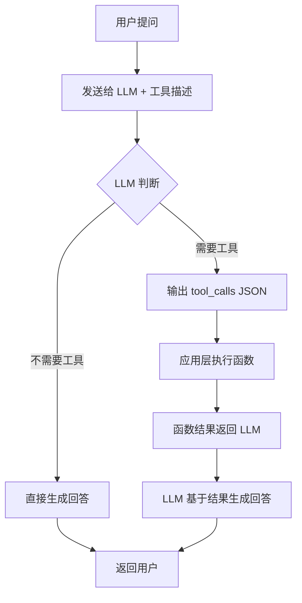

# 第 08 课：Function Calling 与工具调用

> **核心问题**：让 LLM 从"聊天"变成"干活"
> **预计时间**：2 天
> **前置知识**：第 01-03 课（Transformer、Tokenization、Prompt）

---

## 一、从"聊天"到"干活"的关键一步

### 1.1 LLM 的能力边界

```
纯 LLM 能做的：
  ✓ 理解文本、生成文本、翻译、总结、推理

纯 LLM 做不到的：
  ✗ 查询数据库（没有数据库连接）
  ✗ 调用 API（没有网络权限）
  ✗ 计算准确数字（算术不精确）
  ✗ 获取实时信息（知识截止）
  ✗ 操作系统文件（没有文件系统）
```

### Function Calling（函数调用）

> **严谨定义**：Function Calling 是 LLM 与外部工具/系统交互的标准化协议。模型在推理时根据用户意图和可用工具描述，决定是否调用函数、调用哪个函数、生成什么参数。模型本身不执行函数，仅输出结构化的 tool_calls JSON，由应用层执行并将结果返回模型进行二次推理。本质是将 LLM 从“文本生成器”升级为“决策引擎”。

> **通俗理解**：就像你请了一个超级聪明的助手，他什么都能分析、什么都能建议，但他不能直接查数据库、不能直接发邮件。当他需要查数据时，他会告诉你：“请帮我查一下候选人 ID 123 的手机号”。你查完告诉他结果，他再用这个信息回答用户。Function Calling 就是这个“助手说需求、你来执行”的桥梁。

**Function Calling（函数调用）** 就是桥：让 LLM 在需要时**调用你写的函数**。

### 1.2 直观类比

```
你（用户）："帮我查一下这个候选人的手机号"
LLM（助手）：不能直接查数据库
               ↓ Function Calling
LLM："我需要调用 getCandidateById 函数，参数是 123"
你的程序：执行 SQL 查询，拿到手机号，返回给 LLM
LLM：把结果组织成自然语言回答你
```

### 工具调用完整流程



### Function Calling vs 其他方案对比

| 方案 | 原理 | 优点 | 缺点 | 适用场景 |
|------|------|------|------|----------|
| Function Calling | 模型决定调用时机和参数 | 灵活、自然语言驱动 | 需要模型支持 | 复杂业务逻辑 |
| 正则提取 + 硬编码 | 规则匹配用户意图 | 简单可控 | 不灵活 | 简单固定场景 |
| 纯 Prompt 指示 | 在 Prompt 中描述工具 | 无需模型支持 | 不可靠 | 原型验证 |

---

## 二、Function Calling 的核心流程

```
┌─────────────────────────────────────────────┐
│ 第 1 步：定义工具（把函数描述给模型）           │
│  模型知道：有哪些函数、参数是什么、干什么用的   │
├─────────────────────────────────────────────┤
│ 第 2 步：用户提问 → 模型决定是否调用           │
│  模型输出：tool_calls = [{                   │
│    "name": "searchCandidates",              │
│    "arguments": {"keyword": "Java"}         │
│  }]                                          │
├─────────────────────────────────────────────┤
│ 第 3 步：你的程序执行函数                      │
│  执行 SQL / 调 API / 读文件                  │
├─────────────────────────────────────────────┤
│ 第 4 步：把结果返回给模型（第二轮调用）         │
│  模型基于函数结果生成最终回答                   │
└─────────────────────────────────────────────┘
```

**关键理解**：**模型不执行函数，模型只"决定"调用哪个函数并生成参数**。真正执行的是你的代码。

---

## 三、Spring AI 中的 Function Calling 实战

### 3.1 定义工具函数

```java
// 1. 定义一个普通 Java 类，这就是"工具"
@Component
public class CandidateService {

    @Description("根据ID查询候选人基本信息")
    public CandidateInfo getCandidateById(
            @Parameter(description = "候选人ID") Long id) {
        // 真实业务逻辑：查数据库
        return candidateMapper.selectById(id);
    }

    @Description("按关键字搜索候选人列表")
    public List<CandidateInfo> searchCandidates(
            @Parameter(description = "搜索关键字，如姓名、技能") String keyword,
            @Parameter(description = "最多返回条数", required = false) Integer limit) {
        return candidateMapper.search(keyword, limit == null ? 10 : limit);
    }
}
```

### 3.2 注册给模型

```java
// 2. 把工具注册到 ChatModel
@Bean
public ChatClient chatClient(ChatClient.Builder builder,
                             CandidateService candidateService) {
    return builder
            .defaultSystem("你是一个HR助手，可以查询候选人信息")
            .defaultTools(candidateService)  // ← 注册工具
            .build();
}
```

### 3.3 调用

```java
// 3. 用户提问，模型自动决定调用哪个工具
String answer = chatClient.prompt()
        .user("帮我查一下候选人张三的手机号")
        .call()
        .content();

// 底层流程：
// 1. 模型看到可用工具：getCandidateById、searchCandidates
// 2. 模型输出 tool_calls: getCandidateById(123)
// 3. Spring AI 自动执行该方法
// 4. 把结果返回模型 → 模型生成最终回答
```

---

## 四、工具定义的细节（决定成功率）

### 4.1 描述质量决定一切

```
❌ 差描述：
@Description("getUser")  ← 模型不知道什么时候用

✅ 好描述：
@Description("根据候选人ID查询候选人基本信息，包括姓名、联系方式、工作经历")
  ← 模型能判断"查候选人"应该用这个

规则：
1. 描述要说明"什么时候用"和"干什么"
2. 参数要说明"传什么"，可选参数要标 required = false
3. 函数数量适度：太多模型会混乱（< 20 个为佳）
```

### 4.2 工具命名规范

```
✅ 好命名：search_candidates / getCandidateById / createInterview
❌ 坏命名：doSomething / helper / process

命名要能表达功能，模型靠名字+描述来"理解"工具
```

### 4.3 参数类型

```
支持的参数类型：String、Integer、Long、Boolean、Double、枚举、嵌套对象

注意：
- 参数尽量简单（基本类型），复杂对象容易解析失败
- 返回类型要能序列化（JSON），模型才能"看懂"
- 大对象返回时要截断/摘要，避免 token 爆炸
```

---

## 五、多轮工具调用（Tool Loop）

有时一个函数不够，需要多个工具协作：

```
用户："把张三的简历发给他的面试官王经理"

第 1 轮：
  模型：getCandidateByName("张三") → 得到张三ID
  模型：getInterviewerByName("王经理") → 得到王经理ID
  （模型可能一次输出多个 tool_calls！）

第 2 轮：
  你的代码：两个结果都执行完，一起返回给模型

第 3 轮：
  模型：sendEmail(candidateId, interviewerId)
  
第 4 轮：
  你的代码：发送邮件成功
  模型："已发送成功"
```

**实现要点**：
- 循环执行：模型输出 tool_calls → 执行 → 返回结果 → 再调用模型
- 设置最大轮数（如 10 轮），防止死循环
- 每轮结果都追加到对话历史中

---

## 六、Function Calling 常见坑

```
坑 1：工具执行失败
  函数抛异常 → 要把错误信息返回给模型
  模型可以说："查询失败，请稍后重试"
  而不是让整个调用崩溃

坑 2：参数解析失败
  模型偶尔生成非法 JSON 参数
  对策：重试一次 / 让模型重新生成 / 校验后拒绝

坑 3：工具数量过多
  超过 20 个工具，模型选择准确率下降
  对策：分组路由（先调"路由工具"决定用哪组工具）

坑 4：敏感操作无确认
  Function Calling 是"程序自动执行"的！
  删除、发送、转账等操作必须加人工确认环节
  （你项目的实践："Chat-based recommendation confirmation flow"）
```

---

## 六点五、用 AI 工具实际体验

### 体验 1：用 ChatGPT 体验 Function Calling

```
🧑 用户提问（ChatGPT，已启用Function Calling）：
帮我查一下候选人张三的手机号

🤖 ChatGPT 内部流程：
[模型看到可用工具：getCandidateByName, getCandidateById]
[模型决定调用工具]

🔧 工具调用：
getCandidateByName(name="张三")

🔧 工具返回：
{
  "id": 123,
  "name": "张三",
  "phone": "13800138000",
  "email": "zhangsan@example.com"
}

🤖 ChatGPT 最终回答：
候选人张三的手机号是 13800138000。

📝 解读：模型自己决定调用哪个工具、传什么参数，
   但真正执行的是你的代码，模型只负责"决策"和"组织回答"。
```

### 体验 2：用 Claude 体验多轮工具调用

```
🧑 用户提问（Claude）：
把张三的简历发给他的面试官王经理

🤖 Claude 内部流程：

[第1轮：模型决定需要查两个人]
🔧 工具调用1：getCandidateByName(name="张三")
🔧 工具调用2：getInterviewerByName(name="王经理")

[第1轮：工具返回]
结果1：{id: 123, name: "张三", resume_url: "..."}
结果2：{id: 456, name: "王经理", email: "wang@example.com"}

[第2轮：模型决定发送邮件]
🔧 工具调用3：sendEmail(
  to="wang@example.com",
  subject="候选人简历：张三",
  body="请查收张三的简历..."
)

[第2轮：工具返回]
结果3：{status: "sent", message_id: "msg_789"}

[第3轮：模型生成最终回答]
🤖 Claude 最终回答：
已将张三的简历发送给王经理（wang@example.com）。

📝 解读：多轮工具调用让模型能完成复杂任务，
   每一步都由模型决策，但每步都基于真实的工具结果。
```

### 体验 3：用ChatGPT理解工具描述质量的影响

```
🧑 用户提问：
为什么我的Function Calling经常调错工具？

🤖 ChatGPT 回答：
工具描述质量是调用准确率的关铹因素：

【差描述 vs 好描述】

差描述：
@Description("getUser")
→ 模型不知道什么时候用，可能乱调

好描述：
@Description("根据候选人ID查询候选人基本信息，包括姓名、联系方式、工作经历")
→ 模型能判断"查候选人"应该用这个

差描述：
@Description("search")
→ 太模糊，模型不知道搜什么

好描述：
@Description("当用户想查找候选人信息时使用，支持按姓名/技能/岗位搜索")
→ 明确"触发条件"，模型更容易匹配意图

【工具命名】
差：doSomething, helper, process
好：search_candidates, getCandidateById, createInterview

【工具数量】
< 10个：选对率高
10-20个：还行
> 20个：明显下降 → 需要"工具分组/路由"

【最佳实践】
1. 描述要说明"什么时候用"和"干什么"
2. 参数要说明"传什么"
3. 工具数量控制在20个以内
4. 用Few-shot示例教模型何时调用

📝 解读：工具描述就像函数的Javadoc，
   写得越清晰，模型越能正确调用。
```

---

## 六点六、Java 开发者视角：完整的 Function Calling 实现

```java
/**
 * Java + Spring AI 的完整 Function Calling 实现
 */
@Service
public class FunctionCallingService {

    @Autowired
    private ChatClient chatClient;

    /**
     * 1. 定义工具函数（用注解描述）
     */
    @Component
    public class CandidateTools {

        @Description("根据候选人ID查询候选人基本信息，包括姓名、联系方式、工作经历")
        public CandidateInfo getCandidateById(
                @Parameter(description = "候选人ID，如：123") Long id) {
            return candidateMapper.selectById(id);
        }

        @Description("当用户想查找候选人信息时使用，支持按姓名/技能/岗位搜索")
        public List<CandidateInfo> searchCandidates(
                @Parameter(description = "搜索关键字，如：Java、张三") String keyword,
                @Parameter(description = "最多返回条数，默认10", required = false) Integer limit) {
            return candidateMapper.search(keyword, limit == null ? 10 : limit);
        }

        @Description("发送邮件给指定用户")
        public EmailResult sendEmail(
                @Parameter(description = "收件人邮箱") String to,
                @Parameter(description = "邮件主题") String subject,
                @Parameter(description = "邮件内容") String body) {
            // 实际发送邮件的逻辑
            return emailService.send(to, subject, body);
        }
    }

    /**
     * 2. 注册工具到ChatClient
     */
    @Bean
    public ChatClient chatClient(ChatClient.Builder builder,
                                  CandidateTools candidateTools) {
        return builder
            .defaultSystem("你是一个HR助手，可以查询候选人信息、发送邮件")
            .defaultTools(candidateTools)  // 注册工具
            .build();
    }

    /**
     * 3. 调用（模型自动决定调用哪个工具）
     */
    public String chat(String userMessage) {
        return chatClient.prompt()
            .user(userMessage)
            .call()
            .content();
        // 底层流程：
        // 1. 模型看到可用工具
        // 2. 模型决定调用哪个工具（如果需要）
        // 3. Spring AI自动执行工具
        // 4. 把结果返回给模型
        // 5. 模型生成最终回答
    }

    /**
     * 4. 手动处理工具调用（高级用法）
     */
    public String chatWithManualToolHandling(String userMessage) {
        ChatResponse response = chatClient.prompt()
            .user(userMessage)
            .call()
            .chatResponse();
        
        // 检查是否有工具调用
        if (response.hasToolCalls()) {
            for (ToolCall toolCall : response.getToolCalls()) {
                String toolName = toolCall.getName();
                String args = toolCall.getArguments();
                
                // 手动执行工具
                Object result = executeTool(toolName, args);
                
                // 把结果返回给模型
                response = chatClient.prompt()
                    .toolResult(toolCall.getId(), result)
                    .call()
                    .chatResponse();
            }
        }
        
        return response.getContent();
    }

    /**
     * 5. 工具执行失败的处理
     */
    public String chatWithErrorHandling(String userMessage) {
        try {
            return chat(userMessage);
        } catch (ToolExecutionException e) {
            // 工具执行失败，把错误信息返回给模型
            return chatClient.prompt()
                .user(userMessage)
                .toolError(e.getToolCallId(), e.getMessage())
                .call()
                .content();
            // 模型会说："查询失败，请稍后重试"
        }
    }
}
```

> 💡 **生产建议**：
> - 工具描述要写"触发条件"而非"是什么"
> - 危险操作（发邮件、删除）必须加人工确认
> - 工具执行失败要把错误信息返回给模型，让它友好提示

---

## 七、工具调用的安全设计（生产必备）

```
原则 1：最小权限
  工具函数只暴露必要的操作
  查询类：只读；变更类：需要权限校验

原则 2：人工确认闸门
  危险操作（删简历、发邮件、改状态）→ 先返回"待确认"给用户
  用户确认后再执行（你项目中的 WAIT_APPROVAL 模式！）

原则 3：输入校验
  模型生成的参数可能是恶意的（Prompt 注入）
  所有参数必须经过你的业务校验（ID 存在性、权限范围）

原则 4：审计日志
  记录：谁在什么时候调用了什么工具、参数是什么、结果是什么
  出问题时能追溯
```

---

## 八、与你项目的关联

你项目中的 Function Calling 场景：

| 你的功能 | 工具类型 | 说明 |
|---------|---------|------|
| AI 查候选人 | 查询工具 | getCandidateById 等 |
| AI 推荐确认 | 变更工具 | 需要用户确认（WAIT_APPROVAL）|
| AI 工作流执行 | 执行工具 | 按步骤执行操作 |
| RAG 知识库问答 | 检索工具 | 查知识库 |

**核心模式**：AI 建议 → 用户确认 → 执行（你项目已实践）
这正是 Function Calling 生产级应用的标准模式。

---

## 九、本课小结

```
核心要点：
1. Function Calling = 模型"决定调什么"，你的代码"真正执行"
2. 流程：定义工具 → 模型输出 tool_calls → 执行 → 结果回传 → 模型生成回答
3. 工具描述质量决定调用准确率
4. 多轮工具调用：循环执行直到模型不需要更多工具
5. 安全：最小权限 + 人工确认 + 参数校验 + 审计日志
6. 危险操作必须加确认闸门
```

---

## 十、思考题

1. **为什么说"模型不执行函数，只决定调用函数"？执行在哪里发生？**
2. **工具描述写得模糊会有什么后果？举例说明。**
3. **AI 自动执行"发送邮件"和"查询候选人"哪个更危险？为什么？如何设计确认机制？**
4. **如果模型连续 5 轮都在调用工具不回答用户，说明什么？怎么处理？**

---

## 十一、实战练习

1. 在你项目中找一个已有的工具类，检查 @Description 是否清晰
2. 新增一个工具：根据公司名称查询该公司所有候选人的数量
3. 测试："帮我查一下所有来自腾讯的候选人有多少个"——观察模型是否自动调用
4. 故意让工具抛异常，观察模型如何应对（应返回友好错误说明）

---

## 十二、深度原理：Tool Calling 的底层机制

### 12.1 模型"调用工具"到底发生了什么

```
表面：模型"决定"调用工具
底层：仍然是 next-token 预测！

实现方式（以 OpenAI 兼容 API 为例）：

第 1 步：把工具定义序列化成文本，拼进系统提示
  tools 参数会被转成一段特殊格式的文本：
  "可用工具：\n- name: search_candidate\n  description: ...\n  parameters: {...}"

第 2 步：模型看到工具定义后，
  预测输出时选择"输出普通文本"还是"输出 tool_call 标记"
  → 模型被训练成：需要外部信息时，输出工具调用标记

第 3 步：输出被解析成结构化指令：
  {name: "search_candidate", arguments: "{\"keyword\": \"Java\"}"}

第 4 步：应用代码执行工具 → 把结果以"tool 消息"回填

所以本质是：
  工具调用 = 模型学会输出"特殊格式的文本"
  工具定义 = 格式化后的训练分布激活器（同第 03 课 ICL）
```

### 12.2 工具调用失败的根因分析

```
失败模式 1：调用不存在的工具
  原因：工具 description 与模型训练数据中的工具名相似
  例：定义 search_candidate，模型输出 search_candidates
  对策：代码侧校验工具名，未命中 → 拒绝 + 提示模型重试

失败模式 2：参数格式错误
  原因：模型生成的 arguments 是非法 JSON
  （逐 token 生成，无全局约束 —— 同 03 课 11.4）
  对策：解析失败 → 重试 / 约束解码 / 参数补全（缺省值）

失败模式 3：参数值编造
  原因：模型"猜测"参数（工具没返回，模型脑补）
  例：搜"张三"却传了"张三人"（记错的名字）
  对策：关键参数二次确认 / 必填参数无默认值 / 结果校验

失败模式 4：调用时机错误
  原因：上下文里已有答案，模型仍调工具（或反之）
  对策：few-shot 示例教"何时调用、何时不调用"

失败模式 5：循环调用（死循环）
  工具一直失败 → 模型反复重试 → token 烧完
  对策：最大迭代次数 + 连续失败熔断（第 09 课详述）
```

### 12.3 并行工具调用（Parallel Tool Calls）

```
模型一次可返回多个工具调用（一个消息里多个 tool_call）

适用场景：
  互不依赖的调用
  例：同时查"候选人A的简历"和"候选人B的简历"

不适用场景：
  有依赖的调用（第二次需要第一次的结果）
  例：先查候选人有谁 → 再查第一个人的详情
  → 必须串行：等第一次结果回填后再让模型继续

实现要点：
  Java/Spring AI：ToolExecutionRequest 列表逐个执行
  执行完把所有结果作为多条 tool 消息回填
  API 调用是并发的（CompletableFuture），执行是串行的

风险：
  并行调用可能触发"高并发"副作用（如批量发邮件）
  → 对"有副作用"的工具强制串行 + 审批（WAIT_APPROVAL）
```

### 12.4 工具描述如何影响选择（可解释性）

```
模型选工具的依据（按影响力排序）：
  1. 工具名（最强信号，越直观越好）
  2. description（次强，写"何时用"而非"是什么"）
  3. parameters 的 schema（弱信号，但影响参数生成）

描述的最佳实践：
  差："搜索候选人"
  好："当用户想查找候选人信息时使用，支持按姓名/技能/岗位搜索"
  → 写"触发条件"，模型更容易匹配意图

工具数量与准确率：
  工具越多，选错率越高（选择空间增大）
  10 个以内：选对率较高
  20+ 个：明显下降 → 需要"工具分组/路由"
  方案：先用一个小模型/router 选工具组，再调用
```

### 12.5 工具调用的 Token 成本模型

```
一次完整的工具调用 = 4 次往返：
  1. 用户消息 + 工具定义 → 模型选工具（输入含全部工具定义）
  2. 工具定义通常 200-1000 token/个（随 schema 复杂度）
  3. 执行结果回填（可能很长，如简历全文）
  4. 模型基于结果生成最终回答

成本估算公式：
  单次调用成本 ≈
    (工具定义总 token + 上下文 + 输出) × 输入单价
    + (输出 token) × 输出单价
    + 工具结果 token × 输入单价

优化：
  工具定义精简（description 一针见血，不要写论文）
  工具结果截断（简历只回填关键字段而非全文）
  频繁使用的工具结果可缓存（如候选人基本信息）

企业实践：
  给每个核心 Agent 记录"每任务平均 token 消耗"
  超标 → 检查工具定义是否臃肿 / 循环是否过多
```

### 12.6 从 Tool Calling 到 MCP（承上启下）

```
问题：每个工具都要自己写 API 对接（解析、鉴权、重试）

MCP（Model Context Protocol，第 23 课详解）：
  标准化工具接入：
    工具方实现 MCP Server（声明工具+执行）
    应用方用 MCP Client 发现+调用
    协议：JSON-RPC over stdio/HTTP

对你的意义：
  Spring AI 已原生支持 MCP（@Tool + mcpServers 配置）
  企业内可以：
    简历解析 → 一个 MCP Server
    招聘系统 → 一个 MCP Server
    知识库检索 → 一个 MCP Server
  新 Agent 直接声明需要哪些 Server，无需写对接代码

趋势：
  Tool Calling 是"点对点"，MCP 是"标准化总线"
  先精通 Tool Calling（本课），再学 MCP（第 23 课）
```

---

## 十三、延伸阅读

- OpenAI Function Calling 文档：https://platform.openai.com/docs/guides/function-calling
- Spring AI Function Calling：https://docs.spring.io/spring-ai/reference/api/functions.html

---

## 导航

| 上一课 | 下一课 |
| --- | --- |
| [第 07 课：RAG 检索增强生成（下）](07-RAG检索增强生成下.md) | [第 09 课：AI Agent 智能体](09-AIAgent智能体.md) |
