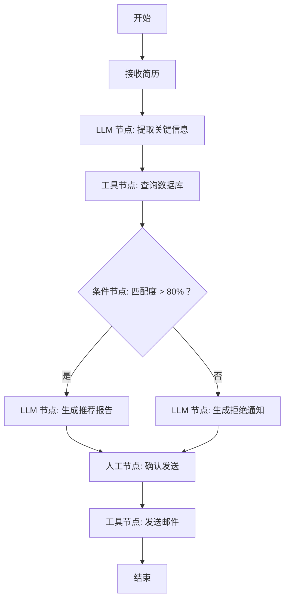

# 第 11 课：AI 工作流引擎

> **核心问题**：用可视化方式编排 AI 任务链
> **预计时间**：2-3 天
> **前置知识**：第 08-10 课（Function Calling、Agent、Multi-Agent）

---

## 一、工作流 vs Agent

### 工作流（Workflow）

> **严谨定义**：工作流是一种预定义的、确定性的任务编排模式，通过有向无环图（DAG）或状态机定义节点（处理单元）和边（数据流/控制流）的执行顺序。每个节点可以是 LLM 调用、工具执行、条件分支、并行聚合等操作。工作流引擎负责调度执行、状态管理、错误处理和可观测性。与 Agent 的动态决策不同，工作流提供可预测、可审计的执行路径。

> **通俗理解**：就像工厂流水线——每个工位固定做什么、顺序固定、产品从第一个工位流到最后一个。工作流是“确定性的”：你知道每一步会发生什么。Agent 是“自由职业者”：自己决定做什么。最优解是“工厂里安排一个聪明的工位”——工作流中嵌入 LLM 节点。

### 1.1 核心区别

```
工作流（Workflow）：
  流程是"预先定义"的 → 确定性执行
  适合：步骤明确、结果可预期、需要稳定可控的场景

Agent：
  流程是"动态生成"的 → 模型自主决策
  适合：步骤不明确、需要灵活应变的场景

实战原则：
  确定性步骤 → 工作流（稳定、便宜、可审计）
  创造性步骤 → Agent（灵活、聪明、不可控）
```

### 1.2 直观类比

```
工作流 = 流水线工厂（每个工位固定做什么，顺序固定）
Agent = 自由职业者（自己决定今天做什么）

最优解 = 工厂里安排一个"聪明的工位"（工作流 + Agent 节点）
```

### 工作流执行流程示例



### 工作流 vs Agent 选型指南

| 维度 | 工作流 | Agent |
|------|--------|-------|
| 流程定义 | 预定义、确定性 | 动态生成、不确定性 |
| 可控性 | 高（可审计） | 低（难以预测） |
| 成本 | 低（只调必要的 LLM） | 高（多轮推理） |
| 灵活性 | 低（固定流程） | 高（动态应变） |
| 适用场景 | 步骤明确的任务 | 探索性任务 |
| 生产推荐 | 确定性步骤用工作流 | 创造性步骤用 Agent |

---

## 二、工作流的基本元素

```
┌──────────────────────────────────────────┐
│              工作流（Workflow）             │
│                                          │
│   [开始] → [节点A] → [节点B] → [结束]      │
│              ↑            ↓               │
│            [条件分支]   [并行节点]          │
│                                          │
└──────────────────────────────────────────┘
```

### 2.1 节点类型（Node）

| 节点类型 | 作用 | 你的项目对应 |
|---------|------|-------------|
| **LLM 节点** | 调用大模型处理文本 | AI 分析步骤 |
| **工具节点** | 调用函数/API/数据库 | 查询候选人、发邮件 |
| **检索节点** | RAG 检索知识库 | 知识库问答步骤 |
| **条件节点** | 根据条件走不同分支 | if/else 路由 |
| **并行节点** | 多个任务同时执行 | 批量简历分析 |
| **人工节点** | 等待人工确认/输入 | WAIT_APPROVAL |
| **聚合节点** | 合并多个分支结果 | 汇总分析 |
| **代码节点** | 执行自定义逻辑 | 数据处理、转换 |

### 2.2 连接（Edge）

```
节点之间的连线定义了执行顺序和数据传递

数据传递（上下文）：
  节点 A 的输出 → 存入上下文变量 → 节点 B 读取

示例：
  [简历提取] → {resume_text} → [LLM 分析] → {analysis_result} → [生成报告]
```

---

## 三、工作流引擎的核心设计（结合你的项目）

### 3.1 流程定义（DSL）

```json
{
  "workflow_id": "candidate_recommend",
  "name": "候选人推荐流程",
  "nodes": [
    {
      "id": "node_1",
      "type": "llm",
      "name": "简历分析",
      "config": {
        "prompt_template": "analyze_resume",
        "model": "gpt-4o",
        "temperature": 0.2
      }
    },
    {
      "id": "node_2",
      "type": "tool",
      "name": "查询候选人",
      "config": {
        "tool": "searchCandidates",
        "params": {"keyword": "{{node_1.output.skills}}"}
      }
    },
    {
      "id": "node_3",
      "type": "condition",
      "name": "是否匹配",
      "config": {
        "condition": "{{node_1.output.score}} > 80"
      }
    }
  ],
  "edges": [
    {"from": "start", "to": "node_1"},
    {"from": "node_1", "to": "node_2"},
    {"from": "node_2", "to": "node_3"},
    {"from": "node_3", "to": "end", "condition": "true"},
    {"from": "node_3", "to": "node_1", "condition": "false"}
  ]
}
```

### 3.2 执行引擎（Runtime）

```java
public class WorkflowEngine {

    public WorkflowResult execute(WorkflowDefinition def, Map<String, Object> input) {
        // 1. 初始化上下文
        WorkflowContext ctx = new WorkflowContext(input);

        // 2. 从开始节点遍历执行
        Node currentNode = def.getStartNode();
        while (currentNode != null) {
            // 执行节点
            NodeResult result = currentNode.execute(ctx);

            // 保存结果到上下文
            ctx.put(currentNode.getId(), result);

            // 根据节点类型决定下一个节点
            if (currentNode instanceof ConditionNode) {
                currentNode = ((ConditionNode) currentNode)
                        .next(result.getConditionResult());
            } else {
                currentNode = currentNode.getDefaultNext();
            }
        }

        return ctx.getFinalResult();
    }
}
```

### 3.3 上下文传递

```
核心：变量作用域 + 模板替换

上下文结构：
{
  "input": {"resume_id": 101, "position_id": 5},
  "node_1": {"skills": ["Java", "Spring"], "score": 85},
  "node_2": {"candidates": [...]},
  "node_3": {"matched": true}
}

节点配置里用模板语法引用：
  "keyword": "{{node_1.output.skills}}"
  "condition": "{{node_1.output.score}} > 80"
```

---

## 四、关键节点详解

### 4.1 人工确认节点（Human-in-the-loop）⭐

```
为什么需要：
  AI 自动执行有风险（删除、发送、改状态）
  用户需要知情和控制权

实现：
  节点执行 → 生成"待确认操作" → 状态置为 WAITING
  → 通知用户（前端弹窗/消息）
  → 用户确认/拒绝
  → 确认后继续执行 / 拒绝后走拒绝分支

你项目的实践（记忆确认）：
  "Chat-based recommendation confirmation flow"
  "WAIT_APPROVAL" 状态
  "AI suggestions must support one-click execution"
```

### 4.2 条件分支节点

```
if (score > 80) → 进入"推荐"流程
elif (score > 60) → 进入"待定"流程
else → 进入"淘汰"流程

实现方式：
  1. 规则式：JSONPath 表达式判断（如上例）
  2. LLM 判断：让 LLM 决定走哪个分支（灵活但不可控）
```

### 4.3 并行节点

```
场景：同时分析 10 份简历

实现：
  1. 并行节点把任务拆成多个子任务
  2. 子任务并发执行（线程池/虚拟线程）
  3. 聚合节点收集所有结果

注意：
  并行任务的错误处理：单个失败不影响整体？
  部分失败 → 标记失败 → 聚合时剔除/重试
```

### 4.4 重试与降级

```
LLM 调用失败：重试 2-3 次（指数退避）
工具调用失败：根据错误类型决定（重试/跳过/终止）
节点超时：设超时时间，超时走降级分支

你项目的实践：AI 服务故障时业务仍可用（降级策略）
```

---

## 五、用 AI 工具实际体验

### 体验 1：用 ChatGPT 理解工作流 vs Agent 的区别

```
🧑 用户提问：
工作流和Agent有什么区别？什么时候用哪个？

🤖 ChatGPT 回答：
工作流 vs Agent 的核心区别：

【工作流（Workflow）】
特点：流程是"预先定义"的 → 确定性执行
类比：流工厂（每个工位固定做什么，顺序固定）

优点：
✓ 稳定可控（每步都确定）
✓ 便宜（不用动态决策）
✓ 可审计（每步都可追溯）
✓ 可预测（成本、时间都可估算）

缺点：
✗ 不灵活（流程固定，不能动态调整）
✗ 需要人工设计流程

适用场景：
- 简历解析（固定步骤）
- 审批流程（固定规则）
- 报告生成（固定模板）

【Agent】
特点：流程是"动态生成"的 → 模型自主决策
类比：自由职业者（自己决定今天做什么）

优点：
✓ 灵活（能应对未知情况）
✓ 能处理复杂意图
✓ 不需要预定义流程

缺点：
✗ 不可控（模型可能做错决策）
✗ 贵（每步都要LLM调用）
✗ 不可预测（成本、时间难估算）

适用场景：
- 复杂咨询（需要理解意图）
- 多步推理（需要动态调整）
- 探索性任务（没有标准流程）

【最佳实践：混合架构】
固定流程 → 工作流
流程中的灵活环节 → 嵌入Agent节点

例：简历筛选工作流
[解析] → [匹配] → [Agent评估] → [人工确认] → [生成报告]

📝 解读：能用工作流解决的，不要上Agent，
   Agent是"灵活性"换"成本+不可控性"。
```

### 体验 2：用 Claude 体验动态步骤生成

```
🧑 用户提问（Claude）：
帮我设计一个简历初筛流程

🤖 Claude Agent 动态生成工作流定义：

{
  "workflow_id": "resume_screening",
  "name": "简历初筛流程",
  "nodes": [
    {"id": "start", "type": "start"},
    {"id": "parse", "type": "llm",
     "name": "简历解析",
     "prompt": "从简历中提取关键信息"},
    {"id": "match", "type": "tool",
     "name": "关键词匹配",
     "tool": "matchKeywords"},
    {"id": "score", "type": "llm",
     "name": "LLM评分",
     "prompt": "评估候选人与岗位的匹配度"},
    {"id": "gate", "type": "condition",
     "name": "是否通过",
     "condition": "score > 70"},
    {"id": "approval", "type": "human",
     "name": "人工确认",
     "assignee": "recruiter"},
    {"id": "report", "type": "llm",
     "name": "生成报告",
     "prompt": "生成筛选报告"}
  ],
  "edges": [
    {"from": "start", "to": "parse"},
    {"from": "parse", "to": "match"},
    {"from": "match", "to": "score"},
    {"from": "score", "to": "gate"},
    {"from": "gate", "to": "approval", "condition": "true"},
    {"from": "gate", "to": "end", "condition": "false"},
    {"from": "approval", "to": "report"},
    {"from": "report", "to": "end"}
  ]
}

📝 解读：LLM能根据需求动态生成工作流定义，
   然后引擎执行这个"动态生成"的流程，这就是"动态步骤生成"。
```

### 体验 3：用ChatGPT理解人工确认节点的重要性

```
🧑 用户提问：
为什么工作流中需要"人工确认"节点？

🤖 ChatGPT 回答：
人工确认节点（Human-in-the-loop）是生产级工作流的关键：

【为什么需要】
1. AI自动执行有风险：
   - 删除数据
   - 发送邮件
   - 改变状态
   → 错误操作有真实副作用

2. 用户需要知情和控制权：
   - 用户有权知道AI要做什么
   - 用户有权拒绝AI的建议
   → 建立信任

3. 合规要求：
   - 某些操作必须人工审批
   - 审计要求（谁在何时批准了什么）

【实现方式】
节点执行 → 生成"待确认操作" → 状态置为WAITING
→ 通知用户（前端弹窗/邮件）
→ 用户确认/拒绝
→ 确认后继续执行 / 拒绝后走拒绝分支

【你的项目实践】
"WAIT_APPROVAL" 状态
"AI suggestions must support one-click execution"
"Chat-based recommendation confirmation flow"

【最佳实践】
查询类操作：可直接执行（只读，无副作用）
变更类操作：需人工确认（有副作用）
高危操作：双重审批（删除、发送）

📝 解读：人工确认节点是"安全闸门"，
   让AI有建议权，但用户有决策权。
```

---

## 六、Java 开发者视角：工作流引擎完整实现

```java
/**
 * Java 中的工作流引擎完整实现
 */
@Service
public class WorkflowEngine {

    @Autowired
    private NodeExecutorFactory executorFactory;

    @Autowired
    private RedisTemplate<String, String> redisTemplate;

    /**
     * 1. 工作流执行主循环
     */
    public WorkflowResult execute(WorkflowDefinition def, Map<String, Object> input) {
        // 初始化上下文
        WorkflowContext ctx = new WorkflowContext(input);
        ctx.setWorkflowId(def.getId());
        ctx.setInstanceId(generateInstanceId());
        
        // 从开始节点遍历执行
        Node currentNode = def.getStartNode();
        
        while (currentNode != null) {
            // 保存当前状态到Redis（支持崩溃恢复）
            saveState(ctx, currentNode.getId(), "RUNNING");
            
            try {
                // 执行节点
                NodeExecutor executor = executorFactory.getExecutor(currentNode.getType());
                NodeResult result = executor.execute(currentNode, ctx);
                
                // 保存结果到上下文
                ctx.put(currentNode.getId(), result);
                
                // 更新状态
                saveState(ctx, currentNode.getId(), "COMPLETED");
                
                // 根据节点类型决定下一个节点
                if (currentNode instanceof ConditionNode) {
                    currentNode = ((ConditionNode) currentNode)
                        .next(result.getConditionResult());
                } else if (currentNode instanceof HumanNode) {
                    // 人工确认节点：等待用户确认
                    saveState(ctx, currentNode.getId(), "WAITING");
                    return WorkflowResult.waitingForApproval(
                        ctx.getInstanceId(),
                        result.getConfirmationRequest()
                    );
                } else {
                    currentNode = currentNode.getDefaultNext();
                }
                
            } catch (Exception e) {
                // 节点执行失败
                saveState(ctx, currentNode.getId(), "FAILED");
                
                // 重试逻辑
                if (shouldRetry(currentNode, e)) {
                    continue;  // 重试当前节点
                }
                
                // 降级逻辑
                if (currentNode.hasFallback()) {
                    currentNode = currentNode.getFallback();
                } else {
                    throw new WorkflowException("节点执行失败: " + currentNode.getId(), e);
                }
            }
        }
        
        return ctx.getFinalResult();
    }

    /**
     * 2. 人工确认后继续执行
     */
    public WorkflowResult resumeAfterApproval(
            String instanceId, 
            boolean approved) {
        
        // 从Redis恢复状态
        WorkflowContext ctx = loadState(instanceId);
        Node currentNode = ctx.getCurrentNode();
        
        if (approved) {
            saveState(ctx, currentNode.getId(), "COMPLETED");
            currentNode = currentNode.getDefaultNext();
            return execute(ctx, currentNode);
        } else {
            saveState(ctx, currentNode.getId(), "REJECTED");
            return WorkflowResult.rejected("用户拒绝");
        }
    }

    /**
     * 3. 保存状态到Redis（支持崩溃恢复）
     */
    private void saveState(WorkflowContext ctx, String nodeId, String status) {
        String key = "workflow:" + ctx.getInstanceId() + ":" + nodeId;
        String value = objectMapper.writeValueAsString(Map.of(
            "status", status,
            "context", ctx.getAll(),
            "timestamp", System.currentTimeMillis()
        ));
        redisTemplate.opsForValue().set(key, value, Duration.ofDays(7));
    }

    /**
     * 4. 从Redis恢复状态
     */
    private WorkflowContext loadState(String instanceId) {
        // 扫描所有workflow:{instanceId}:*的key
        // 恢复上下文
        // ...
    }

    /**
     * 5. 重试判断
     */
    private boolean shouldRetry(Node node, Exception e) {
        if (node.getRetryCount() >= node.getMaxRetries()) {
            return false;
        }
        
        // 指数退避
        long waitTime = (long) Math.pow(2, node.getRetryCount()) * 1000;
        try {
            Thread.sleep(waitTime);
        } catch (InterruptedException ie) {
            Thread.currentThread().interrupt();
        }
        
        node.incrementRetryCount();
        return true;
    }
}
```

> 💡 **生产建议**：
> - 每个节点的状态都要持久化到Redis，支持崩溃恢复
> - 人工确认节点必须支持"继续"和"拒绝"两个分支
> - 重试用指数退避，防止雪崩
> - 设置超时时间，防止节点无限挂起

---

## 七、工作流引擎架构全景

```
┌──────────────────────────────────────────────┐
│              前端（LogicFlow 设计器）            │
│  拖拽节点 → 连线 → 配置参数 → 保存定义           │
└──────────────────────────────────────────────┘
                    ↓ 定义 JSON
┌──────────────────────────────────────────────┐
│              后端服务                          │
│  ┌──────────┐ ┌──────────┐ ┌──────────┐      │
│  │ 定义管理   │ │ 执行引擎   │ │ 状态管理   │      │
│  │ CRUD/版本 │ │ 节点调度   │ │ Redis    │      │
│  └──────────┘ └──────────┘ └──────────┘      │
└──────────────────────────────────────────────┘
                    ↓
┌──────────────────────────────────────────────┐
│              执行基础设施                      │
│  LLM API │ 工具/API │ 数据库 │ 消息队列 │ 定时任务  │
└──────────────────────────────────────────────┘
```

### 你项目的设计（记忆确认）

```
"LLM Agentic Workflow Engine: 动态步骤生成、HR 专属步骤类型、Redis 持久化"
"LogicFlow v2.2.4 fitView API requirement"（前端设计器）
"Disable LogicFlow double-click text editing"（交互细节）
"Backend AI workflow assignee conversion: string to LogicFlow assignees array"（数据转换）
```

---

## 八、工作流引擎的进阶能力

### 6.1 动态步骤生成（LLM 生成流程）

```
高级模式：让 LLM 根据需求动态生成工作流定义

用户："帮我做一个简历初筛流程"
LLM 生成：
  [简历提取] → [关键词匹配] → [LLM 评分] → [人工确认] → [生成报告]

然后引擎执行这个"动态生成"的定义
→ 这就是你项目"动态步骤生成"的实现！
```

### 6.2 版本管理

```
工作流定义会迭代：
  定义变更 → 生成新版本
  执行中的实例用旧版本（不中断）
  新实例用新版本

数据库设计：
  workflow_def（当前版本）
  workflow_version（历史版本）
  workflow_instance（执行实例，记录用哪个版本）
```

### 6.3 可视化调试

```
前端展示执行过程：
  每个节点的状态（等待/执行中/成功/失败）
  每个节点的输入输出（可展开查看）
  执行时间统计

这是你项目"loop-flowchart"等可视化页面的价值
```

### 6.4 监控与统计

```
指标：
  各节点执行次数、成功率、平均耗时、token 消耗
  工作流整体完成率、平均耗时
  失败原因分布（LLM 错误/工具错误/超时）

用途：
  找到瓶颈节点 → 优化
  发现频繁失败 → 修复
  成本分析 → 调整模型选择
```

---

## 九、工作流 vs Agent 的选型决策

```
选择工作流：
  ✓ 流程固定、业务规则明确
  ✓ 需要审计、合规（每一步都可追溯）
  ✓ 需要人工确认环节
  ✓ 成本可控（不用动态决策）
  例子：简历初筛、审批流、报告生成

选择 Agent：
  ✓ 流程不固定、需要灵活应变
  ✓ 需要理解复杂意图
  ✓ 探索性任务（没有标准流程）
  例子：复杂咨询、多步推理任务

最佳实践：混合架构
  固定流程 → 工作流
  流程中的灵活环节 → 嵌入 Agent 节点
  （你的项目正在走这条路！）
```

---

## 十、本课小结

```
核心要点：
1. 工作流 = 预先定义的确定性流程；Agent = 动态决策
2. 节点类型：LLM、工具、检索、条件、并行、人工、聚合、代码
3. 上下文传递：节点输出 → 上下文变量 → 模板替换引用
4. 人工确认节点是生产级工作流的关键（WAIT_APPROVAL）
5. 重试、超时、降级是可靠性三件套
6. 动态步骤生成 = LLM 生成工作流定义，是高级方向
7. 选型：固定流程用工作流，灵活环节嵌入 Agent
```

---

## 十一、思考题

1. **你的工作流中，哪些节点必须用 LLM？哪些可以用普通代码？为什么？**
2. **"人工确认节点"在工作流中应该放在什么位置？为什么？**
3. **如果工作流执行到一半系统重启，如何恢复？你的 Redis 持久化方案怎么设计？**
4. **动态步骤生成的风险是什么？如何控制？（提示：LLM 生成的流程可能有问题）**

---

## 十二、实战练习

1. 打开你项目的 LogicFlow 设计器，分析一个已有流程的节点类型
2. 画出该流程的节点连接图，标注数据传递
3. 设计一个新流程："候选人入职跟进"（包含 LLM 节点、工具节点、人工节点）
4. 为该流程设计失败处理策略（每个节点如果失败怎么办）

---

## 十三、深度原理：工作流引擎的机制设计

### 11.1 工作流引擎的两种核心模型

```
模型 1：状态机（State Machine）
  节点 = 状态，边 = 转移条件
  特点：任意时刻"只在一个状态"，转移是显式的
  适合：强流程控制（审批流：待审 → 通过/驳回/退回）

模型 2：图（DAG 有向无环图）
  节点 = 任务，边 = 依赖关系
  特点：可以并行（多个无依赖节点同时执行）
  适合：数据处理管线（解析 → 分派 → 评估 可并行）

实际引擎两者结合：
  外层用"图"表达任务依赖（可并行）
  节点内部用"状态机"管理生命周期（待执行/执行中/成功/失败）

你的 LogicFlow 是图模型：
  节点：开始/结束/LLM/工具/审批/条件/循环
  边：数据流向 + 条件分支
```

### 11.2 数据传递机制（上下文变量）

```
问题：节点之间怎么共享数据？
  例：简历解析节点的输出（姓名/技能），评估节点要用

方案 1：直接传递（边传参）
  上游输出 → 下游输入（显式声明）
  优点：清晰；缺点：依赖关系强耦合

方案 2：全局上下文（Context 变量池）⭐ 主流
  引擎维护一个变量池（KV）：
  {
    "candidateId": 42,
    "parsedResume": {...},
    "matchScore": 0.85
  }
  任何节点可读写
  节点声明"输入变量"和"输出变量"
  优点：解耦（节点不关心数据从哪来）
  缺点：隐式依赖（调试时难追踪）→ 需要变量血缘记录

方案 3：外部存储（Redis/DB）
  跨实例、跨重启的持久状态（长任务必须）
  例：任务执行一半重启 → 从 DB 恢复上下文

工程要点：
  变量命名规范（candidate.parsedResume 这种路径式）
  变量类型校验（LLM 节点输出 JSON 要校验后再入池）
  敏感数据脱敏后再入池（简历含手机号）
```

### 11.3 错误处理：重试、补偿、死信

```
LLM 节点失败的常见形态：
  超时（模型慢/网络抖动）→ 重试有效
  JSON 解析失败 → 重试有效（模型偶发）
  内容不符 → 重试无效（换策略才有用）

重试策略（指数退避 + 抖动）：
  第 1 次失败 → 等 1s 重试
  第 2 次失败 → 等 2s
  第 3 次失败 → 等 4s
  （加随机抖动 ±20%，防止同时重试风暴）
  上限：3 次（LLM 重试超过 3 次基本是策略问题）

补偿（Compensation）：
  节点执行成功但后续失败 → 已做的副作用要回滚
  例：状态已改为"已初筛"，后面节点失败 → 改回"待初筛"
  实现：每个"有副作用"的节点定义"逆操作"

死信（Dead Letter）：
  重试仍失败的节点 → 进"死信队列"
  人工查看 + 手动重跑（不自动重试，防止反复失败）

超时控制：
  每个 LLM 节点必须设超时（如 120s）
  不设超时 = 任务挂起无上限
```

### 11.4 并行与并发的执行模型

```
DAG 并行执行的两层：

节点级并行：
  无依赖的节点同时跑（线程池）
  例：技能评估、风险识别、薪资分析 三个节点并行
  → 总耗时从"三个之和"降到"最慢的一个"

数据级并行（Map-Reduce 模式）：
  同一节点处理多个数据项：
  Map：简历解析节点 → 同时解析 100 份简历
  Reduce：汇总节点 → 收集所有结果合并成报告

实现注意：
  并发安全：共享上下文写入要加锁/原子操作
  限流：并发度不能无限（模型有并发限制）
  资源预算：总并发 = min(节点数, 模型并发上限, 数据库连接池)
  结果顺序：并行结果必须按"原顺序"归位（列表索引）
```

### 11.5 DSL 设计：工作流如何被描述

```
工作流定义 = 数据（JSON/XML），不是代码
  → 好处：可存库、可版本化、可灰度、非开发也能改（拖拽）

DSL 的核心结构（以 JSON 为例）：

{
  "id": "resume-screening-v3",
  "nodes": [
    {"id": "start", "type": "start"},
    {"id": "parse", "type": "llm",
     "promptRef": "prompts/resume-parse-v2",
     "output": "parsedResume"},
    {"id": "gate", "type": "condition",
     "expr": "parsedResume.skills contains 'Java'",
     "true": "match", "false": "end"},
    {"id": "approval", "type": "human",
     "assignee": "recruiter"}
  ],
  "edges": [
    {"from": "start", "to": "parse"},
    {"from": "parse", "to": "gate"},
    {"from": "gate", "to": "approval", "condition": "true"}
  ]
}

设计原则：
  1. 引擎只认结构（节点/边/条件），不认业务
  2. 业务内容放引用（promptRef → 提示词库）
  3. 表达式用安全解释器（不执行任意代码！）
  4. 版本化：发布前生成新版本，旧实例跑旧版本
  5. 校验：保存时做 schema 校验 + 拓扑校验（无环/可达性）
```

### 11.6 工作流 vs BPMN 与代码（定位澄清）

```
BPMN（业务流程建模，如 Camunda/Flowable）：
  面向"人+系统"的正式流程（审批流、OA）
  成熟但重：有网关、会签、子流程等全套

AI 工作流（LangGraph/LogicFlow 等）：
  面向"LLM 节点"的管线
  轻量：节点少（LLM/工具/条件/循环）

纯代码 vs 工作流引擎：
  代码：灵活、好调试，但改流程要发版
  引擎：可视化、热更新，但调试黑盒

企业实践：
  核心稳定流程 → 代码（硬逻辑 + 测试保障）
  经常调整的流程 → 引擎（配置化）
  你的项目：核心解析用代码管线，
    面试流程/审批用 LogicFlow 工作流（可拖拽调整）
```

---

## 十四、延伸阅读

- LangGraph：https://langchain-ai.github.io/langgraph/
- Temporal（工作流编排）：https://temporal.io/
- n8n（开源工作流平台）：https://n8n.io/

---

## 导航

| 上一课 | 下一课 |
| --- | --- |
| [第 10 课：Multi-Agent 多智能体协作](10-MultiAgent多智能体协作.md) | [第 12 课：AI 应用工程化](12-AI应用工程化.md) |
