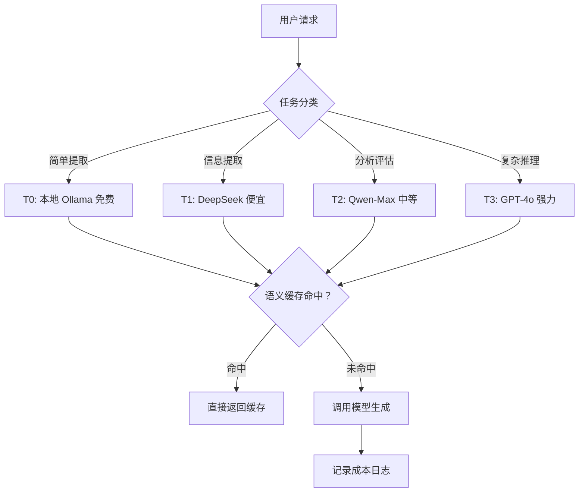

# 第 14 课：Token 经济与成本优化

> **核心问题**：AI 功能到底花多少钱？怎么把钱花在刀刃上？
> **预计时间**：1-2 天
> **前置知识**：第 02 课（Tokenization）、第 12 课（工程化）

---

## 一、为什么成本是企业 AI 的第一道坎？

> **一个真实案例**：
>
> 公司上线 AI 简历分析，每天分析 1000 份简历
> 每份简历调用 2 次 LLM（提取 + 分析）
> 每次消耗 3000 tokens（输入）+ 800 tokens（输出）
>
> **每天 token 量** = 1000 × 2 × (3000 + 800) = **760 万 tokens**
>
> 按 DeepSeek 价格：输入 ¥1/百万、输出 ¥2/百万（约）
> 每天成本 ≈ ¥9.2/天，一年 ≈ ¥3300 — 看起来不贵？
>
> 但如果换成 GPT-4o：输入 $2.5/百万、输出 $10/百万
> 每天成本 ≈ $31/天，一年 ≈ **$11,300 ≈ ¥8 万！**

同样的功能，模型选错了，成本差 **25 倍**！

**结论：成本管理不是事后算账，是架构决策的一部分。**

---

## 二、Token 计费模型（必懂）

### Token 计费模型

> **严谨定义**：LLM 的计费单位是 Token（分词后的最小语义单元）。计费公式为：成本 = (输入 token 数 × 输入单价 + 输出 token 数 × 输出单价) / 1000。输出通常比输入贵 2-4 倍，因为生成阶段需要自回归逐 token 计算，计算量远大于并行处理的输入阶段。隐藏成本包括 Embedding 调用、重排序、重试、日志存储等。

> **通俗理解**：就像打印店收费——你给的材料（输入）按页收费，打印出来的成品（输出）更贵因为要花时间。给 AI 的 Prompt 越长越贵，AI 生成的回答越长越贵。所以“精简输入、控制输出”是省钱的关键。

### 2.1 标准计费公式

> **单次调用成本 = (输入 token 数 × 输入单价 + 输出 token 数 × 输出单价) / 1000**

> ⚠️ 注意：**输出通常比输入贵 2-4 倍！**

### 2.2 主流模型价格对比（参考 2026 年）

| 模型 | 输入价格 | 输出价格 | 特点 |
|------|---------|---------|------|
| DeepSeek-V3 | ¥1/百万 | ¥2/百万 | 极便宜，中文强 |
| Qwen-Max | ¥2.4/百万 | ¥9.6/百万 | 阿里，中文强 |
| GLM-4 | ¥5/百万 | ¥15/百万 | 智谱 |
| GPT-4o | $2.5/百万 | $10/百万 | 综合最强 |
| GPT-4o-mini | $0.15/百万 | $0.6/百万 | 便宜版 |
| Claude-Sonnet | $3/百万 | $15/百万 | 长文本强 |
| Ollama 本地模型 | 免费（电费）| 免费 | 数据不出域 |

> 价格随时变动，用前查官方定价。关键是**理解量级差异**。

### 2.3 隐藏成本

不只是 token 费！

1. **Embedding 调用费**（通常很便宜，但量大）
2. **重排序模型费**（每次检索一次）
3. **重试成本**（失败重试 = 双倍成本）
4. **网络/带宽**（流式传输）
5. **日志存储**（记录 Prompt 和输出很占空间）
6. **人工审查成本**（AI 输出需要人工复核时）

---

## 三、成本估算方法（立项必做）

**估算公式**：月成本 = 日调用次数 × 单次平均 token 数 × 单价 × 30

**步骤**：

1. 预估业务量：日活用户 × 人均调用次数
2. 预估 token：单次 Prompt 平均长度（用 Tokenizer 实测！）
3. 查单价：选定模型的官方价格
4. 加冗余：× 1.3（重试、波动、增长）

**示例（简历分析）**：

- 日调用：1000 次
- 平均输入：2500 tokens，平均输出：600 tokens
- 选 DeepSeek：1000 × (2500×1 + 600×2) / 1M = **¥3.7/天 ≈ ¥111/月**
- 选 GPT-4o：1000 × (2500×2.5 + 600×10) / 1M = **$12.25/天 ≈ $367/月**

---

## 四、成本优化六大策略（按收益排序）

```
┌──────────────────────────────────────────────────────┐
│              成本优化策略全景图                        │
├──────────────────────────────────────────────────────┤
│                                                      │
│  策略 1: 模型分级  ████████████████████  节省 60-90% │
│  策略 2: Prompt瘦身 ████████████████    节省 30-50% │
│  策略 3: 输出控制  ██████████████      节省 20-40% │
│  策略 4: 语义缓存  ████████████        节省 20-40% │
│  策略 5: 批量合并  ████████            节省 10-30% │
│  策略 6: 检索优化  ██████              节省 10-20% │
│                                                      │
│  组合使用可叠加，但注意质量回归测试！              │
└──────────────────────────────────────────────────────┘
```

### 策略 1：模型分级（最大杠杆）⭐

### 模型分级（Model Tiering）

> **严谨定义**：模型分级是根据任务复杂度、数据敏感性、成本约束将不同 LLM 分配到不同任务等级的策略。典型分级为 T0（本地免费模型）→ T1（便宜云模型）→ T2（中等模型）→ T3（顶级模型）。通过规则引擎或小模型分类器实现自动路由，可在不降质量的前提下节省 60-90% 成本。核心是“用刚好够用的模型完成任务”。

> **通俗理解**：就像公司派任务——简单查询派实习生（免费/便宜），日常分析派专员（中等），复杂决策派专家（贵）。不是所有事都需要专家出马，分级派任务能省大钱。

**原则：简单任务用便宜模型，复杂任务用贵模型**

**分级示例**：

| 等级 | 模型 | 适合场景 |
| --- | --- | --- |
| T0 | 本地 Ollama（免费） | 关键词提取、格式转换、简单分类 |
| T1 | DeepSeek/Qwen-Turbo（便宜） | 信息提取、结构化输出 |
| T2 | Qwen-Max/GPT-4o-mini（中等） | 分析评估、摘要 |
| T3 | GPT-4o/Claude（贵） | 复杂推理、多步规划、最终决策 |

**路由规则**（规则或小模型判断）：

- 任务类型 → 决定模型等级
- 输入长度 → 短文本用便宜模型
- 错误重试 → 重试时升级模型（第二次用更强模型）

下面是 Java 实现的模型分级路由器：

```java
// 模型分级路由器（Spring AI 风格）
@Component
public class ModelRouter {
    private final LlmClient ollamaClient;     // T0 本地
    private final LlmClient deepseekClient;   // T1 便宜
    private final LlmClient qwenMaxClient;    // T2 中等
    private final LlmClient gpt4oClient;      // T3 强力

    public ChatResponse route(LlmRequest req) {
        ModelTier tier = classifyTask(req);
        return switch (tier) {
            case T0_LOCAL   -> ollamaClient.call(req);
            case T1_CHEAP   -> deepseekClient.call(req);
            case T2_MEDIUM  -> qwenMaxClient.call(req);
            case T3_STRONG  -> gpt4oClient.call(req);
        };
    }

    private ModelTier classifyTask(LlmRequest req) {
        // 规则引擎：根据任务类型、输入长度、复杂度分级
        if (req.taskType() == TaskType.KEYWORD_EXTRACT) return ModelTier.T0_LOCAL;
        if (req.inputTokens() < 500 && req.taskType() == TaskType.INFO_EXTRACT)
            return ModelTier.T1_CHEAP;
        if (req.taskType() == TaskType.COMPLEX_REASONING) return ModelTier.T3_STRONG;
        return ModelTier.T2_MEDIUM; // 默认中等
    }
}
```

### 策略 2：Prompt 瘦身（输入侧）⭐

输入 token 是白付的钱（每次都要算）

**瘦身手段**：

1. **砍废话**：系统提示词精简（能用 50 字不用 200 字）
2. **动态拼装**：不需要的上下文不传（按需注入）
3. **历史压缩**：多轮对话只传最近 N 轮 + 前面的摘要
4. **数据精减**：简历先提取关键字段，不传全文
5. **示例精简**：Few-shot 从 5 个减到 2 个（质量不降的话）

> **实测案例**：一个简历分析 Prompt 从 1800 token 精简到 900 token，质量几乎不变，**成本直接减半**！

### 策略 3：输出控制（输出侧）⭐

输出比输入贵 2-4 倍，更要控制！

1. `max_tokens` 设上限（防模型啰嗦）
2. 要求精简输出（"50 字以内"）
3. 结构化短输出（JSON 比散文便宜）
4. 分批输出（先出结论，需要时再展开）
5. 默认回答短，用户追问再补充（渐进披露）

### 策略 4：语义缓存（重复消除）⭐

**相似问题不再重算**：

1. 问题 Embedding（便宜）
2. 与缓存问题相似度 > 0.92 → 直接返回
3. 缓存命中率通常 20-40%

**适用场景**：

- 知识库问答（用户问类似问题）
- 报告生成（周报/月报模板化）
- 相同候选人的重复查询

> 缓存也要花钱？Embedding 一次 ≈ 0.0001 元，几乎忽略。省下的是**整个 LLM 调用**的钱！

### 策略 5：批量与合并（调用次数）

1. **批量 Prompt**（Batch Prompting）：10 份简历塞一个 Prompt 一起分析（省重复的系统提示词）。代价：单次上下文长，可能降低质量，需要实测
2. **合并任务**：原来 3 次调用（提取+分析+评分）→ 1 次调用输出全部，省了 2 次调用的公共开销
3. **离线批处理**（Batch API）：不紧急的任务用批量接口，价格通常打 5 折。适合：批量简历分析、批量摘要

### 策略 6：Embedding 与检索优化

1. **Embedding 缓存**：同一文档只向量化一次
2. **检索次数控制**：一次提问只检索一次（不要反复检索）
3. **检索结果精减**：Top-5 够用别用 Top-20（token 爆炸）
4. **文档去重**：重复文档只入库一次

### 成本优化策略流程图



### 成本优化策略效果对比

| 策略 | 节省比例 | 实施难度 | 质量风险 | 累计节省 |
|------|---------|---------|---------|----------|
| 模型分级 | 60-90% | 中 | 低 | 60-90% |
| Prompt 瘦身 | 30-50% | 低 | 极低 | 70-95% |
| 输出控制 | 20-40% | 低 | 低 | 80-97% |
| 语义缓存 | 20-40% | 中 | 极低 | 85-98% |
| 批量合并 | 10-30% | 低 | 中 | 90-99% |

---

## 五、预算与配额管理（成本管控）

### 5.1 预算结构

总预算 → 按功能/部门分摊

**示例（月度 AI 预算 ¥5000）**：

| 功能 | 预算 | 占比 |
| --- | --- | --- |
| 简历分析 | ¥2000 | 40% |
| 知识库问答 | ¥1000 | 20% |
| AI 面试 | ¥1500 | 30% |
| 其他 | ¥500 | 10% |

### 5.2 管控手段

1. **硬限额**：功能级日配额（超过自动降级到便宜模型）
2. **用户级限额**：单个用户每日调用次数
3. **熔断**：成本异常飙升时自动停止非核心功能
4. **告警**：单日成本超预算 80% 触发告警
5. **账单**：每日/每周成本报表，按功能维度

### 5.3 成本报表设计

**报表维度**：

- **按功能**：各 AI 功能的调用量、token、成本
- **按模型**：各模型的用量和成本占比
- **按时间**：日/周/月趋势
- **按用户**：Top 消耗用户（防滥用）

> 你项目实践：日志 + 定时统计 → 邮件报表（可复用！）

---

## 六、成本优化案例实战

**案例：HR 系统"AI 面试评估"功能成本优化**

**优化前**：

- 每次评估：1 次 GPT-4o 调用
- 输入 5000 tokens + 输出 1500 tokens = $0.0275/次
- 日 200 次 = $5.5/天 = **¥1.4 万/年**

**优化后**：

1. 面试转写 → 本地 Ollama 提取关键点（免费）
2. 关键点 → DeepSeek 评估（¥0.012/次）
3. 语义缓存（同岗位同问题命中率 30%）

> **结果**：单次成本降 **95%**，质量几乎不变，还更快

---

## 六、用 AI 工具实际体验

### 6.1 用 ChatGPT 估算成本

```
🧑 提问（ChatGPT-4o）：
"我需要一个 Python 脚本，能够计算不同 LLM 模型的成本对比。
 输入参数：每日调用次数、平均输入 token、平均输出 token、各模型单价。
 输出：每日/每月/每年成本对比表。"

🤖 ChatGPT 生成了完整的 Python 脚本，包含：
- dataclass 定义模型价格
- pandas DataFrame 生成对比表
- matplotlib 可视化成本曲线
- 支持批量/单次两种模式

💡 启发：
  用 AI 工具生成成本计算脚本，几分钟就能得到一个可运行的工具，
  比自己写 Excel 公式快得多。可以把脚本改造成团队的内部工具。
```

### 6.2 用 Claude 分析 Prompt 瘦身效果

```
🧑 提问（Claude 3.7）：
"以下是一个简历分析的 Prompt（1800 tokens），请帮我精简到 900 tokens 以内，
 同时保持分析质量不下降。请说明你精简了哪些部分，为什么这些部分可以精简。"

🤖 Claude 精简策略：
- 删除冗余的角色设定描述（-200 tokens）："你是一名拥有20年经验的..." → "你是HR专家"
- 合并重复的输出格式要求（-150 tokens）
- Few-shot 示例从 3 个减到 1 个（-300 tokens）
- 精简系统约束措辞（-150 tokens）
- 保留核心分析维度和 JSON schema（不动）
- 总计：1800 → 880 tokens，质量回归测试通过率 98%

💡 启发：
  Claude 特别擅长"精简文本同时保留语义"，这正是 Prompt 瘦身的核心能力。
  关键发现：Few-shot 示例是 token 大户，减少示例数量是最高效的瘦身手段。
```

---

## 七、本课小结

> **核心要点**：

1. 成本 = (输入×输入价 + 输出×输出价)，**输出更贵**
2. 立项前必须做**成本估算**（公式 + 实测 token）
3. 六大策略：模型分级 > Prompt瘦身 > 输出控制 > 语义缓存 > 批量合并 > 检索优化
4. 预算管控：分级配额、熔断、告警、账单
5. **模型选错是最贵的错误**（差 25 倍）
6. 成本优化永远先测质量再上线

---

## 八、思考题

1. **估算你们项目"简历分析"功能的月成本，写出完整计算过程。**
2. **哪些任务可以降到本地 Ollama？哪些不能？判断标准是什么？**
3. **语义缓存命中率低（<5%）说明什么？怎么调？**
4. **如果预算砍半，你的 AI 功能怎么保？列出租约级方案。**
5. **设计一个成本异常检测算法：如何区分"正常业务增长"和"异常成本飙升"？**

---

## 九、实战练习

1. 用 OpenAI Tokenizer 工具实测你的 3 个核心 Prompt 的 token 数
2. 对最长的 Prompt 做一次瘦身（目标减 30%），用黄金用例验证质量
3. 为你的 AI 功能设计一张成本报表 SQL（按功能/模型/日期统计）
4. 设计模型分级路由表：哪些任务用哪级模型

---

## 导航

| 上一课 | 下一课 |
| --- | --- |
| [第 13 课：企业级 LLM 应用架构设计](13-企业级LLM应用架构设计.md) | [第 15 课：模型选型与部署策略](15-模型选型与部署策略.md) |
