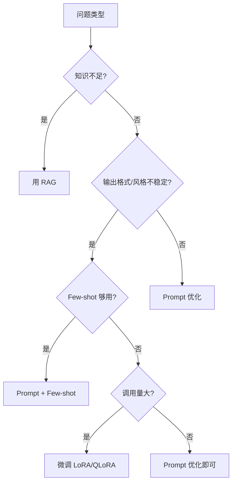

# 第 18 课：LLM 微调实战

> **核心问题**：什么时候该微调？怎么用 LoRA 用私有数据微调模型？
> **预计时间**：3 天
> **前置知识**：第 01 课（Transformer 原理）、第 15 课（模型选型）

---

## 一、微调 vs RAG vs Prompt（决策框架）

| 问题类型 | 方案 |
| --- | --- |
| 知识不足（没数据/数据新） | → **RAG**（检索补充） |
| 推理/格式不稳定 | → **Prompt 优化** |
| 输出风格不像"你们公司的" | → Few-shot → **微调** |
| 需要高频稳定执行特定任务 | → **微调** |
| 需要学习私有领域"思维方式" | → **微调** |
| 需要学习私有数据"事实" | → **RAG**（别微调！事实会过时） |

> **核心原则**：微调学"行为和格式"，不学"事实"。事实会变 → 用 RAG；行为不变 → 微调

### 1.1 何时值得微调？

**值得微调的信号**：

- ✅ 每天调用量大（微调摊薄成本）
- ✅ 输出格式高度固定（JSON 结构化、特定风格）
- ✅ Few-shot 已经不够（示例太长太贵）
- ✅ 模型总是不听指令（特定领域指令理解差）
- ✅ 需要模仿特定专家风格（HR 报告、法务意见）

**不值得微调的信号**：

- ❌ 知识型问题（该用 RAG）
- ❌ 调用量小（微调投入 > 收益）
- ❌ 模型换得快（微调成果绑定模型版本）
- ❌ 没有高质量数据（垃圾进垃圾出）

---

## 二、微调核心概念

### 核心概念深度解析

### LoRA（低秩适应）

> **严谨定义**：LoRA（Low-Rank Adaptation）是一种参数高效微调（PEFT）技术，通过在预训练权重矩阵旁注入低秩分解矩阵（W = W₀ + BA，其中 B∈R^(d×r)，A∈R^(r×k)，r << min(d,k)），仅训练少量新增参数（通常减少 90%+ 训练参数量），实现模型适配下游任务。训练时 W 冻结，只更新 A、B；推理时可将 BA 合并回 W，无额外推理延迟。

> **通俗理解**：就像你已经是资深 Java 开发，要学一个新框架。你不需要重新学编程（预训练权重），只需要学习这个框架特有的几个概念（低秩矩阵）。LoRA 就是让大模型“只学新东西，保留旧知识”。

### 灾难性遗忘（Catastrophic Forgetting）

> **严谨定义**：灾难性遗忘是指神经网络在微调过程中，由于新任务数据的梯度更新覆盖了预训练阶段学到的通用知识表示，导致模型在原始任务上的性能显著下降的现象。在 LLM 微调中表现为数学/代码/常识能力的丧失。

> **通俗理解**：就像一个全栈工程师，为了专门做前端而把所有后端知识都忘了。微调时模型“过度学习”新任务，把原来的通用能力覆盖掉了。解决办法是混合一些通用数据，让它“边学新边复习”。

### 量化（Quantization）

> **严谨定义**：量化是将模型权重从高精度浮点数（FP32/FP16）转换为低精度表示（INT8/INT4）的技术，通过减少每个参数的位宽来降低显存占用和计算开销。QLoRA 中使用 NF4（Normal Float 4-bit）量化，在几乎不损失精度的情况下将 7B 模型显存需求从 16GB 降至 8GB。

> **通俗理解**：就像把高清图片压缩成缩略图——细节损失一点点，但占用空间大大减少。量化后的模型“差不多一样聪明”，但你的显卡负担轻了一半。

```
┌────────────────────────────────────────────────────────┐
│              微调方式对比                                │
├─────────────┬──────────┬──────────┬────────────────┤
│             │ 全参数微调 │ LoRA    │ QLoRA          │
├─────────────┼──────────┼──────────┼────────────────┤
│ 训练参数    │ 100%     │ ~1%      │ ~1%            │
│ 7B 显存需求 │ 60GB+    │ 16GB     │ 8GB            │
│ 72B 显存   │ 400GB+   │ 160GB    │ 48GB           │
│ 训练速度    │ 慢       │ 快       │ 中等           │
│ 效果       │ 最佳     │ 接近全参  │ 接近 LoRA      │
│ 显卡要求    │ A100+    │ RTX4090  │ RTX 3090/4090  │
│ 推荐场景    │ 研究/大规模│ 企业主流 │ 资源受限       │
└─────────────┴──────────┴──────────┴────────────────┘
```

### 微调决策流程图



### 2.1 三种微调方式

**全参数微调（Full Fine-tuning）**：

- 调整模型所有参数（7B = 70 亿参数）
- 需要大量 GPU（7B 全参 ≈ 60GB+ 显存）
- 效果最好但成本最高

**LoRA（Low-Rank Adaptation）** ⭐ 主流：

- 冻结原模型，只训练两个小矩阵（低秩分解）
- 训练参数减少 99%+（7B 只训练 0.1-1% 参数）
- 消费级显卡就能训（7B LoRA ≈ 16GB 显存）

**QLoRA（量化 + LoRA）**：

- LoRA + 4bit 量化基座模型
- 7B QLoRA ≈ 8GB 显存（笔记本可跑！）
- 效果接近全量微调

### 2.2 LoRA 原理（一句话版）

- **原始**：更新 W 全部参数（70 亿个）
- **LoRA**：W' = W + A×B（A、B 是小矩阵，只有几百万个参数）

训练时只更新 A、B，W 冻结；推理时把 A×B 加回去 → 模型行为改变，参数几乎没变

**好处**：

1. 训练快（参数少）
2. 显存小（不需要存梯度）
3. 可插拔（一个底座 + 多个 LoRA 适配器，按需加载）

### 2.3 LoRA 关键超参数解释

**rank (r)**：低秩矩阵的秩

- `r=8`：适合简单任务（格式调整、简单分类）
- `r=16`：中等复杂度（信息提取、分析评估）
- `r=64`：复杂任务（多步推理、创意生成）
- 经验：r 越大表达能力越强，但过拟合风险也越大

**alpha**：缩放系数，通常设为 rank 的 2 倍

- `scaling = alpha / rank`
- 实际更新：W' = W + scaling × A×B

**target_modules**：哪些层应用 LoRA

- `q_proj, v_proj`：最基本（注意力层）
- `all`：所有线性层（效果最好，参数稍多）
- 经验：HR 场景建议用 `all`

**dropout**：防止过拟合

- `0.05-0.1`：数据量大（>5000 条）
- `0.1-0.2`：数据量小（<2000 条）

---

## 三、微调数据准备（决定成败的关键）

### 3.1 数据格式

```
主流格式：指令（Instruction）数据

{
  "instruction": "分析以下简历与Java后端岗位的匹配度",
  "input": "张三，5年Java经验，熟悉Spring Boot...",
  "output": "匹配度：85分。优势：...不足：..."
}

对话格式（多轮）：
{
  "messages": [
    {"role": "system", "content": "你是HR招聘专家"},
    {"role": "user", "content": "分析这份简历"},
    {"role": "assistant", "content": "好的，这份简历..."}
  ]
}
```

### 3.2 数据质量要求

**数量**：任务简单 500-2000 条；复杂任务 5000+ 条

**质量比数量重要**：

1. 每条数据必须真实、准确（错误数据 = 教坏模型）
2. 覆盖各种边界情况（空字段、超长、异常输入）
3. 输出格式严格统一（模型学的就是你给的）
4. 去重（重复数据导致过拟合）

**数据来源**：

1. 历史高质量回答（人工筛选）
2. 人工编写（专家标注）
3. LLM 生成 + 人工审核（性价比高）
4. 你的业务数据（脱敏后）

**数据清洗**：

- 去除：个人信息、公司机密、错误样本、重复样本
- 规范化：格式统一、术语统一
- 比例控制：难样本 20-30%（太难学不会）

### 3.3 数据集划分

- **训练集 80%**：模型学习
- **验证集 10%**：训练过程监控（防过拟合）
- **测试集 10%**：最终评估（模型没见过的）

> ⚠️ **测试集绝不能参与训练！**否则评估失真

---

## 四、微调实战流程（LLaMA-Factory 示例）

### 4.1 环境准备

```bash
# 需要：Python 3.10+、PyTorch、CUDA 显卡（16GB 以上）
pip install llama-factory

# 或克隆官方仓库
git clone https://github.com/hiyouga/LLaMA-Factory.git
cd LLaMA-Factory
pip install -e .
```

### 4.2 数据准备

```bash
# data/dataset_info.json 注册数据集
{
  "hr_resume_analysis": {
    "file_name": "hr_resume_analysis.json",
    "formatting": "sharegpt",
    "columns": {
      "messages": "messages"
    }
  }
}
```

### 4.3 启动训练（QLoRA）

```bash
# 命令行训练 7B 模型（16GB 显存可跑）
llamafactory-cli train \
  --model_name_or_path Qwen/Qwen2.5-7B-Instruct \
  --dataset hr_resume_analysis \
  --finetuning_type lora \
  --quantization_bit 4 \
  --lora_target all \
  --output_dir ./lora_hr \
  --num_train_epochs 3 \
  --learning_rate 2e-4 \
  --per_device_train_batch_size 4 \
  --gradient_accumulation_steps 4 \
  --logging_steps 10 \
  --save_steps 500 \
  --eval_steps 500 \
  --do_train true \
  --do_eval true
```

### 4.4 训练监控

**观察指标**：

- **loss**（训练损失）：下降趋势正常（3→0.5）
- **eval_loss**（验证损失）：下降 → 上升 = **过拟合信号！**
- **学习率曲线**：正常衰减

**过拟合处理**：

- 减少 epoch（3 → 2）
- 增加数据量
- 调低学习率

### 4.5 合并与导出

```bash
# LoRA 适配器合并到基础模型（生成完整模型文件）
llamafactory-cli export \
  --model_name_or_path Qwen/Qwen2.5-7B-Instruct \
  --adapter_name_or_path ./lora_hr \
  --template qwen \
  --finetuning_type lora \
  --export_dir ./merged_hr_model
```

### 4.6 部署（vLLM / Ollama）

```bash
# vLLM 部署合并后的模型
vllm serve ./merged_hr_model --port 8000

# 或转 GGUF 给 Ollama（量化后本地跑）
ollama create hr-expert -f Modelfile
# Modelfile: FROM ./merged_hr_model-q4.gguf
```

---

## 五、微调评估（必须做的验证）

### 5.1 对比评估

同一批测试集，对比三个版本：**原始模型 vs Prompt 优化 vs 微调后**

**评估维度**：

1. 格式正确率（JSON 是否合法）
2. 内容准确率（关键信息是否提取对）
3. 指令遵循率（是否按规则输出）
4. 幻觉率（编造信息的比例）
5. 成本（token 消耗是否减少）

**结论判断**：

- 微调后明显更好 → **值得**
- 差不多 → 微调不值得，Prompt 够了
- 变差 → 数据有问题或参数不对

### 5.2 防灾难性遗忘

微调可能"忘掉"通用能力（数学/代码/常识能力下降）

**检测**：跑一遍通用测试集（MMLU 子集）

**预防**：

- 混合通用数据（10-20% 通用指令）
- 不要过度训练（epoch 过多）

---

## 六、用 AI 工具实际体验

### 6.1 用 ChatGPT 生成微调训练数据

```
🧑 提问（ChatGPT-4o）：
"请帮我生成 10 条简历分析微调训练数据，格式如下：
 {instruction, input, output}
 要求：
 - instruction: 分析简历与Java后端岗位的匹配度
 - input: 不同背景的简历（5年Java/3年前端转后端/应届生/10年架构师/外包经验）
 - output: 包含评分(0-100)、优势、不足、建议，严格JSON格式
 - 评分要合理分布（不要都打高分）"

🤖 ChatGPT 生成了 10 条高质量训练数据：
- 5年Java → 85分，优势：经验丰富，不足：微服务经验未提及
- 3年前端转后端 → 55分，优势：编程基础，不足：Java经验不足
- 应届生 → 45分，优势：基础扎实，不足：无项目经验
- 10年架构师 → 92分，优势：架构能力，不足：可能薪资期望过高
- 外包经验 → 65分，优势：项目多样，不足：深度不足

💡 启发：
  AI 工具生成训练数据的效率非常高，但必须人工审核：
  1. 检查评分是否合理（AI 可能偏向高分）
  2. 检查 JSON 格式是否完全一致
  3. 检查“不足”是否客观（AI 可能过于客气）
  建议：AI 生成 80% + 人工编写 20%（边界用例）
```

### 6.2 用 Claude 分析训练日志

```
🧑 提问（Claude 3.7）：
"我的 LoRA 微调训练日志如下，请帮我分析是否有问题：
 epoch 1: train_loss=3.2, eval_loss=2.8
 epoch 2: train_loss=1.1, eval_loss=1.5
 epoch 3: train_loss=0.3, eval_loss=1.8
 epoch 4: train_loss=0.1, eval_loss=2.5
 请问：哪一epoch的模型最好？是否有过拟合？建议怎么调整？"

🤖 Claude 分析：
- 最佳 epoch 是 2（eval_loss 最低 = 1.5）
- epoch 3 开始明显过拟合：train_loss 继续下降但 eval_loss 上升
- epoch 4 严重过拟合：train_loss=0.1 几乎背下了训练数据
- 建议：
  1. 使用 epoch 2 的模型
  2. 设置 early_stopping_patience=2（eval_loss 连续 2 次不降就停）
  3. 增加数据量或数据多样性
  4. 降低学习率（2e-4 → 1e-4）
  5. 增加 dropout（0.05 → 0.1）

💡 启发：
  AI 工具能快速分析训练日志并给出专业建议。
  关键发现：eval_loss 上升是过拟合的最早信号，必须监控。
```

---

## 七、微调常见坑

| 坑 | 问题 | 对策 |
| --- | --- | --- |
| 坑 1 | 数据错误 → 模型"学会"错误 | 数据三重检查（规则校验 + 人工抽查 + 小样本试训） |
| 坑 2 | 过拟合 → 只会背题 | 验证集监控 eval_loss，早停；数据多样化 |
| 坑 3 | 格式不一致 → 模型输出混乱 | 输出格式严格统一（每条都要一样） |
| 坑 4 | 领域漂移 → 通用能力下降 | 混入通用数据、控制训练量 |
| 坑 5 | 评估用训练数据 → 假高分 | 测试集绝对独立 |
| 坑 6 | 微调后没解决 → 问题其实在别处 | 先确认是"行为问题"再微调 |

---

## 八、微调在企业的实际应用案例

**案例：HR 简历分析微调**

**痛点**：GPT-4o 分析简历输出格式不稳定（有时 JSON 有时散文），每次都要重试 2-3 次

**方案**：

1. 收集 800 条高质量分析样例（人工修正 LLM 输出）
2. QLoRA 微调 Qwen2.5-7B（本地部署）
3. 结果：格式正确率 92% → 99%，成本降 90%

> ⚠️ 这个方案的前提是"格式行为"问题，不是"知识"问题。如果简历分析需要最新行业知识 → 仍需 RAG 配合

---

## 九、本课小结

> **核心要点**：

1. 决策框架：学"行为"用微调，学"事实"用 RAG
2. LoRA/QLoRA：只训 1% 参数，消费级显卡可跑
3. **数据决定成败**：500-2000 条高质量、格式统一、边界覆盖
4. 流程：注册数据 → 训练（监控 loss）→ 合并 → 部署 → 评估
5. 评估必须对比：原模型 vs Prompt vs 微调
6. 防灾难性遗忘：混合通用数据、控制 epoch
7. 微调是"最后的武器"，先用完 Prompt 和 RAG 的潜力

---

## 十、思考题

1. **你们项目的简历分析，是"知识问题"还是"行为问题"？微调值得吗？**
2. **为什么微调学"事实"不好？事实会过时的例子是什么？**
3. **LoRA 为什么比全参数微调省这么多资源？原理是什么？**
4. **如果微调后模型开始"一本正经胡说"，先检查什么？**（数据？参数？）

---

## 十一、实战练习

1. 从你的历史 AI 分析记录中整理 20 条微调样本（instruction/input/output）
2. 检查这 20 条的输出格式是否完全一致（不一致先统一）
3. 用 LLaMA-Factory 对 Qwen2.5-3B 做一次 1 epoch 试训（如果显卡允许）
4. 设计一个对比实验：同一测试集，原模型 vs 微调模型，列出评估维度

---

## 十二、延伸阅读

- LoRA 论文：《LoRA: Low-Rank Adaptation of Large Language Models》
- QLoRA 论文：《QLoRA: Efficient Finetuning of Quantized LLMs》
- LLaMA-Factory 文档：https://github.com/hiyouga/LLaMA-Factory

---

## 导航

| 上一课 | 下一课 |
| --- | --- |
| [第 17 课：生产级 Prompt 工程](17-生产级Prompt工程.md) | [第 19 课：多模态应用实战](19-多模态应用实战.md) |
