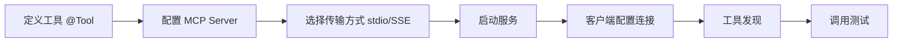

# 第 23 课：MCP 与 AI 工具生态

> **核心问题**：怎么让 AI 能力"标准化"地连接一切系统？
> **预计时间**：2 天
> **前置知识**：第 08 课（Function Calling）、第 10 课（Multi-Agent）

---

## 一、MCP 是什么？

**MCP（Model Context Protocol，模型上下文协议）**
由 Anthropic 于 2024 年提出的**开放标准协议**，用于 LLM 与外部工具/数据源的标准化连接。

> **类比：USB 接口**
>
> 以前：每个设备有专属接口（每个 AI 应用对接每个系统都要定制）
> MCP：统一接口标准（一次开发，处处连接）

### 核心价值

**没有 MCP 之前**：每个 AI 应用对接每个系统 = 定制开发

**有了 MCP**：

- 数据库供应商提供"一个 MCP Server"
- 任何 AI 应用（支持 MCP 的）直接连接使用
- **一次开发，处处复用**

---

## 二、MCP 架构

### 核心概念深度解析

### MCP（Model Context Protocol，模型上下文协议）

> **严谨定义**：MCP 是由 Anthropic 于 2024 年提出的开放标准协议，用于规范化 LLM 与外部工具/数据源的连接。基于 JSON-RPC 2.0 协议，采用 Host → Client → Server 三层架构。MCP 提供三要素：工具（Tools，可调用函数）、资源（Resources，可读取数据）、提示词（Prompts，可复用模板）。核心价值是“一次开发，处处复用”，将 AI 与外部系统的连接从定制化变为标准化。

> **通俗理解**：就像 USB 接口——以前每个设备（打印机、鼠标、键盘）都有专属接口，现在统一用 USB，插上就能用。MCP 就是 AI 的“USB 接口”，数据库、文件系统、API 只要实现 MCP Server，任何 AI 应用都能直接调用，不用每次都重新开发。

### Agent Card（Agent 名片）

> **严谨定义**：Agent Card 是 Agent 的自描述元数据，包含名称、描述、能力标签、端点地址、认证方式等信息。在 A2A（Agent-to-Agent）协议中，Agent Card 用于服务发现和能力匹配，类似微服务架构中的服务注册信息。

> **通俗理解**：就像你的 LinkedIn 个人资料——告诉别人你叫什么、擅长什么、怎么联系你。Agent Card 就是 AI Agent 的“名片”，其他 Agent 看到名片就知道“这个 Agent 擅长简历筛选，可以通过这个地址调用它”。

### 工具发现（Tool Discovery）

> **严谨定义**：工具发现是指 MCP Client 在连接 Server 时，自动获取该 Server 暴露的所有工具列表及其参数描述（JSON Schema）的机制。这使得 LLM 能够动态了解可用工具，并在推理时选择合适的工具调用。工具发现是 Agent 自主决策的基础。

> **通俗理解**：就像你进入一个新厨房，先看一眼灶台、烤箱、微波炉上都有什么按钮。工具发现就是 AI“查看”有哪些工具可用，每个工具能做什么、需要什么参数，然后决定“现在该用哪个工具”。

```
┌─────────────────────────────────────────┐
│ Host（宿主）                              │
│  AI 应用 / IDE / 桌面助手                  │
│  如：Claude Desktop、Cursor、Qoder        │
└──────────────────┬──────────────────────┘
                   │ MCP 协议（JSON-RPC 2.0）
                   │ （stdio / HTTP/SSE 传输）
┌──────────────────┴──────────────────────┐
│ Client（客户端）                          │
│  管理连接、工具发现、调用转发               │
└──────────────────┬──────────────────────┘
                   │
┌──────────────────┴──────────────────────┐
│ Server（服务器）                          │
│  暴露工具/资源/提示词                      │
│  ┌─────────┐ ┌─────────┐ ┌─────────┐   │
│  │ 数据库   │ │ 文件系统 │ │ 外部 API │   │
│  │ Server  │ │ Server  │ │ Server  │   │
│  └─────────┘ └─────────┘ └─────────┘   │
└─────────────────────────────────────────┘
```

### MCP 三要素

1. **工具（Tools）**：可调用的函数（类似 Function Calling，但标准化了协议）
2. **资源（Resources）**：可读取的数据（文件、数据库记录、API 数据）
3. **提示词（Prompts）**：可复用的 Prompt 模板（标准化的提示词共享机制）

---

## 三、MCP 与 Function Calling 的关系

**Function Calling**：模型与"你的函数"的接口（单应用内部）
**MCP**：模型与"任意系统"的标准化接口（跨应用通用）

**关系**：

- MCP 是 Function Calling 的"标准化 + 生态化"
- Function Calling 是你写代码时直接用的
- MCP Server 把工具"包装"成标准协议
- 模型通过 MCP Client 发现并调用远程工具

> 你的项目视角：现有 Function Calling（Spring AI tools）→ 单应用内；未来接入 MCP → 你的 AI 能调用全公司的系统！

---

## 四、MCP Server 开发实战

### MCP Server 开发流程图



```
┌──────────────────────────────────────────────────────────┐
│           MCP Server 开发流程                              │
├──────────────────────────────────────────────────────────┤
│                                                          │
│  1. 定义工具 ─→ @Tool 注解标记方法                      │
│       │                                                │
│  2. 配置服务 ─→ application.yml 启用 MCP Server       │
│       │                                                │
│  3. 选择传输 ─→ stdio(本地) / SSE(网络)              │
│       │                                                │
│  4. 启动服务 ─→ 独立进程 / 嵌入应用                    │
│       │                                                │
│  5. 客户端配置 ─→ Host 添加 MCP Server 连接          │
│       │                                                │
│  6. 测试验证 ─→ 工具发现 + 调用测试                    │
└──────────────────────────────────────────────────────────┘
```

### 4.1 开发一个 HR 数据库 MCP Server

```java
// 使用 Spring AI MCP Server 支持（mcp-server 依赖）
@Configuration
public class HrMcpServerConfig {

    // 用 @Tool 注解暴露工具（与 Function Calling 类似）
    @Tool(description = "根据姓名查询候选人基本信息")
    public CandidateInfo searchCandidate(String name) {
        return candidateMapper.findByName(name);
    }

    @Tool(description = "查询岗位下的候选人列表")
    public List<CandidateInfo> listCandidatesByPosition(Long positionId) {
        return candidateMapper.listByPosition(positionId);
    }

    @Tool(description = "获取候选人的简历分析报告")
    public AnalysisReport getAnalysisReport(Long candidateId) {
        return analysisService.getReport(candidateId);
    }
}
```

### 4.2 启动 MCP Server

```yaml
# application.yml
spring:
  ai:
    mcp:
      server:
        enabled: true
        name: hr-mcp-server
        version: 1.0.0
        # 暴露方式：stdio（本地进程）或 SSE（网络服务）
        type: stdio
```

### 4.3 客户端配置（AI 应用接入）

```json
{
  "mcpServers": {
    "hr-system": {
      "command": "java",
      "args": ["-jar", "hr-mcp-server.jar"],
      "env": {"SPRING_PROFILES_ACTIVE": "mcp"}
    }
  }
}
```

---

## 五、MCP 企业应用场景

**场景 1：统一数据访问**

- 公司各系统（HR/财务/CRM）各提供 MCP Server
- AI 助手通过标准协议访问所有系统数据

**场景 2：AI 开发工具链**

- IDE 的 MCP Server（代码库、构建、测试）
- AI 编码助手直接调用（你正在用的 Qoder 就是 MCP Host！）

**场景 3：跨部门 AI 协作**

- 招聘 Agent ↔ HR 系统（MCP） ↔ 面试系统（MCP） ↔ 邮件系统（MCP）

**场景 4：Agent 生态**

- MCP 成为 Agent 的"标准插件接口"
- 类似"App Store"模式

---

## 七、用 AI 工具实际体验

### 7.1 用 ChatGPT 生成 MCP Server 代码

```
🧑 提问（ChatGPT-4o）：
"请帮我用 Java + Spring AI 写一个完整的 MCP Server，
 暴露以下工具：
 1. searchCandidate(name) - 根据姓名查询候选人
 2. listCandidatesByPosition(positionId) - 查询岗位下的候选人
 3. getAnalysisReport(candidateId) - 获取分析报告
 4. updateCandidateStatus(candidateId, status) - 更新状态
 包含完整的配置和客户端接入示例。"

🤖 ChatGPT 生成了：
- 完整的 HrMcpServerConfig 类（@Tool 注解）
- application.yml 配置（stdio/SSE 两种模式）
- 客户端 mcpServers.json 配置
- 测试代码（工具发现 + 调用示例）
- 安全配置（API Key 认证）

💡 启发：
  MCP Server 的开发和 Function Calling 工具定义非常相似，
  主要区别在于协议标准化和跨应用复用。
  如果已经有 Spring AI 的 @Tool 注解，迁移成本几乎为零。
```

### 7.2 用 Claude 设计 MCP 安全策略

```
🧑 提问（Claude 3.7）：
"我要把 HR 系统的核心能力封装成 MCP Server，
 供公司内部的 AI 助手调用。请帮我设计安全策略：
 1. 哪些工具应该暴露？哪些不应该？
 2. 权限控制怎么做？
 3. 数据流安全怎么保障？
 4. 审计怎么做？"

🤖 Claude 安全方案：
- 暴露工具：查询类（search/list/get）✅，修改类（update/delete）⚠️ 需审批
- 不暴露：系统管理类（用户管理/角色配置/系统设置）❌
- 权限控制：每个 MCP 调用带调用方身份，服务端校验权限
- 数据安全：敏感字段（手机号/身份证）自动脱敏后返回
- 审计：每次调用记录工具名/参数/调用方/结果摘要

💡 启发：
  MCP 安全设计的核心原则：最小暴露 + 读易写难。
  查询类工具可以开放，修改类工具必须加权限和审批。
```

---

## 八、MCP 生态现状（2026）

**已支持 MCP 的平台**：

- Claude Desktop、Cursor、Qoder、VS Code
- OpenAI 也支持（ANYC 协议，趋同趋势明显）

**主流 MCP Server 示例**：

| 类别 | 示例 |
| --- | --- |
| 数据库 | PostgreSQL MCP、MySQL MCP |
| 文件 | 文件系统 MCP、Git MCP |
| 办公 | Slack、飞书、钉钉、Google Drive |
| 浏览器 | Playwright MCP、Chrome DevTools MCP |
| 开发 | GitHub、GitLab、Jira |

> 你环境中的 MCP：chrome-devtools、browser-use、schedule 等 → 这些就是 MCP Server！

---

## 九、MCP 的安全考量

1. **权限控制**：MCP Server 暴露的工具 = 攻击面，最小暴露原则
2. **认证授权**：远程 Server 用 API Key / OAuth，本地 Server 用进程隔离
3. **审计**：每次调用记录工具名/参数/调用方/结果摘要
4. **供应链**：MCP Server 来自第三方，审查来源、代码审计、依赖检查
5. **数据流**：敏感数据工具 → 本地部署 Server

---

## 十、未来趋势：Agent 与 MCP 的融合

**趋势 1**：MCP 成为 AI 应用的"USB-C" → 标准化连接一切系统 → 生态爆发

**趋势 2**：Agent 市场 → 组合"Agent + MCP Server 集"发布

**趋势 3**：企业 MCP 治理 → 企业级 MCP 注册中心（类似 API 网关）

**趋势 4**：多协议收敛 → MCP / ANYC / A2A 等协议逐步统一

> **你的机会**：把你们 HR 系统的核心能力封装成 MCP Server → 任何 AI 应用都能调用你们的招聘能力

---

## 十一、本课小结

> **核心要点**：

1. MCP = LLM 连接外部系统的**开放标准**（AI 的 USB 接口）
2. 架构：Host → Client → Server，JSON-RPC 协议
3. 三要素：工具（调用）、资源（读取）、提示词（复用）
4. MCP 是 Function Calling 的**标准化 + 生态化**
5. 用 `@Tool` 注解即可开发 MCP Server（Spring AI 支持）
6. 安全：最小暴露、鉴权、审计、供应链审查
7. 趋势：MCP 治理中心 + Agent 生态市场

---

## 十二、思考题

1. **你们 HR 系统哪些能力适合封装成 MCP Server？画出工具清单。**
2. **MCP 和 Function Calling 的区别是什么？什么时候用哪个？**
3. **如果第三方 MCP Server 有恶意工具，AI 应用怎么防？**
4. **MCP 的"工具发现"机制对 Agent 意味着什么？**
5. **设计一个 MCP Server 的版本管理方案，保证向后兼容性。**

---

## 十三、实战练习

1. 查看你 IDE 里已接入的 MCP Server（chrome-devtools 等），理解它们如何工作
2. 用 Spring AI 写一个"候选人查询" MCP Server（@Tool 注解）
3. 在客户端配置中接入你的 MCP Server，测试工具发现
4. 设计一个"HR 系统 MCP 注册中心"方案（工具目录 + 权限 + 审计）

---

## 十四、延伸阅读

- MCP 官方文档：https://modelcontextprotocol.io/
- MCP 规范（GitHub）：https://github.com/modelcontextprotocol/modelcontextprotocol
- Spring AI MCP 文档：https://docs.spring.io/spring-ai/reference/api/mcp.html

---

## 导航

| 上一课 | 下一课 |
| --- | --- |
| [第 22 课：AI 测试与评估体系](22-AI测试与评估体系.md) | [第 24 课：端到端案例——AI 招聘系统架构全解](24-端到端企业案例AI招聘系统.md) |
