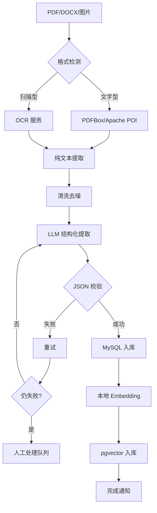

# 第 24 课：端到端案例——AI 招聘系统架构全解

> **核心问题**：把前 23 课串起来，一个真实的企业级 AI 系统长什么样？
> **预计时间**：2 天
> **前置知识**：全部课程（这是总复习 + 综合实战）

---

## 一、案例背景

**公司**：某互联网公司（500 人规模）
**业务**：技术岗位招聘（月 200 个岗位，月 5000 份简历）

**痛点**：

1. HR 每天人工筛简历 3 小时（低效）
2. 简历质量参差不齐（漏掉优秀候选人）
3. 面试评估主观（面试官水平不一）
4. 知识分散（招聘制度、面试题库没人整理）

**目标**：AI 招聘系统

- 简历智能解析 → AI 初筛 → 人岗匹配 → AI 面试辅助 → 全流程跟踪

---

## 二、总体架构

### 核心概念深度解析

### AI 网关（AI Gateway）

> **严谨定义**：AI 网关是位于应用与 LLM 服务之间的统一代理层，负责模型路由（根据任务复杂度选择本地/云端模型）、故障转移（主模型不可用时自动切换备用）、统一计费（记录各功能 token 消耗）、限流熔断（防止成本失控）等职责。核心目标是解耦业务逻辑与模型服务，实现模型无关架构。

> **通俗理解**：就像公司的“前台接待”——所有找 AI 的请求先到前台，前台看情况分配：简单问题找本地 Ollama（免费快），复杂问题找云端 GPT-4o（贵但强），某个模型宕机了自动换另一个。业务代码不用关心具体用哪个模型，统一由网关调度。

### 语义缓存（Semantic Cache）

> **严谨定义**：语义缓存是基于向量相似度的缓存机制，当新请求与缓存中的历史请求语义相似度超过阈值时，直接返回缓存结果，避免重复调用 LLM。与传统精确匹配缓存不同，语义缓存能识别“换汤不换药”的重复请求（如“年假多少天”和“请问年假有几天”）。典型实现：Redis + 向量索引。

> **通俗理解**：就像客服的“常见问题库”——用户问的问题和之前的问题“意思差不多”，就直接给标准答案，不用每次都麻烦 AI。这样既省钱（少调用 LLM）又快（缓存秒回）。

### 人工闸门（Human-in-the-Loop Gate）

> **严谨定义**：人工闸门是 AI 工作流中的强制人工确认节点，所有高风险操作（对外发送、录用决策、数据删除）必须经过人工审批后才能执行。状态表示为 WAIT_APPROVAL，支持超时自动取消、审批记录审计。核心原则是“AI 辅助，人工决策”。

> **通俗理解**：就像银行的“双人确认”——柜员（AI）办完业务后，必须经过主管（人工）确认才能把钱给客户。AI 可以建议“这个候选人很适合”，但不能直接发录用通知，必须 HR 点“确认”才行。

```
┌─────────────────────────────────────────────────────┐
│                    前端（Vue 3）                      │
│  候选人管理 │ 岗位管理 │ AI 分析报告 │ 知识库 │ 工作流  │
└────────────────────────┬────────────────────────────┘
                         ↓ HTTP/SSE
┌─────────────────────────────────────────────────────┐
│                 后端服务（Spring Boot）               │
│  ┌──────────┐ ┌──────────┐ ┌──────────┐ ┌─────────┐ │
│  │ 候选人模块 │ │ 岗位模块  │ │ AI 分析   │ │ 知识库   │ │
│  │ CRUD/导入 │ │ CRUD/发布 │ │ 引擎      │ │ RAG     │ │
│  └──────────┘ └──────────┘ └──────────┘ └─────────┘ │
│  ┌──────────┐ ┌──────────┐ ┌──────────┐             │
│  │ 工作流引擎 │ │ 通知模块  │ │ 权限认证  │             │
│  │ Agent    │ │ 邮件/站内 │ │ 审计日志  │             │
│  └──────────┘ └──────────┘ └──────────┘             │
└────────────────────────┬────────────────────────────┘
                         ↓
┌─────────────────────────────────────────────────────┐
│                  AI 基础设施层                        │
│  ┌─────────┐ ┌─────────┐ ┌─────────┐ ┌──────────┐  │
│  │ AI 网关  │ │ 语义缓存 │ │ Prompt  │ │ 观测监控  │  │
│  │ 路由/降级│ │ Redis   │ │ 版本管理 │ │ 日志/告警 │  │
│  └─────────┘ └─────────┘ └─────────┘ └──────────┘  │
│  ┌─────────┐ ┌─────────┐ ┌─────────┐               │
│  │ 本地 Ollama│ │ 云 LLM  │ │ pgvector│               │
│  │ Embedding│ │ 分析/生成│ │ 向量库   │               │
│  └─────────┘ └─────────┘ └─────────┘               │
└────────────────────────┬────────────────────────────┘
                         ↓
┌─────────────────────────────────────────────────────┐
│  数据层：MySQL（业务）│ PostgreSQL+pgvector（向量）│ Redis │
└─────────────────────────────────────────────────────┘
```

---

## 三、核心链路 1：简历智能解析入库

### 简历解析入库流程图



```
┌──────────────────────────────────────────────────────────┐
│           简历智能解析入库流程                              │
├──────────────────────────────────────────────────────────┤
│                                                          │
│  [PDF/DOCX/图片] ─→ [格式检测]                          │
│       │                                                  │
│       ├─ 文字型 ─→ [PDFBox/Apache POI] ─→ [纯文本]    │
│       └─ 扫描型 ─→ [OCR 服务] ─→ [纯文本]              │
│              │                                            │
│              ↓                                            │
│  [清洗] ─→ [LLM 结构化提取] ─→ [JSON 校验]            │
│              │                    │                      │
│              │              失败 → [重试] → [人工队列]  │
│              ↓                                            │
│  [MySQL 入库] ─→ [本地 Embedding] ─→ [pgvector 入库]  │
│              │                                            │
│              ↓                                            │
│  [完成通知] ─→ [质量抽检]                              │
└──────────────────────────────────────────────────────────┘
```

**输入**：PDF/DOCX/图片简历（多格式）

1. 格式检测（文字型/扫描型）
2. 文本提取（PDFBox / OCR / 文档智能）
3. 清洗（页眉页脚、乱码）
4. LLM 结构化提取（JSON 输出 + 校验） — 失败 → 重试 → 人工处理队列
5. 字段校验（必填、格式、范围）
6. 入库（MySQL 结构化数据）
7. Embedding（本地 Ollama，数据不出域）
8. 切块 + 入库 pgvector
9. 完成通知（异步任务状态）

**质量保障**：

- 提取失败率监控（> 5% 告警）
- 每日抽检 10 份对比人工提取
- 黄金数据集回归（每次 Prompt 改动必跑）

> 对应课程：第 19 课（多模态）、第 16 课（RAG）、第 22 课（评估）

---

## 四、核心链路 2：AI 人岗匹配

**输入**：岗位要求 + 候选人池

1. 岗位要求结构化（JD → 要求向量 + 结构化条件）
2. 批量筛选（结构化 SQL 硬条件：年限、学历）
3. 语义匹配（简历向量 × 岗位向量 → 相似度）
4. Rerank（重排序模型精排 Top 50）
5. LLM 深度评估（Top 10：逐份分析匹配理由） — 并行调用 + 超时 + 重试
6. 评分汇总（规则加权：语义分 + LLM 分 + 硬条件）
7. 生成推荐报告（附理由 + 引用）
8. 人工确认（`WAIT_APPROVAL`）→ 进入面试流程

**防注入**：简历内容视为数据，Prompt 指令隔离
**质量评估**：推荐采纳率、面试通过率 vs AI 评分相关性

> 对应课程：第 04-05 课（Embedding/向量）、第 07 课（RAG 优化）、第 08 课（工具）

---

## 五、核心链路 3：AI 面试辅助

**输入**：候选人 + 岗位

1. 生成个性化面试题（LLM + 岗位要求 + 简历亮点）
2. 面试官提问（人工主导，AI 辅助记录）
3. 录音 → ASR 转写（Whisper）
4. 转写清洗（语气词、重复、分段）
5. LLM 评估（技术准确性/逻辑/表达/风险点）
6. 生成评估报告（结构化 + 证据引用）
7. 面试官复核（AI 只辅助，决策人工）⭐ 合规要求
8. 记录存档（审计：谁评的、AI 结论、人工修正）

**合规要点**：

- AI 报告必须标识"AI 辅助生成"
- 人工修正记录保留（申诉可追溯）
- 面试数据分级保护（L3 敏感）

> 对应课程：第 19 课（多模态）、第 20 课（安全合规）、第 10 课（多 Agent）

---

## 六、核心链路 4：招聘知识库 RAG

**输入**：制度文档、面试题库、行业知识

**建库**：

- 上传 → 解析 → 切块（按章节）→ Embedding → pgvector
- 多知识库隔离（制度库/题库/岗位库）
- 权限控制（HR vs 面试官可见范围）

**问答**：

- 提问 → 查询改写（多轮指代消解）
- → 混合检索（向量 + 关键词）+ 权限过滤
- → Rerank → Prompt 组装（引用编号）→ LLM 生成 → 引用溯源

**运维**：

- 文档更新 → 增量索引
- 无结果率监控 → 知识缺口清单
- 语义缓存 → 重复问题秒回

> 对应课程：第 06-07 课（RAG）、第 16 课（企业 RAG）、第 17 课（Prompt）

---

## 七、核心链路 5：AI 招聘工作流（Agent 编排）

**场景**：新岗位发布 → 全自动初筛流程

**流程定义**（工作流引擎）：

`[岗位发布] → [JD 解析] → [简历收集] → [批量初筛]`

- **条件分支**：评分 > 80 → 推荐面试；60-80 → 待定（人工复核）；< 60 → 自动淘汰
- `[面试安排]`（人工确认节点：HR 确认时间）
- `[面试评估] → [结果通知]`

**工作流特性**：

- 状态持久化（Redis）：系统重启可恢复
- 超时/重试：每个节点独立失败处理
- 人工闸门：所有对外动作必须人工确认
- 审计：全链路可追溯

> 对应课程：第 09-11 课（Agent/多 Agent/工作流）、第 13 课（架构）

---

## 八、横向能力：支撑所有链路的基础设施

```
┌──────────────────────────────────────────────────────────┐
│              横向能力全景图                                │
├──────────────────────────────────────────────────────────┤
│                                                          │
│  ┌─────────┐ ┌─────────┐ ┌─────────┐ ┌─────────┐  │
│  │ AI 网关  │ │ Prompt  │ │ 语义缓存 │ │ 观测告警 │  │
│  │ 路由/降级│ │ 版本管理 │ │ Redis   │ │ 日志/指标│  │
│  └────┬────┘ └────┬────┘ └────┬────┘ └────┬────┘  │
│       │            │            │            │          │
│       └────────────┴────────────┴────────────┘          │
│                        │                                │
│              ┌─────────┴─────────┐                  │
│              │   评估体系 + 安全合规  │                  │
│              │  黄金数据集 / 审计日志 │                  │
│              └───────────────────────┘                  │
└──────────────────────────────────────────────────────────┘
```

1. **AI 网关**：模型路由（简单→本地，深度→云LLM）、故障转移、统一计费
2. **Prompt 管理**：每个链路的 Prompt 独立版本管理，改动 → 黄金回归 → 灰度 → 全量
3. **语义缓存**：相同/相似问题命中缓存（知识库问答命中率 30%+）
4. **观测与告警**：成功率、TTFT、JSON 失败率、成本、采纳率
5. **评估体系**：黄金数据集 200+ 条，回归每次改动全量跑，线上采纳率看板
6. **安全合规**：数据分级、脱敏、权限三级、审计全链路、人工闸门

> 对应课程：第 13/14/17/20/21/22 课

---

## 九、演进路线（从 0 到 1 到 N）

**阶段 0（1-2 月）：MVP**

- 简历导入 + 文本提取 + 基础人岗匹配
- 目标：跑通链路，验证 AI 价值

**阶段 1（2-3 月）：质量提升**

- RAG 知识库 + 检索优化 + 评估数据集
- 目标：匹配准确率提升，建立评估基线

**阶段 2（3-4 月）：自动化**

- 工作流引擎 + Agent 初筛 + 人工确认机制
- 目标：初筛自动化率 > 60%

**阶段 3（4-6 月）：规模化**

- 多知识库 + 权限体系 + 成本优化 + 观测告警
- 目标：稳定生产，成本可控

**阶段 4（6 月+）：智能化**

- 多 Agent 协作 + MCP 生态接入 + 微调优化
- 目标：AI 成为招聘流程的核心参与者

> 这就是你项目的真实演进路径！

---

## 十、企业级 AI 系统的 12 条军规（总结）

```
┌──────────────────────────────────────────────────────────┐
│          企业级 AI 系统 12 条军规                          │
├──────────────────────────────────────────────────────────┤
│                                                          │
│  数据层：  1. 数据先行    2. 成本可见    3. 质量可测  │
│  安全层：  4. 权限分明    5. 人工兜底    6. 可回滚    │
│  运维层：  7. 可追溯      8. 渐进发布    9. 降级优雅  │
│  架构层：  10. 模型无关   11. 持续评估   12. 合规底线  │
│                                                          │
│  优先级：安全 > 稳定 > 质量 > 成本 > 功能            │
└──────────────────────────────────────────────────────────┘
```

1. **数据先行**：没有好数据，一切 AI 都是空中楼阁
2. **成本可见**：每个功能都能回答"花了多少钱"
3. **质量可测**：黄金数据集 + 回归测试
4. **权限分明**：数据分级 + 最小权限
5. **人工兖底**：高风险决策永远有人
6. **可回滚**：Prompt/模型/配置都能一键回滚
7. **可追溯**：`request_id` 贯穿全链路
8. **渐进发布**：灰度 + A/B，不一次性全量
9. **降级优雅**：AI 挂了，业务不挂
10. **模型无关**：架构不绑定任何一家模型厂商
11. **持续评估**：数据越用越多，系统越用越稳
12. **合规底线**：隐私、标识、申诉机制

> **优先级**：安全 > 稳定 > 质量 > 成本 > 功能

---

## 十一、用 AI 工具实际体验

### 11.1 用 ChatGPT 设计完整架构

```
🧑 提问（ChatGPT-4o）：
"我正在设计一个端到端的 AI 招聘系统，包括：
 1. 简历智能解析入库（多格式支持）
 2. AI 人岗匹配（向量检索 + LLM 评估）
 3. AI 面试辅助（语音转写 + 评估报告）
 4. 招聘知识库 RAG
 5. 工作流自动化（Agent 编排）
 请帮我设计技术架构，包括：技术栈、数据流、部署方案。"

🤖 ChatGPT 架构建议：
- 前端：Vue 3 + Element Plus（与你的选择一致）
- 后端：Spring Boot 3 + Spring AI（统一 AI 抽象层）
- AI 网关：自建（基于 Spring AI 的 LlmClient 抽象）
- 向量库：PostgreSQL + pgvector（与业务库同实例，降低运维成本）
- 消息队列：RabbitMQ（异步任务）
- 缓存：Redis（语义缓存 + 任务状态）
- 部署：Docker Compose（开发）→ K8s（生产）

💡 启发：
  ChatGPT 给出的架构与你的实际项目高度吻合，验证了技术选型的合理性。
  额外建议：用 Docker Compose 统一开发环境，新成员 10 分钟启动全套服务。
```

### 11.2 用 Claude 分析系统演进路线

```
🧑 提问（Claude 3.7）：
"我的 AI 招聘系统现在处于 MVP 阶段，已实现：
 - 简历导入 + 基础解析
 - 简单人岗匹配
 - 本地 Ollama + 云 API 混合
 请帮我规划未来 12 个月的演进路线，
 每个阶段说明：目标、关键功能、技术挑战、团队配置。"

🤖 Claude 演进路线：
- Q1：质量提升（RAG 知识库 + 评估数据集 + Prompt 版本管理）
  技术挑战：检索质量调优，团队需 +1 AI 工程师
- Q2：自动化（工作流引擎 + Agent 初筛 + 人工确认机制）
  技术挑战：工作流状态管理，团队需 +1 后端
- Q3：规模化（多知识库 + 权限 + 成本优化 + 观测告警）
  技术挑战：性能优化，团队需 +0.5 运维
- Q4：智能化（多 Agent 协作 + MCP 生态 + 微调优化）
  技术挑战：Agent 编排，团队需 +1 AI 研究员

💡 启发：
  Claude 给出的团队配置建议很实用：不同阶段需要不同类型的人才。
  关键发现：Q1 的评估数据集是最重要的基础设施，应该优先建设。
```

---

## 十二、本课小结

> **恭喜你完成了全部 24 课！**
>
> 你现在能回答：
>
> - ✅ AI 怎么理解语言（01-02）
> - ✅ 怎么让 AI 听话（03、17）
> - ✅ 怎么让 AI 懂你的数据（04-07、16）
> - ✅ 怎么让 AI 干活（08-11、23）
> - ✅ 怎么落地生产（12-15、21）
> - ✅ 怎么保证安全合规（20）
> - ✅ 怎么证明价值（22）
> - ✅ 怎么设计完整系统（13、24）

**下一步行动**：

1. 把你项目对照第 24 课的架构图，找出差距
2. 优先补齐：**黄金数据集 → 成本统计 → AI 审计日志**
3. 挑一个功能做"评估闭环"试点
4. 持续学习：关注 MCP 生态和 Agent 工程

---

## 十三、终极思考题

1. **对照第 24 课的架构，你的项目在哪个阶段？下一步最重要的三件事是什么？**
2. **如果现在要说服老板投入 AI 招聘系统，你的 PPT 怎么写？（用本课的价值指标）**
3. **AI 招聘的边界在哪里？哪些环节永远不应该让 AI 自动决定？**
4. **三年后，AI 招聘系统会进化成什么样？你现在应该提前布局什么？**
5. **用 AI 工具（ChatGPT/Claude）帮你设计你项目的架构图，对比本课的架构，找出差距。**

---

## 导航

| 上一课 | 下一课 |
| --- | --- |
| [第 23 课：MCP 与 AI 工具生态](23-MCP与AI工具生态.md) | [第 25 课：智能体发展史](25-智能体发展史.md) |
