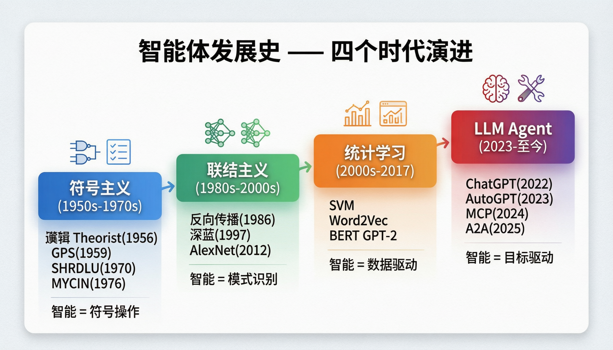

# 第 25 课：智能体发展史 —— 从符号主义到 LLM 驱动

> **核心问题**：AI Agent 不是 2023 年才出现的概念，它的前身可以追溯到 1950 年代。理解历史，才能看清方向。
> **预计时间**：1-2 天
> **前置知识**：无（本课是 Agent 专题篇的起点）

---

## 一、从你最熟悉的说起

作为 Java 开发者，你写过的最"智能"的程序可能是这样的：

```java
// 简历筛选 —— 典型的"符号主义"做法
public String screenResume(Resume resume) {
    int score = 0;
    if (resume.getYearsOfExp() >= 5) score += 30;
    if (resume.getSkills().contains("Spring Cloud")) score += 20;
    if (resume.getEducation().ordinal() >= Education.MASTER.ordinal()) score += 20;
    if (resume.getCompanyTier() <= 2) score += 30;
    
    if (score >= 70) return "推荐面试";
    if (score >= 50) return "待定";
    return "不通过";
}
```

这就是**基于规则**的系统——你告诉程序"如果 A 则 B"。程序不会自己思考，不会自己决定。

现在想象一个系统，它**自己决定**该做什么、怎么做、做完了没有：

```
你（人类）：帮我找到最适合"高级Java开发"岗位的候选人

AI Agent 自主执行：
  1. 理解需求 → 分析 JD 中的关键要求
  2. 制定计划 → 先搜人才库，再看市场数据，最后出报告
  3. 调用工具 → 查询数据库、调用匹配算法、生成报告
  4. 观察结果 → 发现候选人不足，扩大搜索范围
  5. 调整策略 → 降低经验年限要求，增加潜力评估
  6. 输出结果 → 推荐 5 位候选人 + 匹配度分析
```

这就是"智能体"的核心思想。而这个思想，已经发展了 **70 多年**。

---

## 二、四个时代



### 2.1 符号主义（1950s-1970s）—— "用规则描述世界"

**核心思想**：智能 = 符号操作。把问题变成逻辑推理，用 if-then 规则描述世界。

**直观类比**：像走迷宫时记住"死胡同就回头"，用纸条记录"这个路口试过了"。你不需要"理解"迷宫，只需要一套好规则。

#### 代表成果详解

| 成果 | 年份 | 做了什么 | 为什么重要 |
|------|------|---------|-----------|
| **Logic Theorist** | 1956 | 证明《数学原理》中的定理，部分证明比书中更简洁 | 第一个 AI 程序，证明机器可以"思考" |
| **General Problem Solver (GPS)** | 1959 | 通用问题求解器，用"手段-目的分析"解决任意问题 | 第一个尝试"通用智能"的程序 |
| **SHRDLU** | 1970 | 在"积木世界"中理解自然语言指令 | 首次展示自然语言理解的可行性 |
| **专家系统 MYCIN** | 1976 | 诊断血液感染疾病，准确率超过普通医生 | 首次在企业级场景超越人类专家 |

#### SHRDLU 深度解析

SHRDLU 是早期最惊艳的成果。它在一个"积木世界"中：

```
用户：把红色积木放到蓝色积木上面
SHRDLU：[移动积木] 好的，已经放上去了

用户：最上面的积木是什么颜色？
SHRDLU：红色

用户：为什么你把绿色积木移走？
SHRDLU：为了给红色积木腾出空间

用户：把最高的积木放到盒子里
SHRDLU：[分析] 红色积木最高 → 移动红色积木到盒子
```

**它能做到的**：理解代词（"它"指什么）、推理因果关系、回答关于状态的问题。

**致命局限**：只能处理积木世界。让它理解"股票市场"或"天气"？完全做不到。每换一个场景，就要从头写规则。

#### 专家系统 MYCIN 深度解析

```
医生输入：
  患者：男性，45岁
  症状：发热、头痛、颈部僵硬
  脑脊液：革兰氏阴性球菌

MYCIN 推理链：
  IF 革兰氏阴性球菌 AND 脑脊液感染
  THEN 可能是脑膜炎奈瑟菌 (置信度 0.85)
  
  IF 脑膜炎奈瑟菌
  THEN 推荐青霉素 G，剂量 1200万单位/天 (置信度 0.92)

MYCIN 输出：
  诊断：细菌性脑膜炎（脑膜炎奈瑟菌），置信度 85%
  建议：青霉素 G 1200万单位/天，疗程 10天
```

**为什么重要**：MYCIN 的诊断准确率（69%）超过了普通医生（55%）和传染科专家（60%）。

**为什么失败了**：
- 规则太多（约 500 条），维护困难
- 知识获取瓶颈：需要专家一条条教
- 无法处理规则之外的情况
- 医生不信任"黑箱"决策

#### Java 中的对应

```java
// 规则引擎 Drools —— 符号主义的现代版
rule "高分候选人推荐面试"
when
    $c : Candidate(score > 80, status == null)
then
    $c.setStatus("推荐面试");
    update($c);
end

// 状态机 Spring StateMachine —— 符号主义的另一种形态
@Configuration
@EnableStateMachine
public class InterviewStateMachine extends StateMachineConfigurerAdapter<InterviewState, InterviewEvent> {
    @Override
    public void configure(StateMachineStateConfigurer<InterviewState, InterviewEvent> states) {
        states.withStates()
            .initial(InterviewState.PENDING)
            .state(InterviewState.SCREENING)
            .state(InterviewState.INTERVIEWING)
            .end(InterviewState.OFFERED);
    }
}
```

**共同局限**：规则是人写的，覆盖不了所有情况。世界太复杂，写不完。

---

### 2.2 联结主义（1980s-2000s）—— "从数据中学习"

**核心思想**：智能 = 神经网络中涌现的模式识别。不需要人写规则，让机器自己从数据中学。

**直观类比**：符号主义像"按说明书操作"，联结主义像"看一万张猫的照片，自己学会什么是猫"。你不需要告诉神经网络"猫有尖耳朵"——它自己从数据中学到了这个特征。

#### 关键里程碑详解

| 年份 | 事件 | 意义 | 局限 |
|------|------|------|------|
| 1986 | 反向传播算法（Hinton） | 训练多层神经网络成为可能 | 训练慢、容易陷入局部最优 |
| 1997 | IBM 深蓝击败国际象棋冠军 | 搜索 + 评估函数 + 硬件加速 | 只能下棋，不能做别的 |
| 2006 | Hinton 提出深度学习 | 多层网络预训练方法 | 需要大量数据和 GPU |
| 2012 | AlexNet 赢得 ImageNet | 深度学习爆发，错误率降 10% | 仍需要大量标注数据 |

#### 强化学习——Agent 概念的萌芽

```
强化学习循环：

Agent 观察环境状态（State）
  → 选择行动（Action）
  → 环境返回新状态 + 奖励（Reward）
  → Agent 更新策略（Policy）
  → 重复

目标：最大化累积奖励
```

**具体例子**：训练一个走迷宫的 Agent

```
初始状态：Agent 随机移动，到处撞墙

Episode 1: 走了 200 步，撞墙 50 次，奖励 -100
Episode 10: 走了 80 步，撞墙 10 次，奖励 -20
Episode 100: 走了 15 步到达终点，奖励 +50
Episode 1000: 走了 12 步到达终点，奖励 +55（最优路径）
```

**为什么强化学习没有直接发展出 Agent？**
- 需要大量试错（现实中不可行）
- 只能处理定义明确的环境（游戏、机器人）
- 无法处理语言理解等高级认知任务
- 奖励函数设计困难（什么是"好的面试评价"？）

---

### 2.3 统计学习（2000s-2017）—— "用数据训练模型"

**核心思想**：用统计方法从数据中学习模式。关键转变：**从"人写规则"到"人写模型 + 数据训练"**。

#### 代表技术详解

| 技术 | 做什么 | 在 HR 中的应用 | 局限 |
|------|--------|---------------|------|
| SVM / 随机森林 | 分类任务 | 简历通过/不通过 | 需要人工特征工程 |
| Word2Vec | 词向量表示 | 语义相似度匹配 | 一词多义处理不好 |
| Seq2Seq + Attention | 机器翻译 | 多语言简历翻译 | 长序列遗忘 |
| BERT | 双向语言理解 | 简历信息抽取 | 只能理解，不能生成 |
| GPT-2 | 文本生成 | 自动生成 JD | 生成质量不稳定 |

#### 代码对比：三种范式的差异

```java
// 1. 符号主义：人写规则
public boolean screenByRules(Resume resume) {
    return resume.getYearsOfExp() >= 5 
        && resume.getSkills().contains("Java");
}

// 2. 联结主义：神经网络学习
public boolean screenByNN(Resume resume) {
    double[] features = extractFeatures(resume); // 人工特征
    return neuralNet.predict(features) > 0.5;
}

// 3. 统计学习：预训练模型
public boolean screenByLLM(Resume resume) {
    String embedding = bertModel.encode(resume.getText());
    return classifier.predict(embedding);
}
```

---

### 2.4 LLM 驱动的智能体（2023-至今）—— "用目标驱动行为"

**核心思想**：LLM 作为"大脑"，具备理解、推理、规划、工具使用能力。它不再需要人写规则，也不需要人训练模型——只需要给一个**目标**。

#### LLM Agent 的质变

```
传统程序：输入 → 固定逻辑 → 输出
  特点：逻辑是人写的，确定性的，可预测的

LLM Agent：目标 → 自主规划 → 选择工具 → 执行 → 观察 → 调整 → 再执行
  特点：逻辑是 LLM 生成的，概率性的，不完全可预测的
```

#### 关键里程碑详解

| 年份 | 事件 | 为什么重要 | 对 Java 开发者的影响 |
|------|------|-----------|-------------------|
| 2022.11 | ChatGPT 发布 | 首次展示 LLM 的通用推理能力 | 意识到 AI 可以写代码 |
| 2023.3 | GPT-4 发布 | 多模态 + 推理能力飞跃 | AI 可以看懂架构图 |
| 2023 | AutoGPT / BabyAGI | 自主 Agent 概念爆发 | 第一次看到 AI 自主执行任务 |
| 2023 | LangChain / LlamaIndex | Agent 开发框架成熟 | Java 开发者有了 Python 参考实现 |
| 2024.3 | Claude 3 / GPT-4o | 长上下文 + 工具使用 | 128K 上下文 = 可以处理整本书 |
| 2024.11 | MCP 协议发布 | Agent 工具连接标准化 | Java 可以实现 MCP Server |
| 2025.1 | DeepSeek-R1 / o1 | 推理链 + 思维链 | AI 可以"想清楚再做" |
| 2025.5 | A2A 协议发布 | Agent 间通信标准化 | 多 Agent 系统有了通信标准 |

---

## 三、用 AI 工具实际体验

### 3.1 让 ChatGPT 扮演 Agent

```
你（给 ChatGPT 的提示词）：
你是一个招聘 Agent。你的任务是帮我为"高级 Java 开发"岗位筛选候选人。
你可以使用以下工具：
1. search_candidates(keywords, min_exp, location) - 搜索候选人
2. get_resume(candidate_id) - 获取简历详情
3. evaluate_match(resume_text, jd_text) - 评估匹配度

现在，请帮我筛选候选人。

ChatGPT 回复：
好的，我来为"高级 Java 开发"岗位筛选候选人。

[Thought 1] 首先，我需要了解这个岗位的具体要求。
[Action 1] 由于你没有提供 JD 详情，我先用关键词搜索。
[Action 1] search_candidates("Java 高级", min_exp=5, location="上海")

你（模拟工具返回）：
找到 3 位候选人：
- 张三：8年经验，Spring Cloud/K8s，上海
- 李四：6年经验，Spring Boot/MySQL，上海
- 王五：10年经验，微服务架构，杭州

ChatGPT 回复：
[Thought 2] 找到 3 位候选人，需要逐一评估匹配度。
[Action 2] get_resume("张三")

你（模拟工具返回）：
张三简历：8年Java经验，前阿里P7，主导过3个微服务项目...

ChatGPT 回复：
[Thought 3] 张三背景很强，评估匹配度。
[Action 3] evaluate_match(张三简历, "高级Java开发岗位要求...")

你（模拟工具返回）：
匹配度：92%

ChatGPT 回复：
[Thought 4] 张三匹配度很高(92%)，继续评估其他候选人。
...

[最终输出]
推荐排序：
1. 张三 - 匹配度 92%（8年经验，微服务架构专家）
2. 李四 - 匹配度 78%（6年经验，基础扎实）
3. 王五 - 匹配度 65%（经验丰富但地点不匹配）
```

### 3.2 对比：传统程序 vs LLM Agent

```
传统 Java 程序处理同样的任务：

// 硬编码的筛选逻辑
public List<Candidate> screen(String positionId) {
    Position pos = positionMapper.selectById(positionId);
    List<Candidate> candidates = candidateMapper.selectByCondition(
        pos.getRequiredSkills(), pos.getMinExperience(), pos.getLocation());
    // 固定排序：按经验年限
    return candidates.stream()
        .sorted(Comparator.comparing(Candidate::getYearsOfExp).reversed())
        .collect(Collectors.toList());
}

问题：
  - 不能理解 JD 的语义（"微服务经验" ≠ 精确匹配关键词）
  - 不能根据中间结果调整策略（候选人不够时不会自动扩大搜索）
  - 不能给出推荐理由（只能返回数据，不能生成分析）

LLM Agent 处理同样的任务：
  + 理解语义（"微服务经验"包括 Dubbo/Spring Cloud/K8s）
  + 自主调整（候选人不够 → 扩大搜索范围 → 降低地点要求）
  + 生成分析（"推荐张三，因为..."）
  - 但：结果不完全可预测，需要质量保障机制
```

---

## 四、发展脉络总结

```
符号主义（规则驱动）
  特点：人写规则，机器执行
  局限：规则写不完，换场景就废
    ↓
联结主义（数据驱动）
  特点：人设计网络，数据训练权重
  局限：需要大量标注数据，能力窄
    ↓
统计学习（特征工程）
  特点：人设计特征/模型，数据训练
  局限：仍是窄能力，不通用
    ↓
Transformer + 预训练（自监督学习）
  特点：通用语言能力，迁移学习
  突破：一个模型处理所有文本任务
    ↓
LLM Agent（目标驱动）
  特点：给目标，自主规划执行
  突破：理解 + 推理 + 规划 + 工具使用 + 记忆
```

---

## 五、你项目中的对应

| 时代 | HR 项目中的对应 | 具体代码/组件 | 局限性 |
|------|----------------|-------------|--------|
| 符号主义 | 简历筛选规则引擎 | `if score >= 70 → 推荐` | 规则覆盖不了所有情况 |
| 联结主义 | 候选人评分模型 | `neuralNet.predict(features)` | 需要大量标注数据 |
| 统计学习 | 岗位-简历匹配 | `bert.encode() + classifier` | 只能匹配，不能生成 |
| LLM Agent | AI 面试助手 | `agent.run("评估候选人")` | 结果不完全可预测 |

---

## 六、本课小结

```
核心要点：
1. AI Agent 的历史可以追溯到 1950 年代，不是 2023 年才出现的
2. 四个时代的核心转变：规则驱动 → 数据驱动 → 特征工程 → 目标驱动
3. LLM Agent 的质变在于：它是通用认知引擎，不只是模式匹配
4. 每个时代都有其局限，推动下一个时代的出现
5. 理解历史帮助我们看清：当前 LLM Agent 的局限在哪里，下一代 Agent 会是什么
```

---

## 七、思考题

1. **你当前的 HR 系统中，哪些功能是"符号主义"的？哪些可以用 LLM Agent 替代？替代后有什么风险？**
2. **SHRDLU 的局限（只能处理积木世界）和当前 LLM Agent 的局限有什么相似之处？**
3. **为什么强化学习没能直接发展出真正的 Agent？它和 LLM Agent 的本质区别是什么？**
4. **MYCIN 专家系统失败的原因（规则太多、知识获取瓶颈、黑箱决策）和当前 LLM Agent 面临的问题有什么相似之处？**

---

## 八、延伸阅读

- [Hello-Agents 第二章：智能体发展史](https://hello-agents.datawhale.cc/#/chapter2/)
- 《人工智能：一种现代方法》第 1-2 章 —— 经典教材，覆盖符号主义到统计学习
- 《心智社会》马文·明斯基 —— 理解智能本质的哲学思考
- [Anthropic: Building Effective Agents](https://www.anthropic.com/research/building-effective-agents) —— 现代 Agent 设计最佳实践

---

## 导航

| 上一课 | 下一课 |
| --- | --- |
| [第 24 课：端到端案例——AI 招聘系统架构全解](24-端到端企业案例AI招聘系统.md) | [第 26 课：Agent 经典范式构建](26-Agent经典范式构建.md) |
