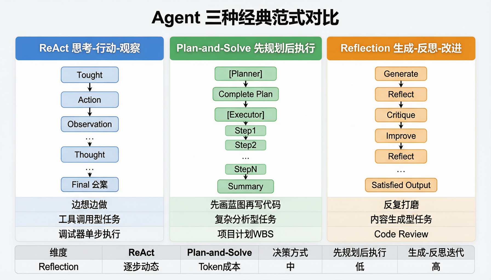

# 第 26 课：Agent 经典范式构建

> **核心问题**：Agent 的"思考方式"有哪几种？每种适合什么场景？
> **预计时间**：2 天
> **前置知识**：第 09 课（AI Agent）、第 10 课（Multi-Agent）

---

## 一、三种经典 Agent 范式概览



```
1. ReAct（Reasoning + Acting）
   思考-行动-观察循环，走一步看一步

2. Plan-and-Solve
   先规划完整计划，再逐步执行

3. Reflection（自我反思）
   执行后自我审视，迭代改进输出质量

类比（Java 开发视角）：
  ReAct        → 调试器：单步执行，每步看结果再决定
  Plan-and-Solve → 项目计划：先排 WBS，再按里程碑推进
  Reflection   → Code Review：写完代码自己审查，反复修改
```

---

## 二、ReAct 范式

### 2.1 核心思想

```
Thought → Action → Observation → Thought → ... → Final Answer

每一步由 LLM 决定：
  - 当前该做什么（Thought）
  - 调用哪个工具（Action）
  - 工具返回了什么（Observation）
  - 是否完成 / 继续下一步（Thought）
```

### 2.2 伪代码实现（Java 风格）

```java
public class ReActAgent {
    private ChatModel llm;
    private Map<String, Tool> tools;
    private int maxSteps = 10;

    public String run(String goal) {
        List<Message> history = List.of(SystemMessage.of(REACT_PROMPT),
                                        UserMessage.of(goal));

        for (int i = 0; i < maxSteps; i++) {
            ChatResponse resp = llm.call(history);

            if (resp.hasToolCalls()) {
                // 执行工具，观察结果
                ToolResult result = executeTool(resp.getToolCall());
                history.add(AssistantMessage.of(resp.getContent()));
                history.add(ToolMessage.of(result));
            } else {
                return resp.getContent(); // 最终答案
            }
        }
        throw new AgentTimeoutException("ReAct exceeded max steps");
    }
}
```

### 2.3 执行示例

```
目标：为"高级 Java 开发"岗位筛选候选人

[Step 1] Thought: 先获取岗位要求
         Action: getPosition(101)
         Observation: 要求 5年+ Java, 微服务经验, 本科以上

[Step 2] Thought: 按硬条件筛选
         Action: searchCandidates("Java", minExp=5, edu="本科")
         Observation: 返回 32 人

[Step 3] Thought: 32 人太多，逐一分析匹配度
         Action: analyzeResume(candidateId=201)
         Observation: 张三, 8年Java, Spring Cloud, 匹配度 92

[Step 4] Thought: 已找到高匹配候选人，汇总输出
         Final Answer: 推荐张三(92)、李四(87)...
```

### 2.4 优势与局限

```
优势：
  + 灵活：每步基于真实数据决策
  + 简单：一个循环搞定
  + 可调试：每步 Thought 可追溯

局限：
  - 容易"走偏"：长任务中后期步骤可能偏离目标
  - Token 消耗大：每轮重发全部历史（第 09 课成本公式）
  - 不适合需要全局规划的任务
```

---

## 三、Plan-and-Solve 范式

### 3.1 核心思想

```
两阶段：
  阶段 1（Planner）：LLM 生成完整执行计划
  阶段 2（Executor）：逐步执行计划，每步可调

类比：先画架构图，再写代码
```

### 3.2 伪代码实现

```java
public class PlanAndSolveAgent {
    private ChatModel planner;
    private ChatModel executor;
    private Map<String, Tool> tools;

    public String run(String goal) {
        // 阶段 1：规划
        List<Step> plan = planner.call(PLAN_PROMPT + goal)
                                 .parseAs(Step.class);

        List<String> results = new ArrayList<>();
        // 阶段 2：逐步执行
        for (Step step : plan) {
            String result = executor.call(
                EXEC_PROMPT + "Goal: " + goal +
                "\nCurrent step: " + step.getDescription() +
                "\nPrevious results: " + results);
            results.add(result);
        }

        // 汇总
        return planner.call(SUMMARIZE_PROMPT + results).getContent();
    }
}
```

### 3.3 执行示例

```
目标：生成本月招聘分析报告

[Planner] 输出计划：
  Step 1: 查询本月新发布岗位数
  Step 2: 查询本月收到简历数
  Step 3: 查询本月面试通过数
  Step 4: 计算各环节转化率
  Step 5: 生成分析报告

[Executor]
  Step 1 → 23 个岗位
  Step 2 → 1847 份简历
  Step 3 → 156 人通过面试
  Step 4 → 简历→面试: 8.4%, 面试→通过: 32.5%
  Step 5 → 报告生成完毕
```

### 3.4 优势与局限

```
优势：
  + 计划透明：用户能看到完整步骤
  + 目标聚焦：每步有明确子任务
  + 适合长任务：全局规划不会"走偏"

局限：
  - 计划可能过时：执行中发现新信息，原计划不再适用
  - 规划本身可能出错：LLM 规划能力有限
  - 改进：Plan-then-Replan（每 2-3 步重新规划）
```

---

## 四、Reflection 范式

### 4.1 核心思想

```
生成 → 反思 → 改进 → 再反思 → ... → 满意输出

两个角色（可以是同一个 LLM）：
  Generator：生成初始输出
  Reflector：审视输出，给出改进建议
```

### 4.2 伪代码实现

```java
public class ReflectionAgent {
    private ChatModel generator;
    private ChatModel reflector;
    private int maxRounds = 3;

    public String run(String task) {
        String output = generator.call(GEN_PROMPT + task).getContent();

        for (int i = 0; i < maxRounds; i++) {
            // 反思
            String critique = reflector.call(
                REFLECT_PROMPT + "Output: " + output).getContent();

            if (critique.contains("SATISFIED")) break;

            // 改进
            output = generator.call(
                IMPROVE_PROMPT + "Original: " + output +
                "\nCritique: " + critique).getContent();
        }
        return output;
    }
}
```

### 4.3 执行示例

```
任务：为"Java 后端开发"岗位写 JD

[Round 1 - Generate]
  输出：初版 JD（5 个要点）

[Round 1 - Reflect]
  反馈：缺少技术栈细节，没有团队介绍，薪资范围不明确

[Round 2 - Improve]
  输出：补充了 Spring Cloud/K8s 要求，加了团队描述

[Round 2 - Reflect]
  反馈：技术栈描述清晰，但缺少成长路径说明

[Round 3 - Improve]
  输出：加了晋升通道和培训体系描述

[Round 3 - Reflect]
  反馈：SATISFIED → 输出最终版本
```

### 4.4 优势与局限

```
优势：
  + 输出质量高：多轮打磨，适合内容生成
  + 自我纠错：减少幻觉和遗漏
  + 可控制轮数：成本可控

局限：
  - 耗时：多轮调用
  - LLM 可能"自己看不出自己的错"
  - 改进：用不同模型/角色做反思（交叉审查）
```

---

## 五、三种范式对比

| 维度 | ReAct | Plan-and-Solve | Reflection |
|------|-------|----------------|------------|
| **决策方式** | 逐步动态 | 先规划后执行 | 生成-反思迭代 |
| **适合任务** | 工具调用型 | 长链条分析型 | 内容生成型 |
| **灵活性** | 高 | 中 | 中 |
| **可控性** | 低 | 高 | 中 |
| **Token 成本** | 中（线性增长） | 低（计划复用） | 中（多轮打磨） |
| **HR 项目场景** | 候选人查询筛选 | 招聘分析报告 | JD 生成、面试评估 |

---

## 六、HR 项目中的应用场景

```
ReAct 适用：
  - 候选人对话式查询（问一句查一步）
  - 简历状态跟踪（逐步获取信息）

Plan-and-Solve 适用：
  - 月度招聘报告生成（步骤明确）
  - 批量简历导入处理（流程固定）

Reflection 适用：
  - JD 撰写与优化
  - 面试评估报告打磨
  - 候选人推荐语生成

混合使用（推荐）：
  外层 Plan-and-Solve → 内层 ReAct → 关键输出 Reflection
  例：招聘报告（规划步骤 → 每步用 ReAct 查数据 → 报告用 Reflection 打磨）
```

---

## 七、本课小结

```
核心要点：
1. ReAct：思考-行动-观察循环，灵活但易走偏
2. Plan-and-Solve：先规划后执行，可控但计划可能过时
3. Reflection：生成-反思-改进，提升输出质量
4. 实际系统常混合使用多种范式
5. 选型依据：任务类型、可控性要求、成本预算
```

---

## 八、思考题

1. **你的 HR 项目中，AI 筛简历环节用哪种范式最合适？为什么？**
2. **ReAct 和 Plan-and-Solve 能否结合？设计一个"先规划再 ReAct 执行"的方案。**
3. **Reflection 范式中，如果反思者和生成者是同一个模型，有什么局限？怎么解决？**
4. **三种范式的 Token 成本如何对比？设计一个实验来测量。**

---

## 九、延伸阅读

- ReAct 论文：https://arxiv.org/abs/2210.03629
- Plan-and-Solve 论文：https://arxiv.org/abs/2305.04091
- Reflexion 论文：https://arxiv.org/abs/2303.11366
- Anthropic Building Effective Agents：https://www.anthropic.com/research/building-effective-agents
