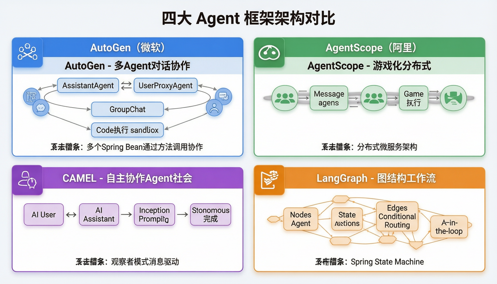

# 第 28 课：主流 Agent 框架实践

> **核心问题**：Python 生态有哪些主流 Agent 框架？Java 生态如何对应？
> **预计时间**：2 天
> **前置知识**：第 09 课（AI Agent）、第 10 课（Multi-Agent）、第 26 课（Agent 范式）

---

## 一、四大框架概览



```
1. AutoGen（微软）：多 Agent 对话协作
2. AgentScope（阿里）：游戏化分布式 Agent
3. CAMEL（开源学术）：自主协作的 Agent 社会
4. LangGraph（LangChain）：图结构工作流引擎

类比（Java 开发视角）：
  AutoGen   → 多个 Spring Bean 通过方法调用协作
  AgentScope → 分布式微服务架构（每个 Agent 是一个服务）
  CAMEL     → 观察者模式（Agent 之间消息驱动）
  LangGraph → 状态机框架（类似 Spring State Machine）
```

---

## 二、AutoGen（微软）

### 2.1 核心机制

```
核心理念：Agent 之间通过"对话"协作

关键概念：
  - AssistantAgent：有 LLM 的 Agent，能思考和生成
  - UserProxyAgent：代表用户，能执行代码/工具
  - GroupChat：多 Agent 群聊，由 Manager 协调
  - 对话终止条件：自动检测 / 最大轮数 / 关键词
```

### 2.2 代码示例

```python
import autogen

# 定义两个 Agent
assistant = autogen.AssistantAgent(
    name="HR_Analyst",
    system_message="你是 HR 数据分析师，擅长招聘数据分析"
)

executor = autogen.UserProxyAgent(
    name="Executor",
    human_input_mode="NEVER",
    code_execution_config={"work_dir": "workspace"}
)

# 多 Agent 群聊
group_chat = autogen.GroupChat(
    agents=[assistant, executor],
    messages=[],
    max_round=5
)

manager = autogen.GroupChatManager(groupchat=group_chat)

# 启动协作
executor.initiate_chat(
    manager,
    message="分析本月招聘数据，生成转化率报告"
)
```

### 2.3 适用场景

```
+ 多角色协作：分析师 + 执行者 + 审核者
+ 代码生成与执行：Agent 写代码并立即运行
+ 人机协作：Human-in-the-loop 自然支持

- 对话式协作，不适合严格流程控制
- 调试复杂：多 Agent 对话难以追踪
```

---

## 三、AgentScope（阿里）

### 3.1 核心机制

```
核心理念：游戏化分布式 Agent 框架

关键概念：
  - Agent：独立执行单元（类似 Java 的 Runnable）
  - Pipeline：Agent 执行流水线（串行/并行/条件）
  - Message：Agent 间通信消息
  - Service：工具函数封装（类似 @Tool）
  - 分布式支持：Agent 可部署在不同进程/机器
```

### 3.2 代码示例

```python
from agentscope.agents import DialogAgent, UserAgent
from agentscope.pipelines import SequentialPipeline

# 定义 Agent
hr_agent = DialogAgent(
    name="HR_Screener",
    sys_prompt="你是简历筛选专家，根据岗位要求评估候选人"
)

review_agent = DialogAgent(
    name="Reviewer",
    sys_prompt="你是审核专家，复核筛选结果的合理性"
)

# 串行流水线
pipeline = SequentialPipeline([hr_agent, review_agent])

# 执行
from agentscope.message import Msg
result = pipeline(Msg(content="为 Java 岗位筛选候选人"))
```

### 3.3 适用场景

```
+ 分布式部署：大规模 Agent 集群
+ 游戏/仿真：多角色模拟场景
+ 流水线任务：串行/并行混合执行

- 社区相对小，文档不够完善
- 学习曲线较陡
```

---

## 四、CAMEL（自主协作）

### 4.1 核心机制

```
核心理念：Agent 之间自主协商完成任务

关键概念：
  - AI User：提出需求的 Agent（"用户"角色）
  - AI Assistant：提供解决方案的 Agent
  - Role Playing：两个 Agent 通过角色扮演协作
  - Task Specifier：定义任务目标
  - 自主终止：任务完成后自动结束对话
```

### 4.2 代码示例

```python
from camel.societies import RolePlaying
from camel.tasks import Task

# 角色定义
society = RolePlaying(
    assistant_agent_kwargs={
        "model": "gpt-4",
        "agent_type": "HR Specialist"
    },
    user_agent_kwargs={
        "model": "gpt-4",
        "agent_type": "HR Manager"
    },
    task_prompt="制定高级 Java 开发的完整招聘方案"
)

# 自主协作（Role Playing 循环）
solution = society.run()
print(solution)
```

### 4.3 适用场景

```
+ 创意任务：头脑风暴、方案设计
+ 双角色协商：需求方 vs 实现方
+ 学术研究：Agent 行为研究

- 两 Agent 模式，扩展多 Agent 较复杂
- 生产环境使用案例较少
```

---

## 五、LangGraph（LangChain 生态）

### 5.1 核心机制

```
核心理念：用"图"定义 Agent 工作流

关键概念：
  - State：全局状态（类似 Java 的 Context 对象）
  - Node：处理节点（函数或 Agent）
  - Edge：节点间的转移（条件分支）
  - Checkpoint：状态持久化（可恢复/回滚）
  - Human-in-the-loop：暂停等待人工输入
```

### 5.2 代码示例

```python
from langgraph.graph import StateGraph, END
from typing import TypedDict

# 定义状态
class RecruitingState(TypedDict):
    goal: str
    candidates: list
    analysis: str
    approved: bool

# 定义节点
def screen_candidates(state: RecruitingState):
    return {"candidates": screened_list}

def analyze_match(state: RecruitingState):
    return {"analysis": match_report}

def human_review(state: RecruitingState):
    return {"approved": True}

# 构建图
graph = StateGraph(RecruitingState)
graph.add_node("screen", screen_candidates)
graph.add_node("analyze", analyze_match)
graph.add_node("review", human_review)

graph.add_edge("screen", "analyze")
graph.add_edge("analyze", "review")
graph.add_conditional_edges("review",
    lambda s: "end" if s["approved"] else "screen")
graph.add_edge("review", END)

# 编译并执行
app = graph.compile(checkpointer=MemorySaver())
result = app.invoke({"goal": "招聘 Java 开发"})
```

### 5.3 适用场景

```
+ 复杂工作流：条件分支、循环、人工确认
+ 状态持久化：长时间任务可恢复
+ 可观测：图结构清晰可视化

- Python 优先，Java 需用 LangChain4j
- 图定义学习成本
```

---

## 六、框架选型矩阵

| 维度 | AutoGen | AgentScope | CAMEL | LangGraph |
|------|---------|------------|-------|-----------|
| **核心模式** | 多 Agent 对话 | 分布式流水线 | 角色扮演 | 图工作流 |
| **适合任务** | 协作分析 | 大规模仿真 | 创意协商 | 复杂流程 |
| **学习曲线** | 低 | 中 | 低 | 中 |
| **生产就绪** | 中 | 低 | 低 | 高 |
| **Java 对应** | 多 Bean 协作 | 分布式服务 | 观察者模式 | 状态机 |

---

## 七、Java 生态对应

```
Python 框架          Java 对应
─────────────────────────────────────
AutoGen         →    Spring AI + 多 Agent Service
AgentScope      →    Spring Cloud + Agent 微服务
CAMEL           →    Spring Event + Agent 消息驱动
LangGraph       →    LangChain4j + 状态机

Java 开发者推荐路径：
  1. 快速原型：用 Dify / n8n 验证
  2. 生产系统：Spring AI（原生 Java，企业级）
  3. 学习研究：Python 框架跑通概念，再 Java 实现

你的 HR 项目：
  已有 Spring AI 基础 → 直接用 Spring AI 实现 Agent
  参考 Python 框架的设计思想，用 Java 模式落地
```

---

## 八、本课小结

```
核心要点：
1. AutoGen：多 Agent 对话协作，微软出品
2. AgentScope：分布式游戏化 Agent，阿里出品
3. CAMEL：角色扮演自主协作，学术驱动
4. LangGraph：图结构工作流，生产就绪度最高
5. Java 生态用 Spring AI / LangChain4j 实现同等能力
6. 选型依据：任务类型、团队技术栈、生产要求
```

---

## 九、思考题

1. **你的 HR 项目中，多 Agent 协作场景用哪个框架最合适？为什么？**
2. **LangGraph 的"图"和你项目中的工作流引擎有什么异同？**
3. **AutoGen 的"对话协作"模式在 Java 中怎么实现？画出类图。**
4. **为什么生产环境 Java 框架（Spring AI）比 Python 框架更有优势？**

---

## 十、延伸阅读

- AutoGen 文档：https://microsoft.github.io/autogen/
- AgentScope GitHub：https://github.com/modelscope/agentscope
- CAMEL GitHub：https://github.com/camel-ai/camel
- LangGraph 文档：https://langchain-ai.github.io/langgraph/
- LangChain4j 文档：https://docs.langchain4j.dev/
- Spring AI 文档：https://docs.spring.io/spring-ai/reference/

---

## 导航

| 上一课 | 下一课 |
| --- | --- |
| [第 27 课：低代码平台 Agent 搭建](27-低代码平台Agent搭建.md) | [第 29 课：从 0 构建 Agent 框架](29-从0构建Agent框架.md) |
