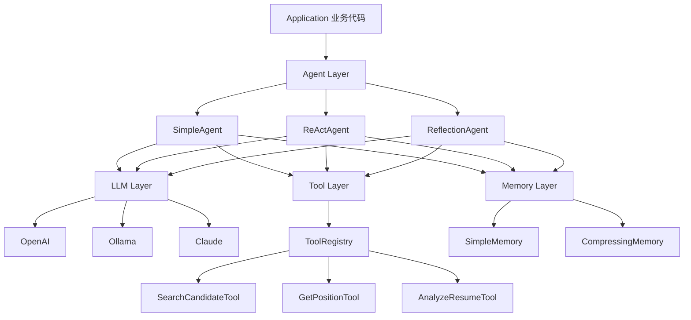

# 第 29 课：从 0 构建 Agent 框架

> **核心问题**：不依赖任何现成框架，从零搭建一个 Agent 框架需要哪些组件？
> **预计时间**：2-3 天
> **前置知识**：第 08 课（Function Calling）、第 09 课（AI Agent）、第 26 课（Agent 范式）

---

## 一、为什么要自己造轮子？

```
学习目的：
  - 理解 Agent 框架的本质抽象
  - 掌握每层的设计取舍
  - 在 Java 项目中能自主实现

类比（Java 开发视角）：
  学 Spring 之前先学 Servlet → 理解 Web 框架本质
  学 Hibernate 之前先学 JDBC → 理解 ORM 本质
  学 Agent 框架之前先手写 → 理解 Agent 本质

参考：Hello-Agents 第七章 HelloAgents 框架
```

---

## 二、框架架构设计

### 核心概念深度解析

### Agent 框架四层架构

> **严谨定义**：Agent 框架的四层架构包括：LLM 层（统一接口，适配多模型）、Tool 层（工具抽象 + 注册中心）、Agent 层（范式实现，如 ReAct/Reflection）、Memory 层（消息管理 + 压缩策略）。每层独立可插拔，支持不同模型、工具、范式的组合。

> **通俗理解**：就像 Spring 框架的分层架构——Controller 层（Agent 层）处理业务逻辑，Service 层（Tool 层）执行具体操作，DAO 层（LLM 层）访问数据，Session（Memory 层）管理状态。Agent 框架也是分层设计，每层负责自己的职责。

### Tool 抽象（工具抽象）

> **严谨定义**：Tool 抽象是对可调用函数的统一封装，包括：名称（name）、描述（description）、参数描述（JSON Schema）、执行逻辑（execute 方法）。Agent 通过 Tool 抽象动态发现和调用工具，无需硬编码。工具注册中心（ToolRegistry）管理所有可用工具，生成给 LLM 的 function schema。

> **通俗理解**：就像 Java 的 Function 接口——所有工具都实现同一个接口，只是具体逻辑不同。Agent 不用关心工具内部怎么实现，只要知道“这个工具叫什么、能做什么、需要什么参数”，然后调用就行。

### Memory 管理（记忆管理）

> **严谨定义**：Memory 管理是 Agent 框架中负责消息历史存储、检索、压缩的组件。核心挑战是 Token 有限 vs 信息无限。简单实现是内存列表（SimpleMemory），高级实现包括压缩记忆（CompressingMemory，超过阈值时摘要化旧消息）、向量检索（VectorStoreMemory，按相关性召回历史）。

> **通俗理解**：就像你的 HttpSession——存什么、不存什么、什么时候过期，都需要策略。Memory 管理就是决定“Agent 应该记住什么、忘记什么”。全量历史太占空间，压缩过度又丢失细节，需要平衡。

```
┌─────────────────────────────────────┐
│           Application               │
│     你的 HR Agent 业务代码            │
└──────────────────┬──────────────────┘
                   │
┌──────────────────┴──────────────────┐
│           Agent Layer               │
│  SimpleAgent / ReActAgent / ...     │
│  （范式实现层）                       │
└──────────────────┬──────────────────┘
                   │
┌──────────────────┴──────────────────┐
│        Memory + Tool Layer          │
│  记忆管理 │ 工具注册 │ 工具执行       │
└──────────────────┬──────────────────┘
                   │
┌──────────────────┴──────────────────┐
│            LLM Layer                │
│  统一接口 │ 多模型适配 │ 消息抽象      │
└─────────────────────────────────────┘
```

---

## 三、核心抽象：LLM 层

### 3.1 消息类型

```java
// 消息基类
public abstract class Message {
    private String role;    // system/user/assistant/tool
    private String content;
}

// 具体消息类型
public class SystemMessage extends Message { }
public class UserMessage extends Message { }
public class AssistantMessage extends Message {
    private List<ToolCall> toolCalls;  // 工具调用请求
}
public class ToolMessage extends Message {
    private String toolCallId;
    private Object result;             // 工具执行结果
}
```

### 3.2 LLM 统一接口

```java
// LLM 统一接口（类似 JDBC 的 Driver）
public interface LLM {
    ChatResponse call(List<Message> messages);
    ChatResponse call(List<Message> messages, LLMOptions options);
}

// 实现：OpenAI / Ollama / Claude
public class OpenAILLM implements LLM { }
public class OllamaLLM implements LLM { }

// 响应封装
public class ChatResponse {
    private String content;
    private List<ToolCall> toolCalls;
    private Usage usage;  // token 统计
}
```

---

## 四、核心抽象：Tool 层

### 4.1 工具基类

```java
// 工具抽象（类似 Java 的 Function 接口）
public abstract class Tool {
    private String name;
    private String description;
    private JsonSchema parameters;

    public abstract ToolResult execute(JsonNode arguments);
}

// 具体工具示例
public class SearchCandidateTool extends Tool {
    public SearchCandidateTool() {
        this.name = "search_candidates";
        this.description = "根据关键词搜索候选人";
        this.parameters = JsonSchema.object()
            .property("keyword", JsonSchema.string("搜索关键词"))
            .property("limit", JsonSchema.integer("返回数量"));
    }

    @Override
    public ToolResult execute(JsonNode args) {
        List<Candidate> list = candidateService.search(
            args.get("keyword").asText(),
            args.get("limit").asInt(10));
        return ToolResult.success(list);
    }
}
```

### 4.2 工具注册与管理

```java
// 工具注册中心
public class ToolRegistry {
    private Map<String, Tool> tools = new HashMap<>();

    public void register(Tool tool) {
        tools.put(tool.getName(), tool);
    }

    public ToolResult execute(String name, JsonNode args) {
        Tool tool = tools.get(name);
        if (tool == null) throw new ToolNotFoundException(name);
        return tool.execute(args);
    }

    // 生成工具描述（给 LLM 的 function schema）
    public List<FunctionSpec> toFunctionSpec() {
        return tools.values().stream()
            .map(t -> new FunctionSpec(t.getName(),
                     t.getDescription(), t.getParameters()))
            .toList();
    }
}
```

---

## 五、核心抽象：Agent 层

### 5.1 Agent 基类

```java
// Agent 基类
public abstract class Agent {
    protected LLM llm;
    protected ToolRegistry tools;
    protected Memory memory;
    protected String systemPrompt;

    public Agent(LLM llm, ToolRegistry tools) {
        this.llm = llm;
        this.tools = tools;
        this.memory = new SimpleMemory();
    }

    public abstract String run(String goal);
}
```

### 5.2 SimpleAgent（最简实现）

```java
// 最简单的 Agent：单次 LLM 调用
public class SimpleAgent extends Agent {

    @Override
    public String run(String goal) {
        List<Message> messages = List.of(
            new SystemMessage(systemPrompt),
            new UserMessage(goal)
        );
        return llm.call(messages).getContent();
    }
}
```

### 5.3 ReActAgent（核心范式）

```java
// ReAct Agent：思考-行动-观察循环
public class ReActAgent extends Agent {
    private int maxSteps = 10;

    @Override
    public String run(String goal) {
        memory.add(new SystemMessage(systemPrompt));
        memory.add(new UserMessage(goal));

        for (int i = 0; i < maxSteps; i++) {
            ChatResponse resp = llm.call(
                memory.getMessages(),
                LLMOptions.withTools(tools.toFunctionSpec()));

            if (resp.hasToolCalls()) {
                // 执行所有工具调用
                for (ToolCall call : resp.getToolCalls()) {
                    ToolResult result = tools.execute(
                        call.getName(), call.getArguments());
                    memory.add(new ToolMessage(call.getId(), result));
                }
            } else {
                return resp.getContent();  // 最终答案
            }
        }
        throw new AgentTimeoutException("Max steps exceeded");
    }
}
```

### 5.4 ReflectionAgent

```java
// Reflection Agent：生成-反思-改进
public class ReflectionAgent extends Agent {
    private Agent generator;
    private Agent reflector;
    private int maxRounds = 3;

    @Override
    public String run(String task) {
        String output = generator.run(task);

        for (int i = 0; i < maxRounds; i++) {
            String critique = reflector.run(
                "Review this output and suggest improvements:\n" + output);

            if (critique.contains("SATISFIED")) break;

            output = generator.run(
                "Improve based on feedback:\n" +
                "Original: " + output + "\nFeedback: " + critique);
        }
        return output;
    }
}
```

---

## 六、核心抽象：Memory 层

```java
// 记忆接口
public interface Memory {
    void add(Message message);
    List<Message> getMessages();
    void clear();
}

// 简单实现：内存列表
public class SimpleMemory implements Memory {
    private List<Message> messages = new ArrayList<>();

    @Override
    public void add(Message message) { messages.add(message); }

    @Override
    public List<Message> getMessages() { return messages; }

    @Override
    public void clear() { messages.clear(); }
}

// 高级实现：带压缩的 Memory
public class CompressingMemory implements Memory {
    private List<Message> messages = new ArrayList<>();
    private int maxTokens = 4000;
    private LLM summarizer;

    @Override
    public void add(Message message) {
        messages.add(message);
        if (estimateTokens() > maxTokens) compress();
    }

    private void compress() {
        // 把旧消息摘要化，保留最近的消息
        String summary = summarizer.call(
            List.of(new UserMessage("Summarize: " + oldMessages)))
            .getContent();
        messages = List.of(new SystemMessage(summary), ...recent);
    }
}
```

---

## 七、完整使用示例

### Agent 框架组件关系图



```java
// 组装框架
LLM llm = new OpenAILLM("gpt-4");

ToolRegistry tools = new ToolRegistry();
tools.register(new SearchCandidateTool(candidateService));
tools.register(new GetPositionTool(positionService));
tools.register(new AnalyzeResumeTool(analysisService));

// 创建 Agent
ReActAgent agent = new ReActAgent(llm, tools);
agent.systemPrompt = """
    你是 HR 招聘助手。根据用户需求完成候选人筛选。
    规则：
    1. 先理解岗位要求
    2. 搜索匹配候选人
    3. 分析匹配度并推荐
    4. 必须使用工具获取真实数据
    """;

// 执行
String result = agent.run("为 Java 高级开发岗位推荐 3 个候选人");
System.out.println(result);
```

---

## 八、Java 版本设计思路对比

| Python HelloAgents | Java 对应设计 |
|-------------------|---------------|
| dict 消息 | Message 类（类型安全） |
| 动态类型工具 | Tool 抽象类 + JsonSchema |
| 函数注册（装饰器） | ToolRegistry + @Tool 注解 |
| 列表 Memory | Memory 接口 + 多种实现 |
| async/await | CompletableFuture / Virtual Threads |

**Java 优势**：
- **类型安全**：编译期发现错误
- **企业集成**：Spring 生态无缝对接
- **性能**：虚拟线程支持高并发 Agent

**Java 劣势**：
- 代码量多：抽象层需要更多样板代码
- 生态：AI 工具库不如 Python 丰富

---

## 九、本课小结

```
核心要点：
1. Agent 框架四层：LLM 层、Tool 层、Agent 层、Memory 层
2. LLM 层：统一接口，适配多模型
3. Tool 层：工具抽象 + 注册中心
4. Agent 层：范式实现（Simple / ReAct / Reflection）
5. Memory 层：消息管理 + 压缩策略
6. Java 实现：类型安全 + Spring 集成是优势
```

---

## 十、思考题

1. **如果不使用框架，你的 HR 项目中 Agent 循环会写成什么样？对比本课设计。**
2. **Tool 层为什么要用 JsonSchema 描述参数？直接用 Java 类型不行吗？**
3. **Memory 层为什么要压缩？不压缩会怎样？设计一个压缩策略。**
4. **Java 版本相比 Python 版本，哪些设计更优？哪些更复杂？**

---

## 十一、延伸阅读

- Hello-Agents 第七章：https://hello-agents.datawhale.cc/#/chapter7/
- LangChain4j 文档：https://docs.langchain4j.dev/
- Spring AI 工具抽象：https://docs.spring.io/spring-ai/reference/api/tools.html
- Anthropic Building Effective Agents：https://www.anthropic.com/research/building-effective-agents

---

## 导航

| 上一课 | 下一课 |
| --- | --- |
| [第 28 课：主流 Agent 框架实践](28-主流Agent框架实践.md) | [第 30 课：上下文工程](30-上下文工程.md) |