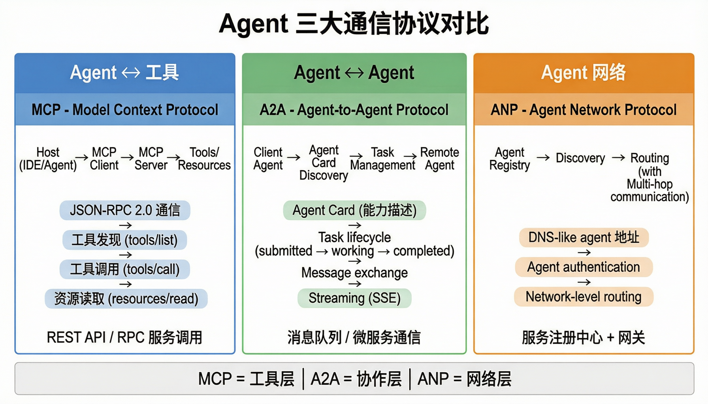
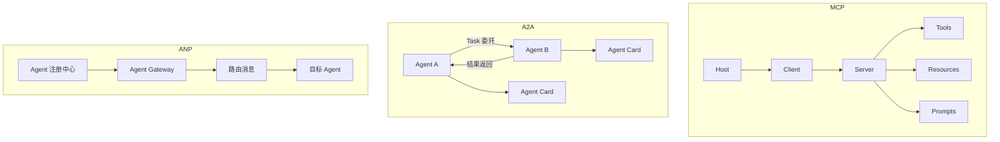

# 第 31 课：Agent 通信协议

> **核心问题**：Agent 之间、Agent 与工具之间如何标准化通信？
> **预计时间**：2 天
> **前置知识**：第 10 课（Multi-Agent）、第 23 课（MCP）

---

## 一、三大协议概览



```
1. MCP（Model Context Protocol）：Agent ↔ 工具
   解决：LLM 如何发现和调用外部工具

2. A2A（Agent-to-Agent Protocol）：Agent ↔ Agent
   解决：Agent 之间如何协作完成任务

3. ANP（Agent Network Protocol）：Agent 网络
   解决：大规模 Agent 如何发现、路由、通信

类比（Java 开发视角）：
  MCP → REST API / RPC（服务调用）
  A2A → 消息队列 / 微服务通信（服务间协作）
  ANP → 服务注册中心 + 网关（服务发现与路由）
```

---

## 二、协议对比

### 核心概念深度解析

### MCP（Model Context Protocol）

> **严谨定义**：MCP 是 Anthropic 提出的开放标准协议，解决 Agent ↔ 工具的标准化连接。基于 JSON-RPC 2.0，采用 Host → Client → Server 三层架构，提供工具（Tools）、资源（Resources）、提示词（Prompts）三要素。核心价值是“一次开发，处处复用”，将 AI 与外部系统的连接从定制化变为标准化。

> **通俗理解**：就像 USB 接口——以前每个设备都有专属接口，现在统一用 USB。MCP 就是 AI 的“USB 接口”，数据库、文件系统、API 只要实现 MCP Server，任何 AI 应用都能直接调用。

### A2A（Agent-to-Agent Protocol）

> **严谨定义**：A2A 是 Google 提出的 Agent 间通信协议，解决 Agent ↔ Agent 的任务委托与协作。核心概念包括：Agent Card（Agent 名片，描述能力和端点）、Task（任务，有状态流转：pending → running → completed/failed）、Message（协作消息）。Agent 通过 A2A 委托任务给其他 Agent，实现跨系统协作。

> **通俗理解**：就像公司间的“业务委托”——招聘 Agent 需要筛选能力，就委托给筛选 Agent：“帮我筛选 Java 候选人”。筛选 Agent 接受任务、执行、返回结果。A2A 就是 Agent 之间的“业务往来协议”。

### ANP（Agent Network Protocol）

> **严谨定义**：ANP 是社区提出的 Agent 网络协议，解决大规模 Agent 的服务发现与路由。核心概念包括：Agent 注册中心（类似 Spring Cloud Eureka）、能力标签（按能力查找 Agent）、Agent Gateway（路由消息到目标 Agent）。ANP 让 Agent 能像微服务一样动态注册、发现、路由。

> **通俗理解**：就像“服务注册中心”——Agent 启动时注册“我是筛选 Agent，擅长简历筛选”，其他 Agent 需要筛选能力时，先到注册中心查找，然后路由过去。ANP 就是 Agent 世界的“Nacos/Eureka”。

| 维度 | MCP | A2A | ANP |
|------|-----|-----|-----|
| **连接对象** | Agent ↔ 工具 | Agent ↔ Agent | Agent 网络 |
| **核心功能** | 工具发现与调用 | 任务委托与协作 | 服务发现与路由 |
| **提出者** | Anthropic | Google | 社区 |
| **传输协议** | JSON-RPC 2.0 | HTTP + SSE | HTTP + WebSocket |
| **成熟度** | 高（已广泛采用） | 中（生态建设中） | 低（早期阶段） |
| **Java 对应** | Spring AI MCP | gRPC / REST | Spring Cloud |

---

## 三、MCP 深入

### 3.1 核心概念回顾

```
MCP = AI 的 USB 接口（第 23 课已介绍）

架构：Host → Client → Server
  Host：AI 应用（Claude / IDE / 你的系统）
  Client：管理连接、工具发现
  Server：暴露工具/资源/提示词

三要素：
  Tools：可调用的函数
  Resources：可读取的数据
  Prompts：可复用的提示词模板
```

### 3.2 传输方式

```
两种传输模式：

1. stdio（本地进程）
   Client 启动 Server 进程
   通过标准输入/输出通信
   适用：本地工具（文件系统、数据库）

2. HTTP/SSE（网络服务）
   Server 作为 HTTP 服务运行
   Client 通过 HTTP 调用
   适用：远程工具（API、微服务）

你的 HR 项目选择：
  本地工具 → stdio
  远程服务 → HTTP/SSE
```

### 3.3 社区生态

```
已支持 MCP 的平台：
  Claude Desktop、Cursor、Qoder、VS Code
  OpenAI（ANYC 协议，趋同趋势）

主流 MCP Server：
  数据库：PostgreSQL、MySQL、Redis
  文件：文件系统、Git
  办公：Slack、飞书、钉钉
  浏览器：Playwright、Chrome DevTools
  开发：GitHub、GitLab、Jira
```

---

## 四、A2A 实战

### Agent 通信协议栈架构图



### 4.1 设计动机

```
问题：两个 Agent 如何协作？

朴素方案：一个 Agent 调用另一个 Agent 的工具
  → 工具粒度不匹配
  → 无法表达复杂任务

A2A 方案：Agent 之间通过"任务"协作
  - 委托方：创建任务，描述目标
  - 执行方：接受任务，返回结果
  - 任务有状态：pending → running → completed/failed
```

### 4.2 Agent Card

```json
// Agent Card：Agent 的"名片"
{
  "name": "hr-screening-agent",
  "description": "简历筛选专家，擅长人岗匹配",
  "capabilities": ["resume_screening", "candidate_matching"],
  "endpoint": "https://hr-api.com/a2a/screening",
  "authentication": {
    "type": "api_key",
    "header": "X-API-Key"
  }
}
```

### 4.3 任务管理

```java
// A2A 任务模型
public class A2ATask {
    private String id;
    private String status;        // pending/running/completed/failed
    private String goal;          // 任务目标
    private Map<String, Object> context;  // 上下文
    private List<Message> messages;       // 协作消息

    // 状态流转
    public void start() { this.status = "running"; }
    public void complete(Object result) {
        this.status = "completed";
        this.result = result;
    }
    public void fail(String reason) {
        this.status = "failed";
        this.error = reason;
    }
}

// A2A 客户端
public class A2AClient {
    // 委托任务给另一个 Agent
    public A2ATask delegateTask(String agentEndpoint, String goal) {
        TaskRequest req = new TaskRequest(goal, getContext());
        return httpClient.post(agentEndpoint + "/tasks", req);
    }

    // 查询任务状态
    public A2ATask getTaskStatus(String taskId) {
        return httpClient.get("/tasks/" + taskId);
    }
}
```

### 4.4 HR 项目中的 A2A 场景

```
场景：招聘 Agent 委托筛选 Agent

[招聘 Agent]
  目标：为 Java 岗位找到合适候选人
  委托：delegateTask("screening-agent", "筛选 Java 候选人")

[筛选 Agent]
  接受任务 → 执行筛选 → 返回结果
  状态：pending → running → completed

[招聘 Agent]
  收到结果 → 继续后续流程（安排面试）
```

---

## 五、ANP 实战

### 5.1 服务发现

```
问题：Agent 怎么找到其他 Agent？

ANP 方案：Agent 注册中心
  - Agent 启动时注册（类似 Spring Cloud Eureka）
  - Agent 通过注册中心发现其他 Agent
  - 支持能力标签（按能力查找）

类比：
  ANP 注册中心 = Nacos / Eureka
  Agent Card = 服务实例信息
  能力标签 = 服务元数据
```

### 5.2 消息路由

```
问题：消息怎么从 Agent A 送到 Agent B？

ANP 路由策略：
  1. 直接路由：知道目标 Agent 地址，直接发送
  2. 能力路由：按能力标签匹配（"我需要筛选能力"）
  3. 广播路由：发给所有相关 Agent（"有新岗位"）

实现：
  Agent Gateway（类似 API 网关）
    - 接收消息
    - 查注册中心
    - 路由到目标 Agent
```

---

## 六、构建自定义 MCP 服务器

### 6.1 Java 实现

```java
// 使用 Spring AI MCP Server
@Configuration
public class HrMcpServerConfig {

    @Tool(description = "根据姓名查询候选人")
    public CandidateInfo searchCandidate(String name) {
        return candidateMapper.findByName(name);
    }

    @Tool(description = "查询岗位下的候选人列表")
    public List<CandidateInfo> listByPosition(Long positionId) {
        return candidateMapper.listByPosition(positionId);
    }

    @Tool(description = "获取候选人分析报告")
    public AnalysisReport getReport(Long candidateId) {
        return analysisService.getReport(candidateId);
    }
}
```

### 6.2 配置与部署

```yaml
# application.yml
spring:
  ai:
    mcp:
      server:
        enabled: true
        name: hr-mcp-server
        version: 1.0.0
        type: stdio  # 或 sse（网络模式）
```

---

## 七、与 Java REST/RPC 的类比

| Agent 通信协议 | Java 对应 |
|--------------|----------|
| MCP | REST API + OpenAPI 文档 |
| A2A | gRPC / 消息队列（任务委托） |
| ANP 注册中心 | Nacos / Eureka |
| ANP 网关 | Spring Cloud Gateway |
| Agent Card | 服务元数据 / Swagger 文档 |

**你的 HR 项目已有**：
- REST API（Controller）→ 可升级为 MCP Server
- 工作流引擎 → 可集成 A2A 任务委托
- 微服务架构 → 可引入 ANP 服务发现

---

## 八、本课小结

```
核心要点：
1. MCP：Agent ↔ 工具，标准化工具调用（已成熟）
2. A2A：Agent ↔ Agent，任务委托与协作（建设中）
3. ANP：Agent 网络，服务发现与路由（早期）
4. 三大协议构成 Agent 通信的完整栈
5. Java 实现：Spring AI MCP + 微服务模式
6. 趋势：协议逐步统一，不绑定单一厂商
```

---

## 九、思考题

1. **你的 HR 系统哪些 REST API 适合封装成 MCP Server？**
2. **A2A 任务模型和你项目中的工作流任务有什么异同？**
3. **如果两个 Agent 需要实时协作（不是委托），用什么协议？**
4. **ANP 的服务发现和 Spring Cloud Eureka 有什么本质区别？**

---

## 十、延伸阅读

- MCP 官方文档：https://modelcontextprotocol.io/
- A2A 协议规范：https://github.com/google/A2A
- ANP 提案：https://github.com/anthropics/agent-protocols
- Spring AI MCP：https://docs.spring.io/spring-ai/reference/api/mcp.html
- Google A2A 博客：https://developers.googleblog.com/en/a2a-a-new-era-of-agent-interoperability/

---

## 导航

| 上一课 | 下一课 |
| --- | --- |
| [第 30 课：上下文工程](30-上下文工程.md) | [第 32 课：Agentic-RL 训练实战](32-Agentic-RL训练实战.md) |
