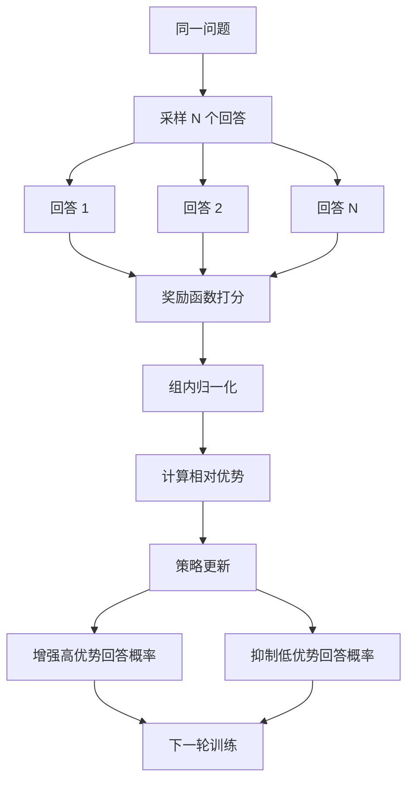

# 第 32 课：Agentic-RL 训练实战

> **核心问题**：如何让 LLM 学会使用工具、自主完成任务？从 SFT 到 GRPO 的训练路径
> **预计时间**：2-3 天
> **前置知识**：第 18 课（LLM 微调实战）、第 09 课（AI Agent）

---

## 一、从 SFT 到 GRPO 的训练路径

### 核心概念深度解析

### SFT（Supervised Fine-Tuning，监督微调）

> **严谨定义**：SFT 是使用问答对数据对预训练模型进行微调的技术，目标是让模型学会按指令回答。数据格式为 {instruction, input, output}，训练时最小化模型输出与标准答案的差距。SFT 是 LLM 训练的第二阶段（预训练后），让模型从“会说话”变成“会听话”。常用 LoRA/QLoRA 参数高效微调。

> **通俗理解**：就像培训班——老师给你看标准答案，你照着学。SFT 就是“给模型看标准问答对，让它学会怎么回答”。比如“分析这份简历”→“匹配度 85%，优势...不足...”，模型看多了就学会这种回答格式。

### GRPO（Group Relative Policy Optimization）

> **严谨定义**：GRPO 是 DeepSeek 提出的强化学习算法，无需奖励模型，直接用规则/结果反馈训练。核心流程：对同一问题采样一组回答（Group Sampling）→ 用规则/结果对每个回答打分 → 组内归一化计算相对优势 → 增强高优势回答的概率，抑制低优势回答。相比 PPO，GRPO 更简单、更稳定。

> **通俗理解**：就像“比赛评分”——同一个问题，让模型生成 8 个不同的回答，然后看哪个回答结果最好（如找到最多匹配候选人）。表现好的回答“加强”，表现差的“削弱”。GRPO 就是“让模型自己试错，从结果中学习”。

### 奖励函数（Reward Function）

> **严谨定义**：奖励函数是告诉模型什么是“好”输出的评分规则。Agent 场景的奖励包括：结果奖励（任务完成 +1，失败 -1）、格式奖励（JSON 合法 +0.1）、效率奖励（步骤少 +0.1）、安全奖励（无危险操作 +0.1）。奖励函数设计是强化学习的核心，直接决定模型学习方向。

> **通俗理解**：就像“绩效考核标准”——你告诉模型“找到匹配候选人 +1 分，格式正确 +0.1 分，步骤精简 +0.1 分”。模型为了拿高分，就会往这些方向优化。奖励函数设计得好，模型就学得好；设计得差，模型可能“钻空子”。

```
LLM 训练演进：

1. Pre-training（预训练）
   海量文本 → 学会语言基础能力
   成本：百万美元级

2. SFT（Supervised Fine-Tuning，监督微调）
   问答对数据 → 学会按指令回答
   成本：几百到几千美元
   第 18 课已讲

3. RLHF（Reinforcement Learning from Human Feedback）
   人类偏好 → 学会"好"的回答风格
   代表：PPO 算法

4. GRPO（Group Relative Policy Optimization）
   无需奖励模型，用规则/结果反馈
   代表：DeepSeek-R1 的训练方法

类比（Java 开发视角）：
  Pre-training → 学 Java 语法（大学课程）
  SFT        → 学框架用法（培训班）
  RLHF/GRPO  → 做项目练手（实战提升）
```

---

## 二、数据集与奖励函数设计

### 2.1 数据集类型

```
SFT 数据集：
  {
    "instruction": "为 Java 岗位筛选候选人",
    "input": "岗位要求：5年+ Java，微服务经验",
    "output": "我来搜索匹配的候选人...\n[调用工具] search_candidates(...)"
  }

Agent 数据集（工具调用）：
  {
    "instruction": "查询张三的候选人信息",
    "thought": "我需要调用候选人查询工具",
    "action": "search_candidate(name='张三')",
    "observation": "{\"id\": 101, \"name\": \"张三\", \"exp\": 8}",
    "final_answer": "张三，8年经验，匹配度 92%"
  }
```

### 2.2 奖励函数设计

```
奖励函数 = 告诉模型什么是"好"的输出

Agent 场景的奖励设计：

1. 结果奖励（最重要）
   任务完成 → +1
   任务失败 → -1
   例：成功找到匹配候选人 → +1

2. 格式奖励
   输出符合 JSON 格式 → +0.1
   工具调用格式正确 → +0.1

3. 效率奖励
   用更少步骤完成 → 额外奖励
   避免无效调用 → 额外奖励

4. 安全奖励
   没有执行危险操作 → +0.1
   遵守权限约束 → +0.1
```

---

## 三、SFT 训练实战

### 3.1 LoRA 参数高效微调

```
回顾第 18 课：LoRA 只训练少量参数（< 1%）

LoRA 核心思想：
  冻结原始模型权重 W
  添加低秩分解：W' = W + BA（A 和 B 是小矩阵）
  只训练 A 和 B

参数对比：
  全量微调 7B 模型：~14GB 显存
  LoRA 微调 7B 模型：~4GB 显存（一张消费级显卡）

你的环境：
  本地 GPU（RTX 3060+）即可跑 LoRA
  或用云 GPU（AutoDL / 阿里云）
```

### 3.2 SFT 训练代码

```python
from transformers import AutoModelForCausalLM, AutoTokenizer
from peft import LoraConfig, get_peft_model
from trl import SFTTrainer

# 1. 加载基础模型
model = AutoModelForCausalLM.from_pretrained("Qwen/Qwen2.5-7B")
tokenizer = AutoTokenizer.from_pretrained("Qwen/Qwen2.5-7B")

# 2. 配置 LoRA
lora_config = LoraConfig(
    r=16,                    # 秩
    lora_alpha=32,           # 缩放因子
    target_modules=["q_proj", "v_proj"],  # 目标层
    lora_dropout=0.05
)
model = get_peft_model(model, lora_config)
model.print_trainable_parameters()  # 可训练参数 < 1%

# 3. 准备数据集
# 格式：instruction + input + output
dataset = load_dataset("json", data_files="hr_agent_data.json")

# 4. 训练
trainer = SFTTrainer(
    model=model,
    train_dataset=dataset["train"],
    args=TrainingArguments(
        output_dir="./hr-agent-sft",
        num_train_epochs=3,
        per_device_train_batch_size=2,
        learning_rate=2e-4,
        fp16=True
    )
)
trainer.train()

# 5. 保存 LoRA 权重
model.save_pretrained("./hr-agent-lora")
```

---

## 四、GRPO 训练实战

### 4.1 从 PPO 到 GRPO

```
PPO（Proximal Policy Optimization）：
  经典 RLHF 算法
  需要：奖励模型（Reward Model）
  复杂：需要训练额外的奖励模型

GRPO（Group Relative Policy Optimization）：
  DeepSeek 提出的改进算法
  不需要奖励模型，用规则/结果直接打分
  更简单、更稳定

对比：
  PPO  → 需要裁判（奖励模型）→ 裁判本身可能不准
  GRPO → 直接看结果 → 结果不会骗人
```

### 4.2 GRPO 训练流程

### GRPO 训练流程图



```
1. 采样一组回答（Group Sampling）
   对同一个问题，让模型生成 N 个回答
   例：同一个筛选任务，生成 8 个不同的执行方案

2. 对每个回答打分（Reward Scoring）
   用规则/结果评估每个回答
   例：方案 A 找到 3 个匹配候选人 → 得分 0.8
       方案 B 找到 1 个 → 得分 0.3

3. 组内归一化（Relative Advantage）
   计算每个回答相对于组平均的优势
   advantage = (score - mean) / std

4. 策略更新（Policy Update）
   增强高优势回答的概率
   抑制低优势回答的概率
```

### 4.3 GRPO 训练代码

```python
from trl import GRPOTrainer, GRPOConfig

# 1. 定义奖励函数
def reward_fn(completions, **kwargs):
    rewards = []
    for completion in completions:
        score = 0.0
        # 结果奖励
        if "推荐" in completion and "匹配度" in completion:
            score += 1.0
        # 格式奖励
        if "search_candidate" in completion:
            score += 0.2
        # 效率奖励（步骤少加分）
        steps = completion.count("[Step")
        if steps <= 3:
            score += 0.1
        rewards.append(score)
    return rewards

# 2. 配置训练
config = GRPOConfig(
    output_dir="./hr-agent-grpo",
    num_generations=8,         # 每组采样数
    per_device_train_batch_size=2,
    learning_rate=1e-5,
    num_train_epochs=2
)

# 3. 训练
trainer = GRPOTrainer(
    model=model,
    config=config,
    reward_function=reward_fn,
    train_dataset=dataset
)
trainer.train()
```

---

## 五、模型评估

### 5.1 BFCL（工具调用基准）

```
BFCL（Berkeley Function Calling Leaderboard）：
  评估 LLM 的工具调用能力

评估维度：
  - 工具选择准确性：选对工具
  - 参数填充准确性：参数格式正确
  - 多步调用能力：连续调用多个工具
  - 并行调用能力：同时调用多个工具

你的 Agent 评估：
  定义 20 个标准任务 → 跑模型 → 统计工具调用成功率
```

### 5.2 GAIA（通用能力基准）

```
GAIA（General AI Assistants）：
  评估 Agent 的综合能力

评估维度：
  - 多步推理：复杂问题分解
  - 工具使用：搜索、计算、代码执行
  - 网页浏览：从网页获取信息
  - 文件处理：读写文件、处理数据

难度分级：
  Level 1：简单（1-2 步）
  Level 2：中等（3-5 步）
  Level 3：困难（5+ 步）
```

---

## 六、与第 18 课 LoRA 微调的关系

| 维度 | 第 18 课 LoRA 微调 | 本课 Agentic-RL 训练 |
|------|------------------|-------------------|
| 目标 | 学会特定任务 | 学会自主决策 |
| 数据 | 问答对 | 任务执行轨迹 |
| 方法 | SFT（监督学习） | GRPO（强化学习） |
| 评估 | 准确率/困惑度 | 任务完成率 |

**关系**：
- SFT 是基础 → 先让模型学会基本工具调用格式
- GRPO 是进阶 → 再让模型学会优化决策策略

**训练路径**：
基础模型 → SFT（学会格式）→ GRPO（学会策略）

---

## 七、Java 开发者如何参与模型训练

```
Java 开发者的优势：
  1. 数据工程：构建高质量训练数据
  2. 评估系统：设计自动化评估流水线
  3. 部署运维：模型服务化、A/B 测试
  4. 业务理解：定义奖励函数（什么是"好"的 Agent）

参与路径：
  1. 构建 HR 领域训练数据（你最懂业务）
  2. 设计评估数据集（黄金任务集）
  3. 用 Python 跑训练实验（学习成本不高）
  4. 将微调模型部署为 Java 服务（Spring AI）

你的 HR 项目：
  已有业务数据 → 可转化为训练数据
  已有评估体系 → 可复用为模型评估
  已有 Spring AI → 可直接接入微调模型
```

---

## 八、用 AI 工具实际体验

### 8.1 用 ChatGPT 体验 SFT 的效果差异

```
场景：让 ChatGPT 扮演 HR Agent，调用工具筛选候选人

【未微调的通用模型（GPT-4o）】
用户：帮我找适合"高级Java开发"的候选人

GPT-4o 回复：
  好的，我来帮你找。请问：
  1. 工作地点在哪里？
  2. 需要多少年经验？
  3. 有什么特殊要求吗？
  （问题：模型不知道有哪些工具可用，只能反问用户）

【经过 SFT 微调的 HR Agent 模型】
用户：帮我找适合"高级Java开发"的候选人

微调模型回复：
  [Thought] 用户需要筛选候选人，先获取岗位详情
  [Action] get_position_detail(position_name="高级Java开发")
  [Observation] 要求：5年+ Java，微服务经验，本科以上，上海
  
  [Thought] 按条件搜索候选人
  [Action] search_candidates(skills=["Java","Spring Cloud"], min_exp=5, location="上海")
  [Observation] 找到 3 位：张三(8年)、李四(6年)、王五(10年)
  
  [Thought] 逐一评估匹配度
  [Action] evaluate_match(candidate="张三", position="高级Java开发")
  [Observation] 匹配度 92%
  
  推荐张三(92%)、李四(87%)参加高级Java开发岗位面试。
  （差异：微调后模型自动调用工具，不需要反问用户）
```

### 8.2 用 Hugging Face 体验微调模型

```
场景：在 Hugging Face 上对比不同模型的 Agent 能力

步骤 1：访问 BFCL 排行榜
  https://gorilla.cs.berkeley.edu/leaderboard.html
  
  观察：
  - GPT-4o：工具调用准确率 85.3%
  - Claude 3.5：工具调用准确率 88.1%
  - Qwen2-72B：工具调用准确率 72.4%
  - Qwen2-72B + SFT：工具调用准确率 81.6%（提升 9.2%）
  - Qwen2-72B + SFT + GRPO：工具调用准确率 86.7%（再提升 5.1%）

  结论：SFT 让模型学会工具调用格式，GRPO 让模型优化工具调用策略

步骤 2：在 Hugging Face Playground 测试
  https://huggingface.co/chat/
  
  选择模型：Qwen2-72B
  输入：帮我查找上海的高级Java候选人，要求 5 年以上经验
  
  观察输出：
  - 基础模型：可能只返回文本建议，不会调用工具
  - SFT 模型：会输出工具调用格式，但可能选错工具
  - GRPO 模型：选对工具、参数准确、步骤精简
```

---

## 九、本课小结

```
核心要点：
1. 训练路径：Pre-training → SFT → RLHF/GRPO
2. SFT：用问答对教模型基本能力（LoRA 参数高效）
3. GRPO：用结果反馈教模型优化策略（无需奖励模型）
4. 评估：BFCL（工具调用）+ GAIA（通用能力）
5. 与第 18 课关系：SFT 是基础，GRPO 是进阶
6. Java 开发者：数据工程 + 评估系统 + 部署运维
```

---

## 十、思考题

1. **你的 HR 项目中，哪些数据可以转化为 Agent 训练数据？**
2. **SFT 和 GRPO 分别解决什么问题？能否只做 SFT 不做 GRPO？**
3. **设计一个 HR Agent 的奖励函数，考虑哪些维度？**
4. **Java 开发者在模型训练中最有价值的贡献是什么？**

---

## 十一、延伸阅读

- DeepSeek-R1 论文：https://arxiv.org/abs/2501.12948
- LoRA 论文：https://arxiv.org/abs/2106.09685
- BFCL 排行榜：https://gorilla.cs.berkeley.edu/leaderboard.html
- GAIA 基准：https://huggingface.co/gaia-benchmark
- TRL 训练库：https://github.com/huggingface/trl
- 第 18 课 LoRA 微调：[18-LLM微调实战](./18-LLM微调实战.md)

---

## 导航

| 上一课 | 下一课 |
| --- | --- |
| [第 31 课：Agent 通信协议](31-Agent通信协议.md) | — |
