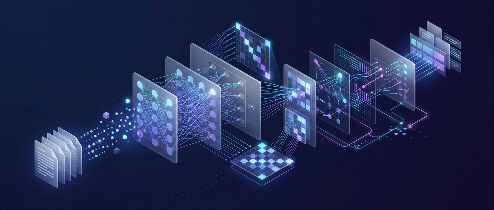

# AI 应用开发学习路线 · Java 开发者的 AI 进阶指南

  

> **从 Transformer 注意力机制，到企业级 LLM 应用落地。**
> 32 课系统化学习笔记，专为有 Java 后端经验的开发者打造。
> 每一课都遵循同一套讲法：**理论原理 → 直观类比 → 项目实战对应 → 思考题自测**。

---

## 一分钟了解

**这是什么？** 一套面向 Java 开发者的 AI 应用开发完整学习路线。不是泛泛的 AI 科普，也不是 API 调用速查手册，而是结合真实企业项目（AI 招聘系统）的实战笔记——从 Self-Attention 的数学原理，一路讲到成本优化、安全合规、可观测性与 Agentic RL 训练。

**适合谁？**

- 有 1-3 年 Java 经验，正在（或准备）转向 AI 应用开发的后端工程师
- 想真正理解 LLM，而不是只会调 API 的开发者
- 需要系统补齐 RAG / Agent / MCP 等核心技术，并在生产环境落地的人
- 关注企业级问题：花多少钱、怎么防注入、怎么评估、怎么不出事故

**核心特色？**

1. **三层讲解法**：每个概念都有「严谨定义 + 通俗理解 + Java 视角类比」三层递进，不怕抽象
2. **实战贯穿**：所有概念都对应到真实项目中的代码与架构（HR 招聘系统），不做空中楼阁
3. **企业视角**：Token 成本、Prompt 注入防御、灰度发布、可观测性、评估体系——网上教程普遍缺失的部分
4. **全图表内嵌**：9 张架构图 + 31 张流程图，PDF 里可直接阅读，无需跳转
5. **免费开放**：MIT 协议，在线阅读与 490 页 PDF 合订本全部免费

---

## 立即开始

| 你想做什么 | 入口 |
| --- | --- |
| 系统学习（推荐） | [课程目录](AI-Learning/README.md) · 从第 01 课开始 |
| 先看全貌 | [00-学习路线图](AI-Learning/00-学习路线图.md) |
| 下载完整 PDF（490 页合订本，8.4MB） | [在线阅读](https://github.com/code-seeking/AI-project/blob/main/AI-Learning/AI应用开发.pdf) / [直接下载](https://github.com/code-seeking/AI-project/raw/main/AI-Learning/AI应用开发.pdf) |
| 直奔某个主题 | 见下方课程地图，每课可直接点击 |

### 按目标选路径

| 你的情况 | 推荐路径 | 预计投入 |
| --- | --- | --- |
| 想快速建立全景认知 | 00 → 01 → 06 → 09 → 13 → 24 | 7 天，每天一课 |
| 从 Java 后端系统性转型 | 基础篇 01-12 顺序读 | 6-8 周，每课 1-2 天 |
| 已在做 AI 应用，补企业级能力 | 进阶篇 13-24 | 6-8 周 |
| 深耕 Agent 方向 | Agent 专题 25-32 | 4-6 周 |

---

## 课程地图

### 基础篇（01-12）：从原理到工程

| 课号 | 主题 | 你将学到 |
| --- | --- | --- |
| 01 | [Transformer 与 LLM 原理](AI-Learning/01-Transformer与LLM原理.md) | Self-Attention 机制、Encoder-Decoder 架构、GPT vs BERT |
| 02 | [Tokenization 分词原理](AI-Learning/02-Tokenization分词原理.md) | BPE / WordPiece / SentencePiece，模型如何看待文字 |
| 03 | [Prompt Engineering 提示工程](AI-Learning/03-PromptEngineering提示工程.md) | 零样本、少样本、Chain-of-Thought、结构化 Prompt 设计 |
| 04 | [Embedding 与语义空间](AI-Learning/04-Embedding与语义空间.md) | 向量化原理、余弦相似度、语义搜索基础 |
| 05 | [向量数据库](AI-Learning/05-向量数据库.md) | pgvector / Milvus / Pinecone，ANN 索引（HNSW / IVF） |
| 06 | [RAG 检索增强生成（上）](AI-Learning/06-RAG检索增强生成上.md) | 核心流程：文档切分 → Embedding → 检索 → 生成 |
| 07 | [RAG 检索增强生成（下）](AI-Learning/07-RAG检索增强生成下.md) | 重排序、混合检索、查询改写、上下文压缩 |
| 08 | [Function Calling 与工具调用](AI-Learning/08-FunctionCalling与工具调用.md) | 让 LLM 调用外部 API、数据库查询、执行代码 |
| 09 | [AI Agent 智能体](AI-Learning/09-AIAgent智能体.md) | ReAct 模式、规划与记忆、自主决策循环 |
| 10 | [Multi-Agent 多智能体协作](AI-Learning/10-MultiAgent多智能体协作.md) | 角色分工、消息传递、协作编排模式 |
| 11 | [AI 工作流引擎](AI-Learning/11-AI工作流引擎.md) | 可视化编排 AI 任务链、条件分支、并行执行 |
| 12 | [AI 应用工程化](AI-Learning/12-AI应用工程化.md) | 网关、缓存、限流、安全、监控、评估体系 |

### 进阶篇（13-24）：企业级落地

| 课号 | 主题 | 你将学到 |
| --- | --- | --- |
| 13 | [企业级 LLM 应用架构设计](AI-Learning/13-企业级LLM应用架构设计.md) | 六层架构：模型层 / 上下文层 / 知识层 / 工具层 / 编排层 / 治理层 |
| 14 | [Token 经济与成本优化](AI-Learning/14-Token经济与成本优化.md) | 成本模型、缓存策略、Prompt 压缩、路由分发 |
| 15 | [模型选型与部署策略](AI-Learning/15-模型选型与部署策略.md) | 云 API vs 私有化 vs 开源模型，选型决策矩阵 |
| 16 | [企业级 RAG 深度实战](AI-Learning/16-企业级RAG深度实战.md) | 多知识库、权限隔离、增量更新、质量评估 |
| 17 | [生产级 Prompt 工程](AI-Learning/17-生产级Prompt工程.md) | 版本管理、灰度发布、A/B 测试、回滚机制 |
| 18 | [LLM 微调实战](AI-Learning/18-LLM微调实战.md) | LoRA / QLoRA、数据准备、训练流程、效果评估 |
| 19 | [多模态应用实战](AI-Learning/19-多模态应用实战.md) | PDF / 图片 / 语音 / 视频处理管线 |
| 20 | [AI 安全与合规](AI-Learning/20-AI安全与合规.md) | Prompt 注入防御、内容过滤、数据脱敏、审计日志 |
| 21 | [AI 可观测性与运维](AI-Learning/21-AI可观测性与运维.md) | Trace / Metrics / Logging、异常检测、SLA 保障 |
| 22 | [AI 测试与评估体系](AI-Learning/22-AI测试与评估体系.md) | 自动化评测、回归检测、质量指标、防改坏机制 |
| 23 | [MCP 与 AI 工具生态](AI-Learning/23-MCP与AI工具生态.md) | Model Context Protocol、标准化连接企业系统 |
| 24 | [端到端企业案例：AI 招聘系统](AI-Learning/24-端到端企业案例AI招聘系统.md) | 完整架构串联全部 23 课知识 |

### Agent 专题篇（25-32）

参考 [Datawhale Hello-Agents](https://hello-agents.datawhale.cc) 课程体系，深入 Agent 理论与实践。

| 课号 | 主题 | 你将学到 |
| --- | --- | --- |
| 25 | [智能体发展史](AI-Learning/25-智能体发展史.md) | 从符号主义到 LLM 驱动的 70 年演进脉络 |
| 26 | [Agent 经典范式构建](AI-Learning/26-Agent经典范式构建.md) | ReAct / Plan-and-Solve / Reflection 三种思维范式 |
| 27 | [低代码平台 Agent 搭建](AI-Learning/27-低代码平台Agent搭建.md) | Coze / Dify / FastGPT / n8n 快速搭建 Agent |
| 28 | [主流 Agent 框架实践](AI-Learning/28-主流Agent框架实践.md) | AutoGen / AgentScope / CAMEL / LangGraph 对比 |
| 29 | [从 0 构建 Agent 框架](AI-Learning/29-从0构建Agent框架.md) | 手把手构建 HelloAgents 智能体框架 |
| 30 | [上下文工程](AI-Learning/30-上下文工程.md) | ContextBuilder / NoteTool / GSSC 流水线 |
| 31 | [Agent 通信协议](AI-Learning/31-Agent通信协议.md) | MCP / A2A / ANP 三大协议深度解析 |
| 32 | [Agentic-RL 训练实战](AI-Learning/32-Agentic-RL训练实战.md) | 从 SFT 到 GRPO 的 LLM Agent 训练路径 |

---

## 这套笔记有什么不同

网上不缺 AI 教程，缺的是**工程师视角的系统化内容**。这套笔记的取舍是：

- **讲清"为什么"，再讲"怎么用"**——先从注意力机制的数学直觉入手，再谈 API 调用；先懂 Token 成本模型，再谈降本
- **每个概念三层递进**——严谨定义（面试可用）、通俗理解（建立直觉）、Java 类比（无缝衔接已有知识）
- **企业级问题是一等公民**——Prompt 怎么做版本管理和灰度？AI 功能怎么算成本？出了事怎么排查？这些占了课程近一半篇幅
- **一个真实项目贯穿始终**——AI 招聘系统从架构设计到安全合规，让所有知识落地在同一张架构图上

## 仓库内容

| 目录 | 内容 |
| --- | --- |
| [AI-Learning](AI-Learning/README.md) | 32 课学习笔记 + 490 页 PDF 合订本（本仓库核心内容） |
| [chat-portal](chat-portal/README.md) | AI 聊天门户：Java AI 服务（RAG / 工具调用 / ReAct / 模型网关）+ Node 编排后端 + Vue 3 前端 + 浏览器扩展 |
| [auto-test](auto-test/README.md) | Playwright 自动化测试：候选人管理系统 API + UI 端到端测试 |

## 如何支持这个项目

- 觉得有用，点一个 **Star**，让更多需要的人看到
- 转发给正在转向 AI 开发的朋友或同事
- 发现错误或想补充内容，欢迎提 [Issue](https://github.com/code-seeking/AI-project/issues)
- 想基于此二次开发，直接 Fork（MIT 协议，无需授权）

## License

[MIT](LICENSE) — 可自由阅读、转发、修改与商用，无需授权。
